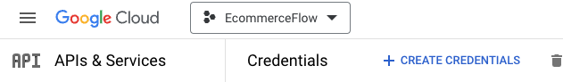
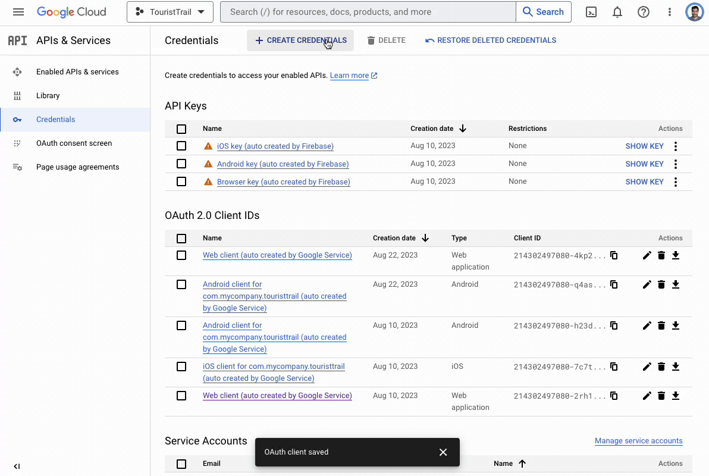
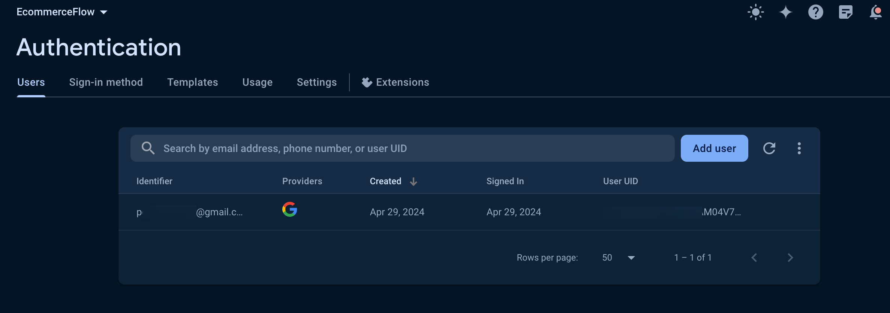

# Google Sign In

Google Sign-In allows users to authenticate using their Google Accounts.

:::info[Prerequisites]

Before getting started with this section, ensure you have:

Completed all steps in
the [Firebase Setup](/docs/Integrations/Authentication/How%20Tos/Firebase%20Authebase%20Auth/initial-setup.md).

Completed [Initial Setup](/docs/Integrations/Authentication/How%20Tos/Firebase%20Authebase%20Auth/initial-setup.md)
required for authentication.

Added SHA-1 key and regerenated Config Keys.

:::

## Enable Google Sign-in Provider in Firebase

- Open the Firebase Console and click on Authentication
- Follow the steps to enable Google Sign in for your Firebase project

<iframe src="https://demo.arcade.software/I50vTFEEyhXfU82yLick?embed&show_copy_link=true" title="EcommerceFlow - Authentication - Sign-in method - Firebase console" frameborder="0" loading="lazy" webkitallowfullscreen mozallowfullscreen allowfullscreen allow="clipboard-write" width="100%" height="600"></iframe>

## Add a Login Screen with Google Login Action

### Create a Login Screen

To allow users to authenticate, you need a Login or Sign-in Page with a button.
You can create your own or use the one from page templates.

### Add Sign-in Action

- On your Google Login button, select **Actions** from the properties panel (the
  right menu) and select Add Action.
- Search and select the Log In (under **Backend/Database > Firebase
  Authentication**) action.
- Set Auth Provider to Google.

<iframe src="https://demo.arcade.software/CBVoec46awMc3yNGLuVJ?embed&show_copy_link=true" title="EcommerceFlow - FlutterFlow" frameborder="0" loading="lazy" webkitallowfullscreen mozallowfullscreen allowfullscreen allow="clipboard-write" width="100%" height="600"></iframe>

- Enable the **Create User Document** and set the **Collection** to **users**.
  After successful login, this will insert the user's account details, such as
  email,
  name, and photo, into the 'users' collection. If a user already exists, it
  won't add details again.

## Test Google Login in various platforms

### Running on Test Mode/Run Mode

1. To test Google sign-in in Test or Run mode, you must add the authorized
   domain in the Firebase console and Google cloud console.

    - **For Test mode**, you can open the browser console, try logging in, and
      get the domain from the browser console. It should look like '
      ff-debug-service-frontend-ygxkweukma-uc.a.run.app'.

    - **For Run mode**, you can simply use 'app.flutterflow.io'.

2. To add in Firebase console:

    - Open the Firebase console and click on Authentication and select the
      Setting tab.

    - Select **Authorized domains** from the left side menu.

    - Click **Add domain**.

3. To add in Google cloud console:

    - Head over to
      your [Project Credentials](https://console.cloud.google.com/apis/credentials?project=_)
      page.
    - Ensure you are on the correct project. In our case, we are using the
      EcommerceFlow project, it will be different for you.
      
    - Under the 'OAuth 2.0 Client IDs', select 'Web client (auto created by
      Google Service)'.

    - Under the 'Authorized JavaScript origins', click ADD URI and add both the
      URL.
    - Similarly, under the 'Authorized redirect URIs', click ADD URI, add both
      the URL and append '/__/auth/handler' at the end.

<iframe src="https://www.loom.com/embed/efd5b99b858d4de8bca55452c6e1d20c" frameborder="0" allowFullScreen style={{ width: '100%', height: '600px' }}></iframe>

4. If you don't see the Web client created yet, you can create new one by
   clicking + CREATE CREDENTIALS, selecting OAuth client ID and then select
   Application type to Web application.

### Verify user creation
To confirm the successful integration of Google authentication and the creation of users, navigate to your Firebase project > Authentication > Users and check the user entries.

