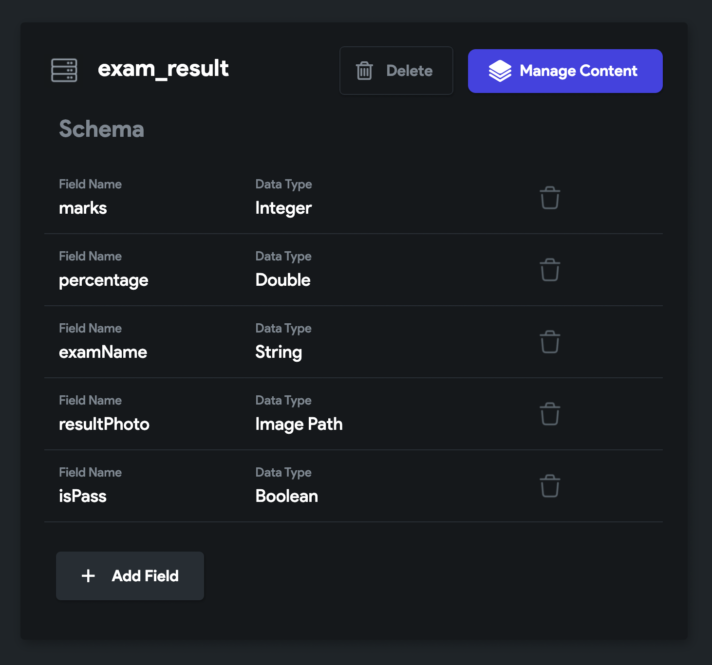
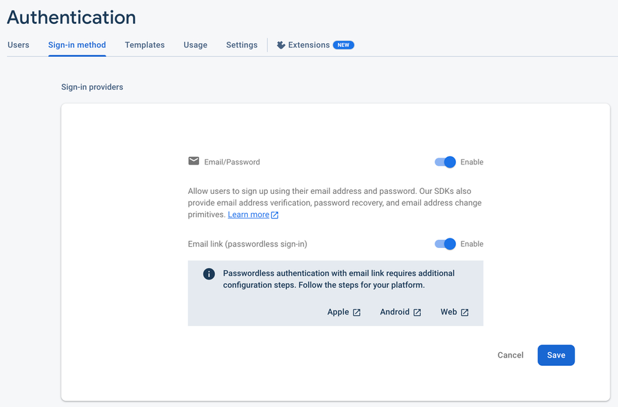

# Firestore Content Manager

The Firestore Content Manager provides an easy way to visually create, edit, and add documents 
to your [**Firestore database**](getting-started.md).

:::info
* Subcollections are not supported in Content Manager at this time.
* This feature is included in our **Pro plans**.
:::

:::note[Prerequisites]

Before getting started with this section, ensure you:

1. Become familiar with [**Structuring the Firebase Database**](getting-started.md#structuring-the-database).
5. Completed all steps in the [**Firebase Setup**](../../firebase/connect-to-firebase-setup.md).
11. Create a [**Collection**](creating-collections.md).
14. [**Defined the Fields**](creating-collections.md#define-schema-creating-fields) for the collection. Only fields defined in 
    your Firebase schema are 
    shown in the Firebase Content Manager.
:::

## Adding Document

Before you add a new document to the collection, make sure you have some Fields added. For instance, the 'exam\_result' collection with basic fields looks like this:

<figure>
    
  <figcaption class="centered-caption">'exam_result' collection</figcaption>
</figure>

To add a document:

1. Head to the **Firestore** (left side Navigation Menu) and click **Manage Content**. This will 
open up a new browser window.
5. Select the **Collection** to which you want to add a document and then select + **Add Document.** A popup will appear.
8. Enter the information for the record and click **Add Document**.

:::caution
If you get this error "**Could not create an account as firebase@flutterflow.io to your Firebase 
project**", just enable the '[Email Sign-In](../../authentication/)' in your Firebase project.


:::

### **Upload CSV file for bulk addition**

You might want to migrate your data from somewhere else to the collection of your current project. Adding an extensive list of records one by one is an incredibly time-consuming process. If you can get or already have data in a CSV (comma-separated values) file, we allow uploading the CSV file, and your data will be loaded into the collection in just a few steps.

To successfully upload the data:

* Ensure you have header rows in your CSV file. The header should contain the exact name of the fields you have in your collection.
* If you are uploading lat-long data, make sure you format it like (lat, lng) or [lat,lng].
* Dates must be in a format like YYYY-MM-DD HH:MM:SS, where hours should be in 24hrs format (e.g., 2022-11-07 13:05:32).

To better understand, here is the sample places collection and CSV file:

places.csvCopy
```
name,location,last_updated
Central,"(40.76835069123224, -73.97203144014624)",2022-11-07 13:05:32
Museum,"(40.8217031079394, -73.9256367137398)",2022-11-09 16:12:02
Zoo,"(40.85452267684994, -73.8774290321384)",2022-11-04 03:05:54
```
Here's how you upload the CSV file:

2. Select the **Collection** and click the **Upload CSV** button (see top right side). A popup will open.
5. Click **Select File** and upload your CSV file.
8. Now, you can choose the **Separator Type** and enter the **Number of Rows to Upload**. If you leave this empty, all records will be imported.
11. Click **Upload CSV** button.
14. Once the file is uploaded, you'll see the preview of data with field name and its data type.
17. Click **Validate & Import**. If everything looks good, this will import the data and you can **Finish and Close**. If there is any issue with data type mismatch or formatting issue, you'll see a message like this:

If your CSV file contains additional fields, you'll go through a quick *field import process* that will add the new fields with their data in your collection.


---

## **Adding advanced fields**

You might want to add some advanced fields to store data, such as a Document Reference, DateTime, LatLng, and Multiple Items.

Let's see how to add them using Firestore Content Manager.

### **Document Reference**

To store the document reference, make sure you have a Field with **Data Type** set to **Doc/Record Reference** and **Reference Type** set to your **Collection**.

The field looks like this:

To add a document reference:

2. First, select the **Collection** from which you want to get a document reference.
5. Click on the **id** of the record to **copy** the document reference.
8. Now, select the **Collection** you would like to add a document to and then select + **Add Document.** A popup will appear.


	2. Find the **Field** that accepts document reference and **paste** it
	5. Click **Add Document**.

### Date Time

To store the DateTime, make sure you have a Field with **Data Type** set to **Timestamp**.

The Field looks like this:

To add a Date Time:

2. Select the **Collection** you would like to add a document to and then select + **Add Document.** A popup will appear.


	2. Find the **Field** that accepts DateTime.
	5. Click on it, choose the **Date,** and then click **OK**.
	8. Now, select **Time** and click **OK**.
	11. Click **Add Document**.

To modify the given Date Time, click on the Date Time Field again to open the Date Picker dialog.

### Lat Lng

To store the Latitude and Longitude of any place, make sure you have a Field with **Data Type** set to **Lat Lng**.

The Field looks like this:

To add a Lat Lng for any place:

2. Select the **Collection** you would like to add a document to and then select + **Add Document.** A popup will appear.


	2. Find the **Field** that accepts LatLng. There are two ways you can add LatLng.
	
	
		2. Directly add LatLng value for any place.
		5.
	5. Click **Add Document**.

### **Multiple Items**

To storethe multiple items of the same data type, For example, a list of Fruit names, make sure you have a Field with **Data Type** set to any from [this](/data-and-backend/firebase/firestore-database-cloud-firestore/creating-collections#data-types-within-flutterflow) and **Field Type** set to **List**.

The Field looks like this:

To add data to List Field:

2. Select the **Collection** you would like to add a document to and then select + **Add Document.** A popup will appear.


	2. Find the **Field** that accepts a list and click on it.
	5. Click on the **+ Add Item** and enter the value.
	8. Similarly, add more items.
	11. Click **Add Document**.

### **Custom DataType (aka Firestore Map)**

To add data to a custom data type field:

2. Select the **Collection** you would like to add a document to and then select + **Add Document**.A popup will appear.


	2. Find the **Field** that accepts a custom data type.
	5. Select **Tap to Set Fields (Unset)** or **Tap to Edit Fields** (based on whether you are creating or updating the document). This will open a new popup.
	8. Enter the values for the fields of the custom data type.
	11. Select **Save Data**.
	14. Click **Add Document**.


---

## **Updating document**

To update a document:

2. Select the **pencil icon** in the row of the Document you want to update**.** You can also open the record by long-pressing any field in the Document (excluding the ID).
5. A popup will appear. Update the document as needed and then select **Update Document.**
8. You will now see the updated information displayed in your collection.


---

## **Other Tips & Tricks**

* Clicking on the ID field will copy the \*reference\* to a record. This is a helpful feature when you need to reference a user while you are creating a document.
* Clicking on assets will open the asset URL.


---

## FAQs

#### 1. Getting 'Error updating Firestore Security Rules...'

**Answer**: To fix this issue, you must [deploy the Firestore Rules](/data-and-backend/firebase/firestore-database-cloud-firestore/firestore-rules#deploy).

#### 2. Getting the error "Could not create an account as firebase@flutterflow.io to your Firebase project."

**Answer**: If you encounter such an issue, you just need to enable the '[Email Sign-In](/data-and-backend/firebase/authentication/email-sign-in#1.-enabling-email-authentication-in-firebase)' in your Firebase project.

