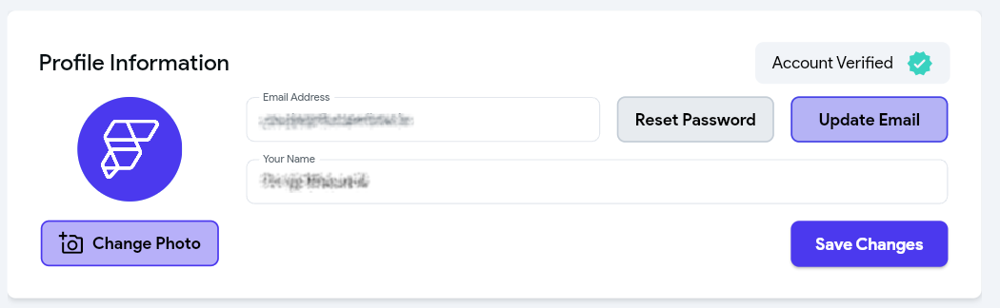
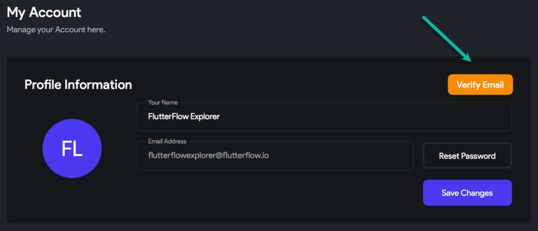
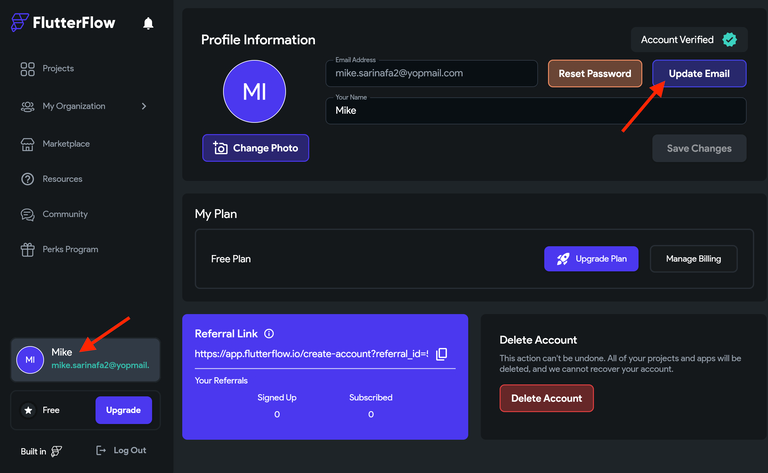

# Account Management
This section contains information on changing your password, verifying your email, and deleting your account.

## Password
### I can't log in to my account / I forgot my login info.

To reset your account password:

- From `flutterflow.io` select Login in the top right corner.

- At the bottom of the page, select Reset Password.

- You will receive an email with a link to reset your password.

- Click the reset link and enter your new password.

If you can’t remember your username or are experiencing any other issues, please reach out to us at support@flutterflow.io

### How Do I Change My Password?

To change your password, please use the following steps:

- Log in to your FlutterFlow account and select Account from the top right.

- Under Personal Info, select Reset Password.

- You will receive an email with a link to reset your password.

- Click the reset link and enter your new password.

## Verify Account
### How Do I Check If My Account Is Verified?
To check if you have verified your account:

1. Log in to your FlutterFlow account and select Account from the top right. 
2. Navigate to the Profile Information section. 
3. If you have a green checkmark next to your email, your account is verified.

### I Didn't Get The Email To Verify My Account / How Do I Resend The Verification Email?
If you did not receive a verification email, please follow these steps:

1. Log in to your FlutterFlow account and select Account from the top right. 
2. Navigate to the Profile Information section and check that your email address is correct. 
3. If your email is incorrect, please reach out to support@flutterflow.io to correct this. 
4. From the Profile Information section, select Verify Email.

You should receive a new confirmation email. If you do not receive the verification email, please contact us at support@flutterflow.io.

## Delete Account
### How Do I Delete My Account
To delete your FlutterFlow account, please follow these steps:

1. Log in to your FlutterFlow account and select Account from the top right.

2. Scroll down to the My Plan section and select Delete Account (bottom right corner)

:::danger
This step can not be undone. We will not be able to recover your projects.
:::

## Change/Update Email Address
### Q: How do I change or update my login email address?
To change your login email in FlutterFlow:

1. Log into your FlutterFlow account. 
2. Go to the dashboard and select your account tile (showing your name and email). 
3. Click on Update Email. 
4. Enter your current email and password. 
5. Input your new email and click Confirm & Log Out. 
6. Verify the new email via the link sent to it. 
7. Now, you need to create a new password for your new email address. To do so, click on the Forgot Password on the login page and enter your new email address. 
8. You'll receive the password reset link at your new email address. Click the link and reset the password.

Now, you are ready to log in with your new email address and password.

