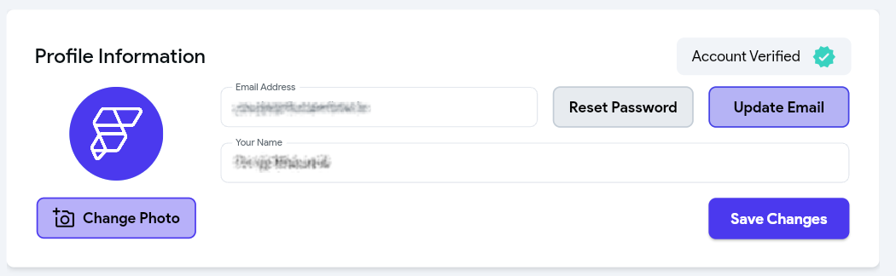
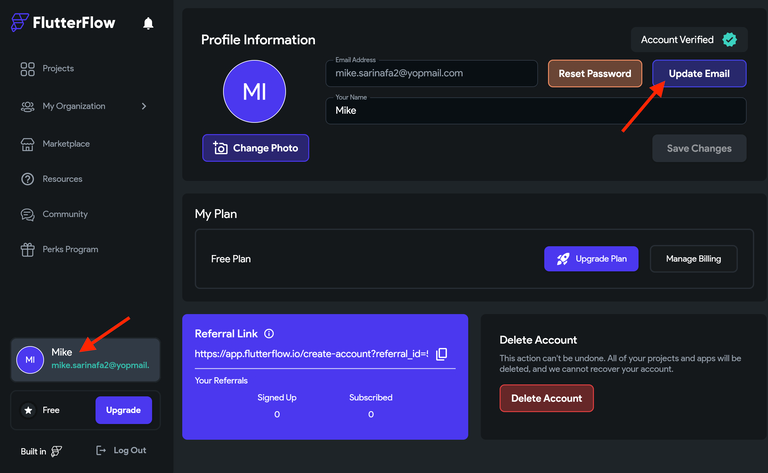

# Account Management
This section contains information on changing your password, verifying your email, and deleting your account.

### I can't log in to my account / I forgot my login info.
To reset your account password:

1. From `flutterflow.io` select Login in the top right corner.
2. At the bottom of the page, select **Reset Password**.
3. You will receive an email with a link to reset your password.
4. Click the reset link and enter your new password.

If you can’t remember your username or are experiencing any other issues, please reach out to us at `support@flutterflow.io`

### How do I change my password?
To change your password, please use the following steps:

1. Navigate to your [account page in FlutterFlow](https://app.flutterflow.io/account).
2. Under Personal Info, select Reset Password.
3. You will receive an email with a link to reset your password.
4. Click the reset link and enter your new password.

### How do I check if my account is verified?
To check if you have verified your account:

1. Navigate to your [account page in FlutterFlow](https://app.flutterflow.io/account).
2. If you have a green checkmark next to your email, your account is verified.

### I didn't get the email to verify my account, how do I resend the verification email?
If you did not receive a verification email, please follow these steps:

1. Navigate to your [account page in FlutterFlow](https://app.flutterflow.io/account).
2. Check that your email address is correct. If your email is incorrect, please reach out to `support@flutterflow.io` to correct this. 
3. From the **Profile Information** section, select **Verify Email**.

You should receive a new confirmation email. If you do not receive the verification email, please contact us at support@flutterflow.io.

### How do I delete my account?
To delete your FlutterFlow account, please follow these steps:

1. Log in to your FlutterFlow account and select **Account** from the top right.
2. Scroll down to the **My Plan** section and select **Delete Account** (bottom right corner)

:::danger
This step can not be undone. We will not be able to recover your projects.
:::

### How do I change or update my email address?
To change your login email in FlutterFlow:

1. Log into your FlutterFlow account. 
2. Go to the dashboard and select your account tile (showing your name and email). 
3. Click on **Update Email**. 
4. Enter your current email and password. 
5. Input your new email and click **Confirm & Log Out**. 
6. Verify the new email via the link sent to it. 
7. Now, you need to create a new password for your new email address. To do so, click on the **Forgot Password** on the login page and enter your new email address. 
8. You'll receive the password reset link at your new email address. Click the link and reset the password.

Now, you are ready to log in with your new email address and password.

### How do I generate an API Token?
An API token is required to use the [CLI](../testing-deployment-publishing/exporting-code/ff-cli.md) and the [Visual Studio Code Extension](../ff-concepts/adding-customization/vscode-extension.md)
.

To create an API token tied to your account:

1. Navigate to your [account page in FlutterFlow](https://app.flutterflow.io/account).
2. Near the bottom of the page, click **Create Token**
