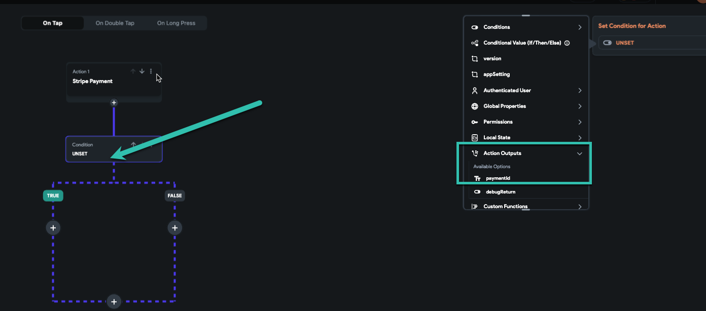
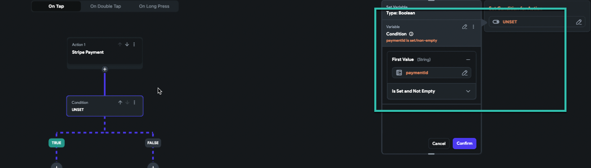

# Check Stripe Payment Status

This article explains how to use output variables in FlutterFlow to determine whether a Stripe payment has succeeded or failed.

:::info[Prerequisites]
- You must have a working Stripe integration in your FlutterFlow project.
- A payment action must be configured in your workflow.
:::

## Understanding Stripe Output Variables

When a Stripe payment is initiated in FlutterFlow, an output variable named `paymentId` is generated by default. This variable holds the ID returned by Stripe after attempting the transaction.

**Steps to Check Payment Status:**

1. **Access the Output Variable**  
   In your Stripe payment action, use the output variable `paymentId`.

2. **Use Conditional Logic**  
   Add a condition to check if `paymentId` is not empty.

   - If `paymentId` is not empty, the payment was successful.
   - If `paymentId` is empty, the payment failed.

    
    
   

3. **Trigger Conditional Actions**  
   Based on the result of the payment check:

   - **If Successful**  
     - Display a confirmation message.
     - Navigate to a success screen.
     - Update the database or send a confirmation email.

   - **If Failed**  
     - Prompt the user to retry.
     - Clear payment input fields.
     - Provide feedback to guide the user.

   

By implementing this logic, you can create a responsive and user-friendly Stripe payment flow in your FlutterFlow app.
