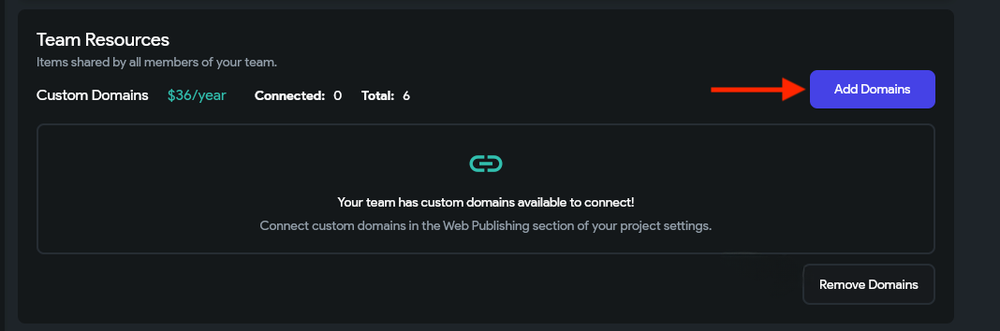
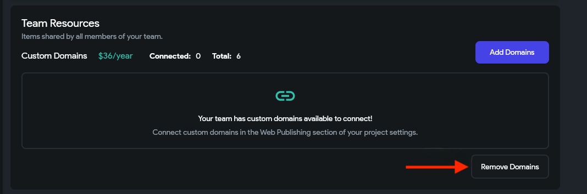

# Manage Custom Domains

Only *Pro* and *Teams* plans include **one** free custom domain. The *Teams* plan comes with one custom domain for the whole team. If you are on the *Standard* plan, you will need to purchase a custom domain, as it is not included in the plan for free.

### How do I purchase additional custom domains?

To purchase domains:

1. *Standard* and *Pro* users can go to their [**account**](https://app.flutterflow.io/account) page, find the **Custom Domains** section, and click the **Add Domains** button.
2. The *Team* owner can buy from the My Organization page.
3. Click **Add Domains** to buy a new one.

:::note
Note that purchasing a domain is not possible during the trial period. If you're interested in obtaining a domain, please reach out to our support team for further assistance.
:::

### How do I remove custom domains?

To remove the custom domain:

1. *Standard* and *Pro* users can go to their [**account**](https://app.flutterflow.io/account) page, find the **Custom Domains** section, and click the **Add Domains** button.
2. The *Team* owner can buy from the My Organization page.
3. Click **Remove Domains** to remove the existing custom domain.

