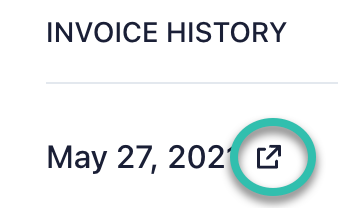

# Update Payment Method After Failed Payment

This article explains how to update your credit card information when a payment fails, ensuring continued access to your FlutterFlow subscription.

:::info[Prerequisites]
You must have an active FlutterFlow account with a failed payment notification.
:::

:::tip[Common Reasons for Payment Failure]
The most common causes of failed payments include:

- Insufficient funds in the account.
- Payment blocked by your credit card provider.
- Expired or invalid credit card.

Contact your card issuer if the reason is unclear.
:::

**Steps to Update Credit Card and Retry Payment:**

    1. Open **My Account** in the FlutterFlow editor.

    2. Select **Manage Billing**.

    3. Scroll to the **Invoice History** section.

    4. Locate the failed invoice at the top of the list and click the **payment icon**.

    

    5. Enter your updated credit card information.

    6. Submit the form to retry the payment.

    Once the payment is successful, your subscription will be restored automatically.

    :::note
    If the payment continues to fail after updating your card, contact support at [support@flutterflow.io](mailto:support@flutterflow.io) for further assistance.
    :::
