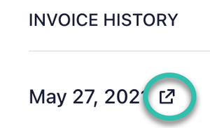

# Payments & Billing
This section contains information on the payment methods we accept and how to change your payment method.

## Invoices
#### Can I Add A Tax ID (e.g. VAT) to my invoice?
If you need to include VAT in your invoices, please reach out to our support team at support@flutterflow.io, and we’ll be happy to assist you with the process.

## Payment Methods
### What payment methods do you accept?
We currently accept Visa, Mastercard, American Express, and JCB.

### Can I use a gift card in addition to my credit card?
At this time we are unable to process Gift Card payments.

### My payment failed, how can I change to a different credit card?

Failed subscription payments happen from time to time. These steps will help you troubleshoot the issue and update your payment method.

:::info
The most common causes for failed payments are insufficient funds, payment blocked by your credit card provider, or an expired card. If your payment fails, please reach out to your credit card provider for more details on why the payment failed.
:::

You can use these steps to update your payment method on an open invoice (where your credit card has not been charged), you can change your payment method using these steps:

1. Head to the [My Account Page](https://app.flutterflow.io/account)
2. Select **Manage Billing**
3. Scroll to **Invoice History**
4. Locate the invoice that failed (should be at the top) and click the icon

5. Enter your updated payment information

Once your updated transaction is successfully completed, your system access will be restored.

### I used the wrong credit card, can I change it?

Once your subscription has been purchased, we unfortunately are unable to change your payment method for this month.

You can change your default payment method for next month's purchase using these steps:

1. After logging into your FlutterFlow, select [“Account”](https://app.flutterflow.io/account) from the top right.
2. In the **My Plan** section, select **Manage Billing.**
3. Scroll down to the **Payment Methods** section.
4. Select **+ New Payment Method,** enter your payment details, and then select **Add.**
5. Remove your old payment method by selecting the three dots to the right of your payment and then selecting **Delete.**

:::note
You can change the default payment method by selecting the three dots next to the payment method and then selecting **Make Default.**
:::