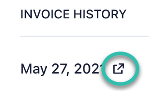

# Payments & Billing
This section contains information on the payment methods we accept and how to change your payment method.

## Invoices
### Add a tax ID
If the billing portal does not let you add the required tax information, contact [FlutterFlow support](mailto:support@flutterflow.io) before the invoice is issued. Tax treatment depends on your billing country and account details.

## Payment Methods
### What payment methods do you accept?
The billing checkout displays the payment methods currently available for your account and region. Commonly supported cards include Visa, Mastercard, American Express, and JCB.

### Can I use a gift card in addition to my credit card?
Gift cards are not supported as a second payment method for a subscription.

### My payment failed, how can I change to a different credit card?

Failed subscription payments happen from time to time. These steps will help you troubleshoot the issue and update your payment method.

:::info
The most common causes for failed payments are insufficient funds, payment blocked by your credit card provider, or an expired card. If your payment fails, please reach out to your credit card provider for more details on why the payment failed.
:::

You can use these steps to update your payment method on an open invoice (where your credit card has not been charged), you can change your payment method using these steps:

1. Head to the [My Account Page](https://app.flutterflow.io/account)
2. Select **Manage Billing**
3. Scroll to **Invoice History**
4. Locate the invoice that failed (should be at the top) and click the icon

5. Enter your updated payment information

After the outstanding transaction succeeds, allow the account page to refresh. If paid access is not restored, contact support with the invoice identifier—never send full card details.

### I used the wrong credit card, can I change it?

Changing the default payment method applies to future charges; it does not move a charge that has already completed to a different card.

You can change your default payment method for next month's purchase using these steps:

1. After logging into your FlutterFlow, select [“Account”](https://app.flutterflow.io/account) from the top right.
2. In the **My Plan** section, select **Manage Billing.**
3. Scroll down to the **Payment Methods** section.
4. Select **+ New Payment Method,** enter your payment details, and then select **Add.**
5. Remove your old payment method by selecting the three dots to the right of your payment and then selecting **Delete.**

:::note
You can change the default payment method by selecting the three dots next to the payment method and then selecting **Make Default.**
:::

## Related documentation

See [Account Management](/accounts-billing/account-management) for a related FlutterFlow workflow.
