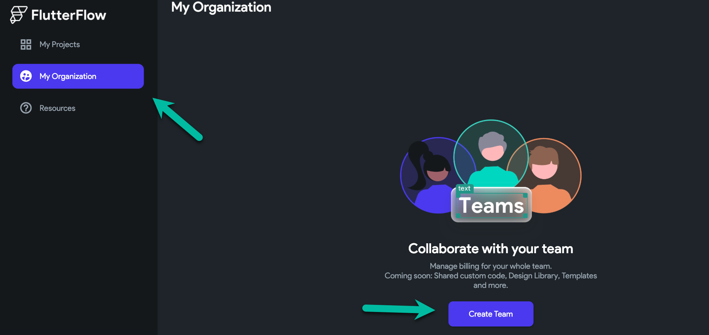
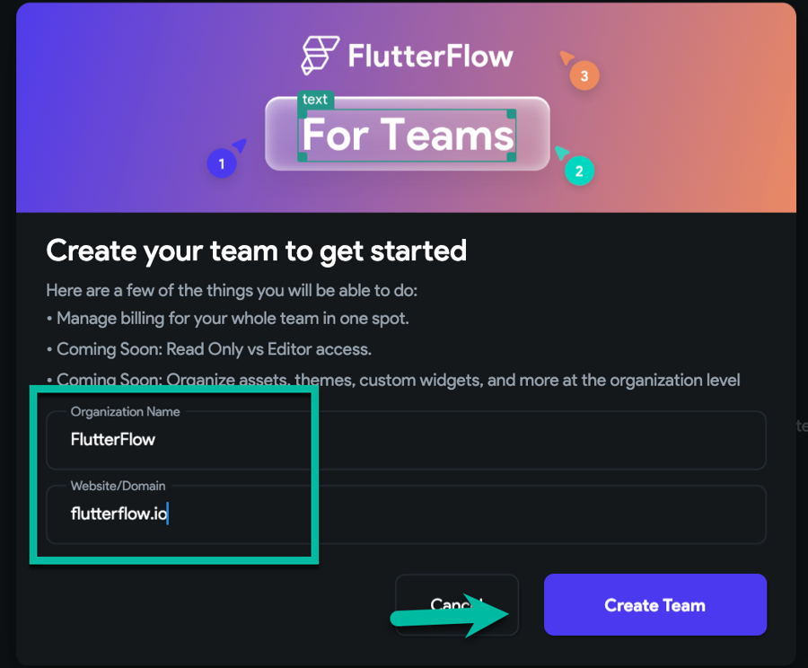
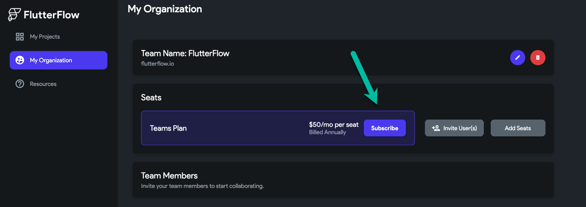
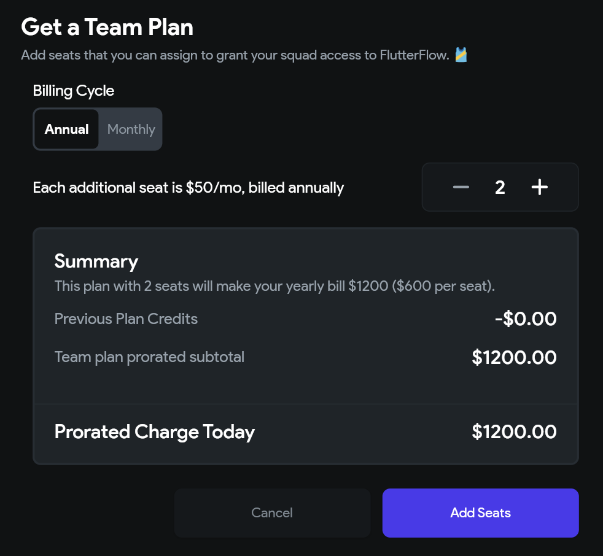
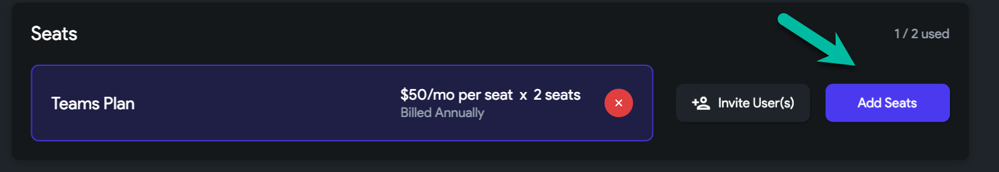
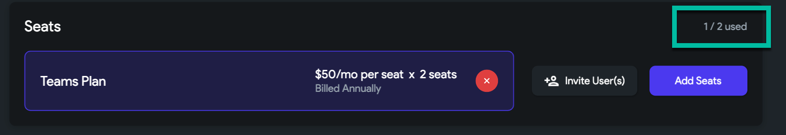
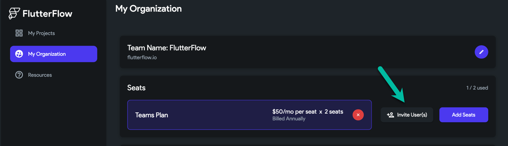
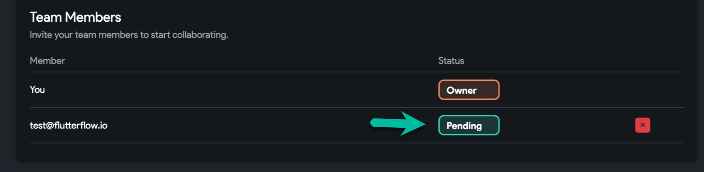
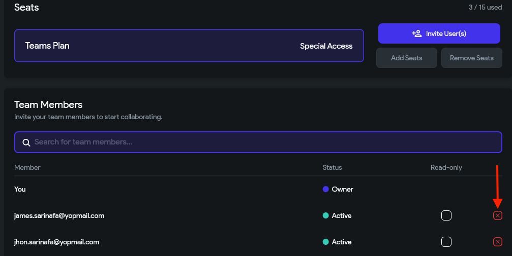
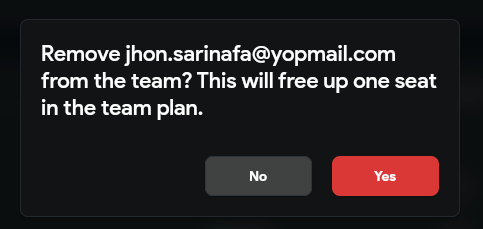

# FlutterFlow For Teams

## How do I upgrade to a Teams plan?

:::info
Teams plans are annual plans and can have up to 20 team members. For an account with more than 20 members, please reach out to sales@flutterflow.io
:::

To change your account to a Teams Plan, please follow these steps:

1. After logging into your FlutterFlow account, head to your account [Dashboard](https://app.flutterflow.io/) and select **My Organization** from the top right.
2. Select **Create Team**.

3. Next, enter your organization name (e.g. FlutterFlow) and your website/email domain (e.g. flutterflow.io) and select **Create Team**.

## How do I add users to my *Teams* plan?

To add users to your Teams plan, you will need to complete two steps:

### 1. Adding seats to your organization

A seat grants one user the ability to use Flutterflow. You will need to purchase a seat for each team member that you would like to add to your Team. To do so:

1. From the **My Organization** tab, select **Subscribe**.

2. A popup will appear, select the number of seats (subscriptions) and Billing Cycle Additional users can be added to your team at any time. **You can select from a monthly or annual plan.**

3. A checkout page will appear for you to complete the purchase. **Please note: this can take a few seconds to load.** If you want to add more seats at a later time, you can do so by selecting the Add Seats button.

:::tip
You can see how many seats you have used here

:::

### 2. Inviting users to your Team

:::warning
If you add an existing Flutterflow user to your Teams plan, they will need to manually cancel their subscription using these [**instructions**](subscriptions.md#cancel-my-plan). Once this is completed, please reach out to support@flutterflow.io or chat to process the refund for any remaining time on your monthly plan. We're working on automating this process soon!
:::

1. After you've purchased your seats, this will be reflected in the **Seats** section under **My Organization** (example below).
2. To invite a new user, select the **Invite User(s)** button.

3. A popup will appear, type the email of the user you would like to add.
4. If they are not an existing user of FlutterFlow, they will be sent an invitation to join.

:::note
* Teams plans do not include a trial period.
* You must verify your email before inviting users.
:::

## Delete users from Teams plan

To remove a user from the teams, click on the **red cancel button** and select **Yes** in the popup to confirm the removal.

<figure>
   
  <figcaption class="centered-caption">Delete users from Teams Plan</figcaption>
</figure>

<figure class="centered-caption">
    
  <figcaption class="centered-caption">Confirmation Popup</figcaption>
</figure>

---

## FAQs

#### Can I reduce my Teams plan to one seat?

No, you can't. The minimum requirement is two seats, which includes one for the owner's pro plan + an additional team seat.

