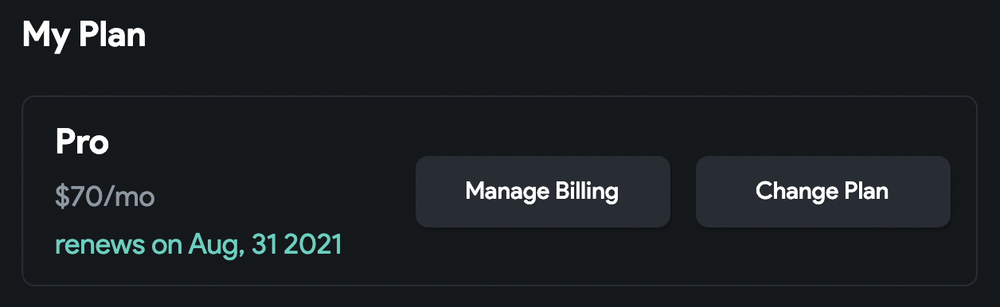

# Other Subscription Questions

### When Will My Plan Renew / When Will I Be Charged?

You can view the next billing cycle date in the "My Plan" section of the [Flutterflow Account Page](https://app.flutterflow.io/account).

<figure>
    
  <figcaption class="centered-caption">The next billing cycle date for this account is August 31, 2021</figcaption>
</figure>

### Do Subscriptions Renew Automatically?

Yes, our subscriptions renew automatically to avoid disrupting your app development. Monthly subscriptions renew on the same day each month (typically the day you subscribed).

### Can I Pause My Subscription?

We do not currently offer the option to pause your subscription.

### Can I Transfer My Subscription To Another User?

We are unable to transfer a paid FlutterFlow subscription to another FlutterFlow account.

### If I have a paid plan will project collaborators be able to use paid features?

FlutterFlow subscriptions are seat based. A user added to your project will only have access to the features of their account plan. In order to access paid features, each individual user will need to have a paid plan.

### If I upgrade from Basic to Growth Plan in the middle of my billing cycle, will I be charged for both plans?

No, you won’t be charged for both plans. FlutterFlow applies a prorated credit for the unused portion of your current plan and deducts it from the cost of the new plan.

For example, if you're on the Basic plan ($39/month) and decide to upgrade to the Growth plan (1st seat: $80/month) halfway through your billing cycle, you’ll receive a credit of about $19.50 for the unused Basic days. This credit will be applied to the new plan, so you’ll only be charged $60.50 for the Growth plan for the rest of the current cycle. On your next billing cycle, you'll be charged the full Growth plan price.

:::info
FlutterFlow provides different pricing options depending on your region. To see the exact prices for your area, visit the [**Plans & Pricing**](../plan-pricing.md) page in our documentation.
:::