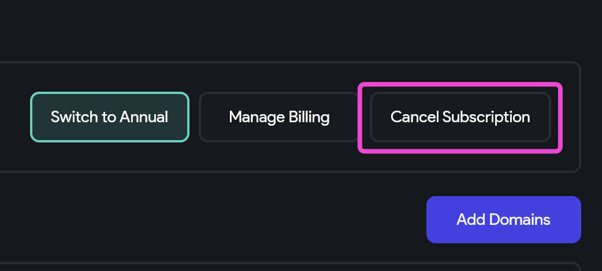
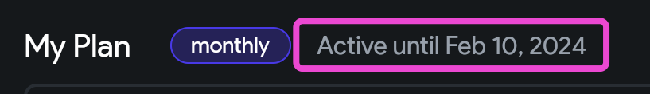
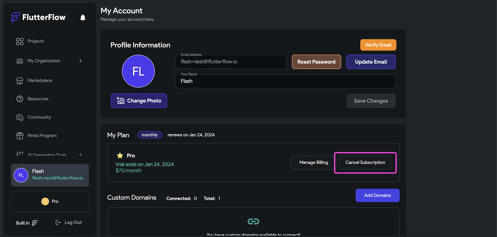
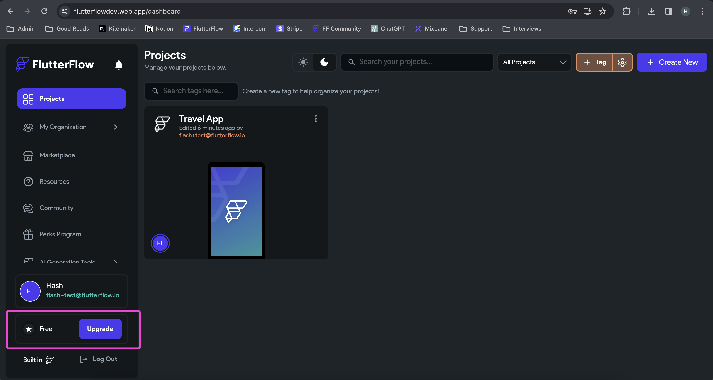
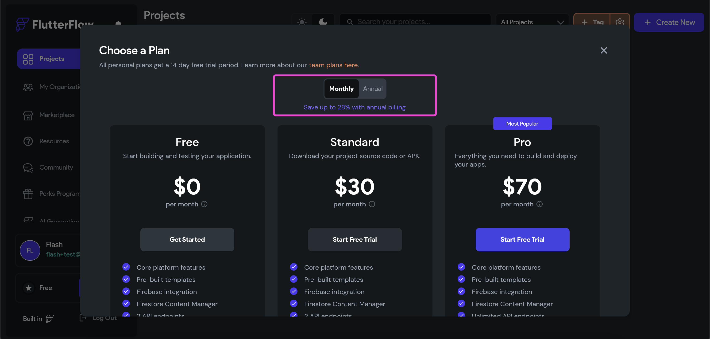
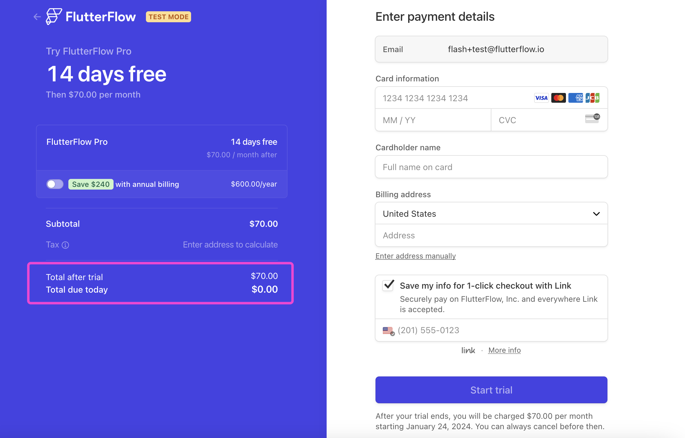

# Subscriptions
This section contains information on free trials, changing your plan, and other subscription questions.

## Free Trials
All paid plans come with a free 14-day trial.

### How do I Start A Free Trial?
To start a free trial, please follow these steps:

1. From flutterflow.io select Create Account in the top right corner. 
2. Enter your name, email address, and password and select Create Account. 
3. Select Upgrade at the top of the screen. 
4. Enter your billing and payment information and select Subscribe.

### What Happens At The End of The Trial Period?
At the end of your trial period, your payment method will be charged. You cancel at any time during the trial period.

## Upgrade Plan

### How do I upgrade my plan?
To upgrade your plan type, please follow these steps:

1. After logging into your FlutterFlow, select “Account” from the top right. 
2. In the My Plan section, select Change Plan. 
3. Select the button under the plan you would like to upgrade to. 
4. Enter your payment information and select Subscribe. The main FlutterFlow page will open.

### How do I check what plan I am subscribed to?
To view your plan details, go to the [**FlutterFlow Account Page**](https://app.flutterflow.io/account) and select **Manage Billing.**

The **Current Plan** section will show which plan you are subscribed to.

:::warning[Teams Plan]
For information on the Teams plan, please use [**this link**](flutterflow-for-teams.md).
:::

## Downgrade Plan
### How to downgrade?
If you wish to downgrade from Pro to Standard or from Teams to Pro or Standard, you should cancel your existing plan and then sign up for the new one after it expires.

### What happens when I downgrade to the free plan? Will my apps be deleted?
You will still be able to access the apps you created and make changes inside FlutterFlow.

However, you won't be able to access any premium features such as custom APIs, GitHub integration, and code downloads. Additionally, premium features will no longer work in Preview and Run Mode.

## Cancel My Plan
You can cancel your plan at any time. You will have access to the paid features until your next billing cycle date.

Please follow these steps to cancel your account:

1. Log in to FlutterFlow and go to the Account page. 
2. Select **Change Plan** from My Plan. 
3. Under your plan type, select **Cancel Plan.** 
4. Complete the Cancellation Survey and select **Cancel Subscription.** 
5. You will be taken to a new page. Under Current Plan select **Cancel**. A popup will appear, select Cancel.

:::note
When you cancel a paid plan, your account will be converted to a Free account.
:::

You can confirm your account has been canceled from the My Plan section of the **[Account Page](https://app.flutterflow.io/account)**. Your account will now say **ends at** vs. **renews at.**

## FAQs

How do I downgrade from a Teams plan to a Pro (or other) plan?

The best way to downgrade from a Teams plan to a different plan is to let your current subscription expire. You can do this by canceling your account to initiate the process.  

1. Click on your name in the bottom-right corner of the screen at [app.flutterflow.io](https://app.flutterflow.io).  

     

2. From the **My Account** page, click **Cancel** in the **My Plan** section. 

     

3. After confirming your cancellation, you will see the expiration date of your subscription displayed in the **My Plan** section.  

     

On the date your plan expires, your account will automatically switch to a **Free plan**. From there, you can upgrade to a **Pro** (or any other plan) by clicking the **Upgrade** button in the bottom-right corner.  

If you need to downgrade from Teams to Pro *immediately*, please contact us at **support@flutterflow.io**.  

How do I cancel my FlutterFlow subscription?

You can cancel your subscription at any time. Once canceled, you will still have access to paid features until your current billing cycle ends. After that, your account will automatically be converted to a **Free plan**.

### Steps to cancel your subscription

1. Log in to **[FlutterFlow](https://app.flutterflow.io)**.  
2. Click on your **name/profile** in the bottom-right corner.  
3. On the **My Account** page, go to the **My Plan** section.  
4. Click **Cancel Subscription**.  
     
5. Complete the **Cancelation Survey** and select **Cancel Subscription** to confirm.  

Once complete, you’ll see a confirmation. The **My Plan** section will display:  
> **Active until [date]**  

This indicates your plan will remain active until the end of the billing cycle, after which your account will downgrade to the Free plan.  

How do I upgrade to a paid plan?

To change your plan type, follow these steps:

1. Login to your account and visit **[app.flutterflow.io](https://app.flutterflow.io)**.
2. In the bottom right-hand corner, click **Upgrade**. 

   

3. In the popup, choose your preferred plan. You can select **Monthly** or **Annual** billing.  
   - Annual plans save up to 28%.  
   - A 14-day free trial is available for new users on personal plans (Teams plans are not eligible).  

   

4. Complete the payment page.  
   - A card is required, but you can cancel anytime.  
   - Trial users will see **Total due today = $0**.  

   

5. Once confirmed, you’ll return to [app.flutterflow.io](https://app.flutterflow.io), where your new plan type will be shown in the bottom right corner.

What happens when I downgrade from a paid plan to a free plan?

When you cancel your FlutterFlow subscription, your account will automatically change to a **Free account**.

You will still be able to access the apps you created and make changes inside of FlutterFlow.

However, you won't be able to access any premium features such as:

- Custom APIs  
- GitHub integration  
- Codemagic  
- Code downloads  

Additionally, premium features will no longer work in **Preview** and **Run Mode**.

:::note
Downgrading from a paid plan to a free plan will **not** affect apps you’ve already deployed to Google Play or the App Store.  
Your projects remain stable, and you can upgrade again at any time to regain access to premium features.
:::

