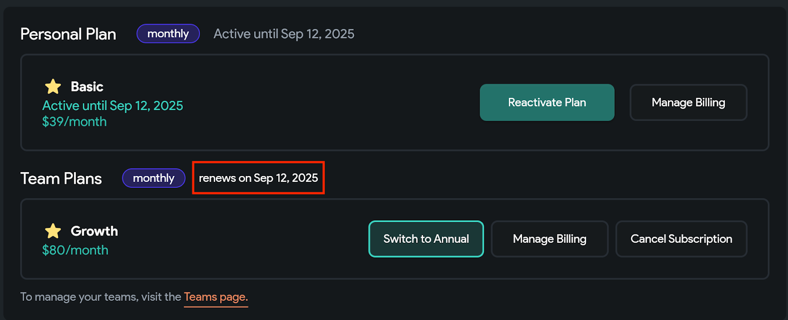

# Subscriptions
This section provides information on free trials, plan changes, and other subscription-related questions.

## Free Trials

The first paid plan you purchase will come with a free 14-day trial. For 14 days, you will have access to the features of the plan you selected before you are charged. If you can cancel your subscription during this 14-day trial, you will not be charged.

:::info

The 14-day trial applies only to your first paid plan. Any later plan (Basic, Growth, or Business) won’t include a trial, even if the first plan is still in trial.

:::

### How do I start a free trial?

To start a free trial, please follow these steps:

1. Navigate to [app.flutterflow.io](http://app.flutterflow.io/)
2. Click the “Create Account” text and enter your name, email address, and password. Then press the “Create Account” button to create your account.
3. Validate your email address by clicking on the link in the message sent to the email address you provided.
4. To start trialing on a **Basic** plan, click on your profile picture in the bottom left corner, then click “Upgrade Plan.” Select “Start Free Trial” and fill out and submit the form with your payment information.
5. To instead start trialing on a **Growth** or **Business** plan, click “My Team”, and create a team. Then press the “Subscribe” button, select your desired plan and number of seats, click on “Start Free Trial”, and fill out and submit the form with your payment information.

### What happens at the end of the trial period?

At the end of your trial period, your payment method will be charged. You can cancel at any time during the trial period.

## Upgrade Plan

### How do I upgrade my plan?

If you would like to upgrade from a Basic plan, follow the steps to purchase a new Growth or Business plan, and then cancel your existing Basic plan if you no longer want it.

To upgrade a team directly from a Growth plan to a Business plan, please follow these steps:

1. Click on “My Team” and select the team that has the Growth plan you wish to upgrade.
2. Click on “Upgrade to Business Plan” near the top right corner.
3. View the invoice and confirm that you are willing to be charged this amount for the upgrade.

### How do I check what plan I am subscribed to?

To view your plan details, go to the [**FlutterFlow Account Page**](https://app.flutterflow.io/account) and select **Manage Billing.** The **Current Plan** section will show which plan(s) you are subscribed to.

## Downgrade Plan

### How to downgrade?

If you wish to downgrade from Growth to Basic or from Business to Growth or Basic, you should cancel your existing plan and then sign up for the new one after it expires.

### What happens when I downgrade to the free plan? Will my projects be deleted?

On the free plan, you will be restricted to two projects. Any other projects won't be deleted, but will be archived and made accessible if you return to any paid plan.

## Cancel My Plan

You can cancel your plan at any time. You will have access to the paid features until your next billing cycle date.

Please follow these steps to cancel your account:

1. Log in to FlutterFlow and click on your profile picture to go to the Account page.
2. Find the plan you want to cancel, and select **Cancel Plan**.
3. Complete the Cancellation Survey and select **Cancel Subscription.**

:::warning

Your FlutterFlow account can have multiple team plans and a personal plan at the same time; you must cancel each plan manually. Canceling one plan does not automatically cancel any other active plan.

:::

## Other Subscription Questions

### When will my plan renew / When will I be charged?

You can view the next billing cycle date in the "My Plan" section of the [Flutterflow Account Page](https://app.flutterflow.io/account).

The next billing cycle date for this plan is September 12, 2025.

### Do subscriptions renew automatically?

Yes, our subscriptions renew automatically to avoid disrupting your app development. Monthly subscriptions renew on the same day each month (typically the day you subscribed).

### Can I pause my subscription?

We do not currently offer the option to pause your subscription.

### Can I transfer my subscription to another user?

We are unable to transfer a paid FlutterFlow subscription to another FlutterFlow account.

### If I have a paid plan, will project collaborators be able to use paid features?

No. Having a paid plan yourself does not give your project collaborators access to paid features. Starting **September 17, 2025**, all collaboration must happen within a **Growth, Business, or Enterprise plan**, and every collaborator must have a **paid seat** in that team to have full edit access. Anyone not on your team will be switched to **view-only** until added as a paid team member.

### If I upgrade from the Growth Plan to the Business Plan in the middle of my billing cycle, will I be charged for both plans?

Upgrades are automatic, so the system will count the remaining days from the Growth plan and reduce it from the Business Plan price.

For example, if you paid $80 for Growth and you have 15 days remaining in the billing cycle, then on upgrading to Business (let's say priced at $150), you will eventually pay $(150-40) = $110.

:::info

FlutterFlow provides different pricing options depending on your region. To see the exact prices for your area, visit the [**Plans & Pricing**](../plan-pricing.md) page.

:::