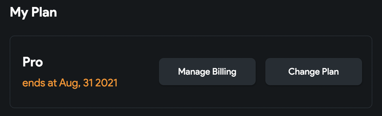

# Subscriptions
This section contains information on free trials, changing your plan, and other subscription questions.

## Free Trials
All paid plans come with a free 14-day trial.

### How do I Start A Free Trial?
To start a free trial, please follow these steps:

1. From flutterflow.io select Create Account in the top right corner. 
2. Enter your name, email address, and password and select Create Account. 
3. Select Upgrade at the top of the screen. 
4. Enter your billing and payment information and select Subscribe.

### What Happens At The End of The Trial Period?
At the end of your trial period, your payment method will be charged. You cancel at any time during the trial period.

## Upgrade Plan

### How do I upgrade my plan?
To upgrade your plan type, please follow these steps:

1. After logging into your FlutterFlow, select “Account” from the top right. 
2. In the My Plan section, select Change Plan. 
3. Select the button under the plan you would like to upgrade to. 
4. Enter your payment information and select Subscribe. The main FlutterFlow page will open.

### How do I check what plan I am subscribed to?
To view your plan details, go to the [**FlutterFlow Account Page**](https://app.flutterflow.io/account) and select **Manage Billing.**

The **Current Plan** section will show which plan you are subscribed to.

:::warning[Teams Plan]
For information on the Teams plan, please use [**this link**](flutterflow-for-teams.md).
:::

## Downgrade Plan
### How to downgrade?
If you wish to downgrade from Pro to Standard or from Teams to Pro or Standard, you should cancel your existing plan and then sign up for the new one after it expires.

### What happens when I downgrade to the free plan? Will my apps be deleted?
You will still be able to access the apps you created and make changes inside FlutterFlow.

However, you won't be able to access any premium features such as custom APIs, GitHub integration, and code downloads. Additionally, premium features will no longer work in Preview and Run Mode.

## Cancel My Plan
You can cancel your plan at any time. You will have access to the paid features until your next billing cycle date.

Please follow these steps to cancel your account:

1. Log in to FlutterFlow and go to the Account page. 
2. Select **Change Plan** from My Plan. 
3. Under your plan type, select **Cancel Plan.** 
4. Complete the Cancellation Survey and select **Cancel Subscription.** 
5. You will be taken to a new page. Under Current Plan select **Cancel**. A popup will appear, select Cancel.

:::note
When you cancel a paid plan, your account will be converted to a Free account.
:::

You can confirm your account has been canceled from the My Plan section of the **[Account Page](https://app.flutterflow.io/account)**. Your account will now say **ends at** vs. **renews at.**

