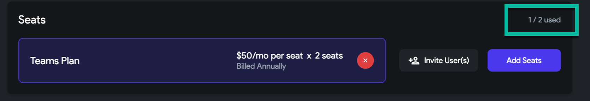
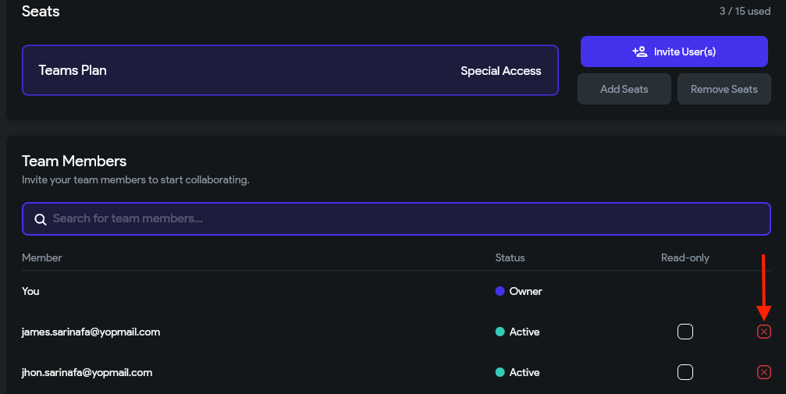

# Manage FlutterFlow Subscription

This guide covers everything you need to know about managing your FlutterFlow subscription, including starting a trial, upgrading to a paid or Teams plan, downgrading to the free plan, and canceling your subscription.

## Free Trial

All **Personal** and **Pro** plans come with a 14-day free trial.

   - **Start a Free Trial**

      Follow these steps to begin your trial:

      1. Visit **[flutterflow.io](https://flutterflow.io)** and click **Create Account**.
      2. Fill in your name, email, and password.
      3. After creating your account, click **Upgrade** at the top of the dashboard.
      4. Enter billing information and select **Subscribe**.

   - **End of Trial Period**

      When your 14-day trial ends, your saved payment method will be charged. You can cancel anytime during the trial to avoid being charged.

      :::note
      The Teams Plan is not eligible for a free trial.
      :::

## Upgrade to a Paid Plan

   You can upgrade your FlutterFlow subscription directly within the platform.

   :::info[Prerequisites]
   You must be logged in to your FlutterFlow account.
   :::

   - **Upgrade from Free Plan**

      1. Go to **[app.flutterflow.io](https://app.flutterflow.io)** and log in.
      2. Click the **Upgrade** button in the bottom-right corner.

         

      3. Select your preferred plan and billing cycle (monthly or annual).

         

      4. On the payment screen, enter your card details. If eligible, it will show **Total due today: $0**.

         

      5. After confirming payment, you’ll return to the dashboard, and your active plan will appear in the corner.

      :::note
      Annual billing offers up to 28% in savings. Subscriptions can be canceled anytime in **Account Settings**.
      :::

   - **View Current Plan**

      Go to the **[FlutterFlow Account Page](https://app.flutterflow.io/account)** and select **Manage Billing** to see your current subscription.

## Upgrade to Teams Plan

   The **Teams Plan** enables real-time collaboration, Git-style branching, and audit logs.

   :::info[Prerequisites]
   - Must be logged into FlutterFlow
   - Teams Plan requires at least 2 seats
   :::

   - **Steps to Upgrade to Teams**

      1. Go to the dashboard and click **My Organization** from the left sidebar.
      2. Click **Create Team**, enter your company details, then select **Create Team**.

           

         

      3. In **My Organization**, click **Subscribe**.

         

      4. Select the number of seats and choose your billing cycle.

         

         

      5. After subscribing, you can monitor seat usage.

         

      6. Invite team members by clicking **Invite User(s)** and entering their emails.

          

         

         :::tip
         If a user has a personal plan, they must cancel it before joining the team. Afterward, email [support@flutterflow.io](mailto:support@flutterflow.io) to request a refund.
         :::

   - **Remove Users from Your Team**

      1. Click the red **Cancel** icon beside a team member.
      2. Confirm the removal in the popup.

          

         

         :::info
         - Teams Plans are billed annually.
         - Up to 20 users per plan; contact [sales@flutterflow.io](mailto:sales@flutterflow.io) for more.
         - Switching to Teams ends any active Pro/Standard trial.
         :::

## Cancel Subscription

   You can cancel your subscription at any time and continue to use paid features until the billing period ends.

   :::info[Prerequisites]
   You must be logged into your FlutterFlow account.
   :::

   - **Cancel from Account Settings**

      1. Log in and click your name in the bottom-right to open **My Account**.

         

      2. In the **My Plan** section, click **Cancel Subscription**.

         

      3. Complete the cancellation survey and confirm.

         :::note
         Your plan remains active until your billing cycle ends. After that, you’ll be switched to the Free plan.
         :::

         You’ll see a status like **Active until [date]** under your plan.

         

## Downgrade to Free Plan

   When you cancel a paid plan, your account is automatically downgraded to Free once your billing cycle ends.

   - **Changes After You Downgrade**

      - **Plan Change**: You switch to the Free tier automatically.
      - **App Access**: You can still access and edit your projects.
      - **Feature Restrictions**:
      - No custom APIs
      - No GitHub integration
      - No Codemagic builds
      - No code download/export
      - No access to premium widgets

   - **Preview & Run Mode Limits**: Premium features won’t work in preview or run mode.

      :::note
      Live apps in app stores remain unaffected. You can restore full access by upgrading your plan again.
      :::

## Downgrade from Teams Plan

   To leave the Teams Plan, cancel the subscription from your **My Account** page.

   - **Cancel Teams Plan**

      1. In FlutterFlow, click your name at the bottom right.

         

      2. Go to **My Plan** and click **Cancel Subscription**.

         

      3. After cancellation, your Teams subscription will remain active until expiration.

         

   - **After Teams Plan Expires**

      Once expired, your account will be downgraded to the Free Plan automatically.

      To switch to another plan (e.g., Pro or Standard) **before** the Teams Plan expires, contact [support@flutterflow.io](mailto:support@flutterflow.io).

