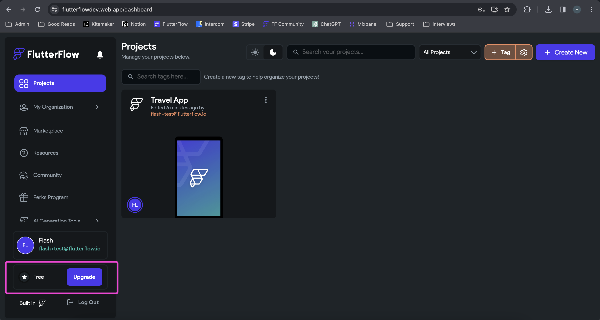

# Upgrade to a Paid Plan

This article explains how to upgrade your FlutterFlow subscription from the free tier to a paid plan.

:::info[Prerequisites]
You must be logged in to your FlutterFlow account.
:::

**Steps to Upgrade Your Subscription:**

    1. Go to **[app.flutterflow.io](https://app.flutterflow.io)** and log in to your account.

    2. Click the **Upgrade** button in the bottom-right corner of the screen.

        

    3. In the pop-up window, select your preferred subscription plan.

        - Review the benefits listed under each option.
        - Choose between **Monthly** or **Annual** billing.
        - Annual billing offers up to 28% savings compared to monthly plans.

        

        :::note
        The Teams plan is not eligible for the 14-day free trial.
        :::

    4. After selecting a plan, you will be redirected to the payment page.

        - A valid credit or debit card is required.
        - If eligible, your trial will show **Total due today: $0**.

        

    5. After confirming payment, you will be redirected back to the app.

        - Your active plan will be displayed in the bottom-right corner.

:::info[Additional Information]
- Subscriptions can be cancelled at any time through **Account Settings**.
- The free trial is only available for **Personal** and **Pro** plans.
:::
