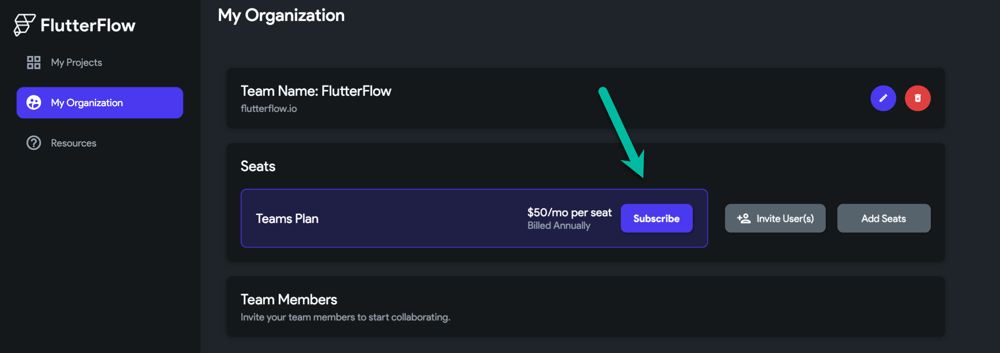
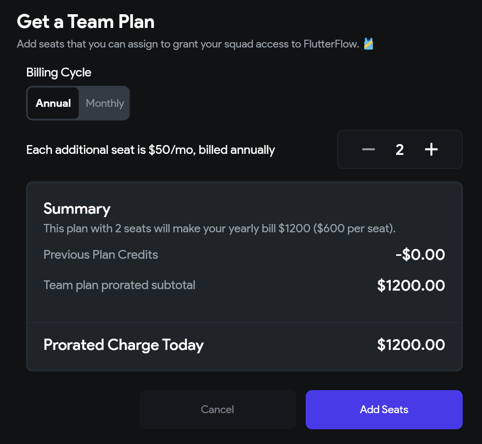
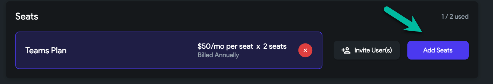
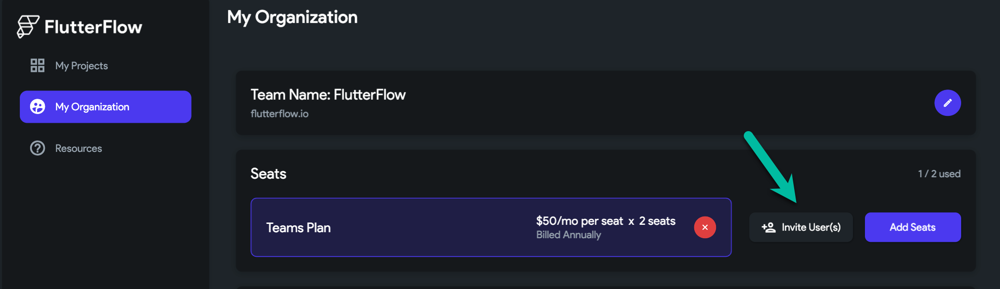

# Upgrade to Teams Plan

The **Teams Plan** enables collaborative real-time development with team members and includes features such as audit logs and Git-style visual branching.

:::info[Prerequisites]
You must be logged in to a FlutterFlow account. A minimum of two seats is required to activate the Teams Plan.
:::

**Steps to Upgrade to the Teams Plan:**

    1. **Open My Organization**  
    From the FlutterFlow dashboard, click **My Organization**.

    2. **Create a Team**  
    Click **Create Team**, then enter your organization name (e.g., My Company) and email domain (e.g., mycompany.com).  
    Click **Create Team** to proceed.

      
    

    3. **Subscribe to Teams Plan**  
    From the **My Organization** tab, click **Subscribe**.

    

    4. **Select Seats and Billing Cycle**  
    Choose the number of seats and select **Monthly** or **Annual** billing.  
    A seat grants access to one team member.

    

    The checkout screen may take a few seconds to load.

    

    5. **Monitor Seat Usage**  
    After subscribing, you can view your used and available seats.

    

    6. **Invite Users to Your Team**  
    Click **Invite User(s)** and enter their email address.  
    New users will receive an invite; existing users must cancel any active subscription before joining.

      
    

    :::tip
    If you add an existing FlutterFlow user to your team, they must cancel their personal subscription. After cancellation, contact [support@flutterflow.io](mailto:support@flutterflow.io) to request a refund for any remaining time on their monthly plan.
    :::

## Removing Users from a Team

    To remove a user from your team:

    1. Click the **red cancel button** next to their name.  
    2. Confirm removal in the popup.

      
    

:::note
Teams Plans are billed annually and support up to 20 users. For plans exceeding 20 seats or companies with over $10 million in annual revenue, contact [sales@flutterflow.io](mailto:sales@flutterflow.io).
:::

:::info
- Teams Plans do not include a free trial.
- Upgrading to Teams will cancel any active trial on Standard or Pro plans.
- Additional seats can be added at any time.
:::
