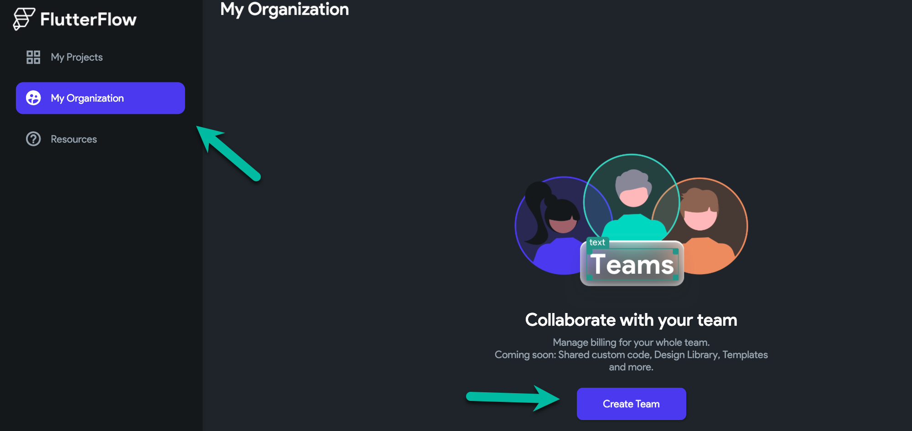
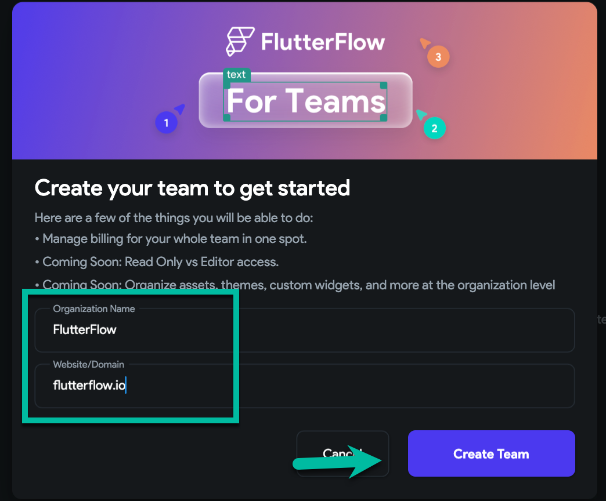
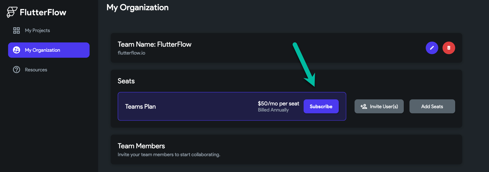
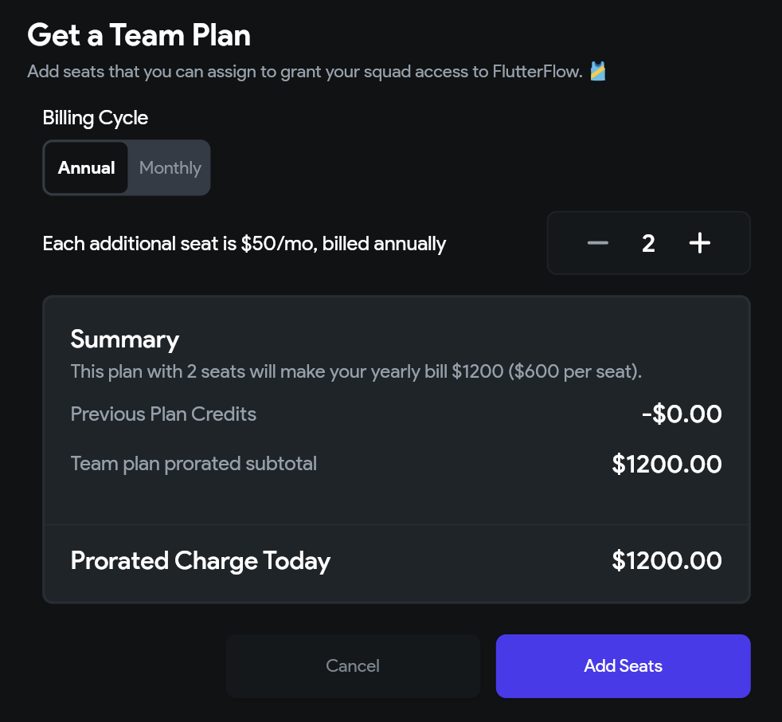
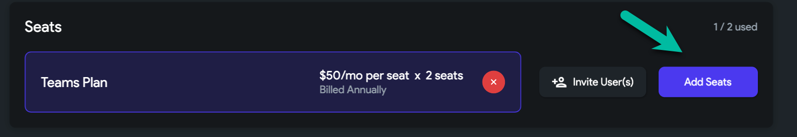
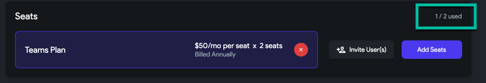
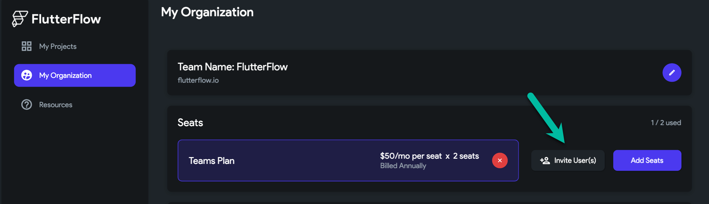
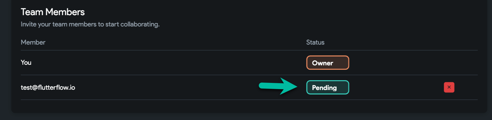
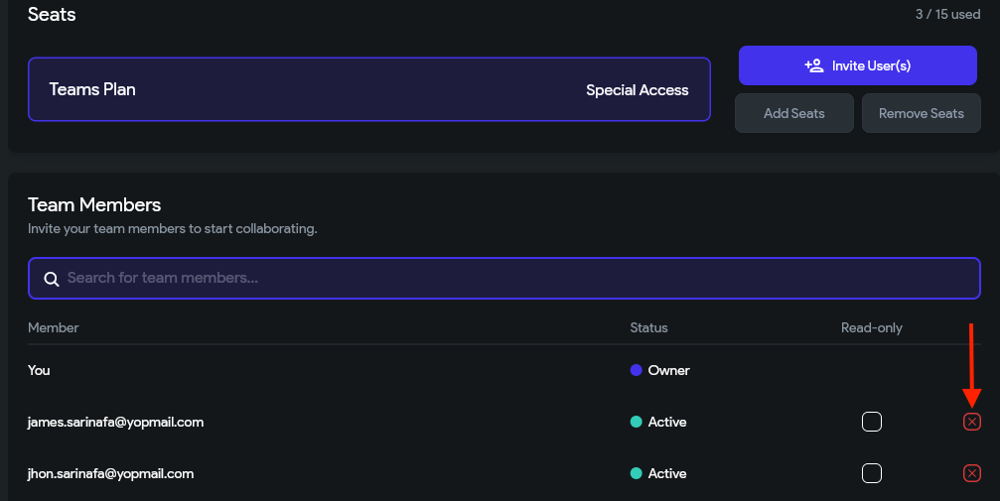
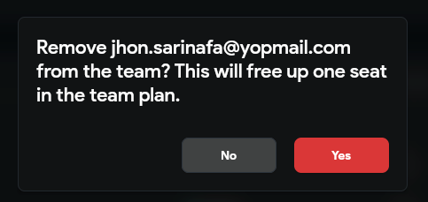

# Upgrade to Teams Plan

The Teams Plan enables real-time collaborative development with multiple team members and includes features such as audit logs and Git-style visual branching.

:::info[Prerequisites]
- You must be logged into a FlutterFlow account. 
- A minimum of two seats is required to activate the Teams Plan.
:::

Follow these steps to upgrade from a Pro Plan to a Teams Plan:

1. **Open My Organization**  
   From the FlutterFlow dashboard, click **My Organization** in the left sidebar.

2. **Create a Team**  
   Click **Create Team**, enter your organization name and email domain (e.g., `mycompany.com`), and select **Create Team**.

    

   

3. **Subscribe to Teams Plan**  
   In the **My Organization** tab, click **Subscribe**.

   

4. **Select Seats and Billing Cycle**  
   Choose the number of seats (one seat per team member) and select a billing cycle: **Monthly** or **Annual**.

   

   The checkout page may take a few seconds to load.

   

5. **Monitor Seat Usage**  
   After subscribing, view how many seats are used and how many are available.

   

6. **Invite Users to the Team**  
   Click **Invite User(s)** and enter the email addresses of team members.

     

   

   :::tip
   If the invited user already has a personal FlutterFlow subscription, they must cancel it before joining. After cancellation, contact [support@flutterflow.io](mailto:support@flutterflow.io) to request a refund for any remaining subscription time.
   :::

**Remove Users from the Team**

To remove a user from your team:

    1. Click the **red cancel button** next to their name.  
    2. Confirm the action in the popup.

      
    

:::info
- Teams Plans are billed annually and support up to 20 users.
- For more than 20 seats or organizations with over $10 million in annual revenue, contact [sales@flutterflow.io](mailto:sales@flutterflow.io).
:::

:::note
- The user removal takes effect immediately and frees up a seat for reassignment.
- Teams Plans do not include a free trial.
- Upgrading to a Teams Plan cancels any existing trial on Standard or Pro plans.
- Additional seats can be added at any time.
:::

