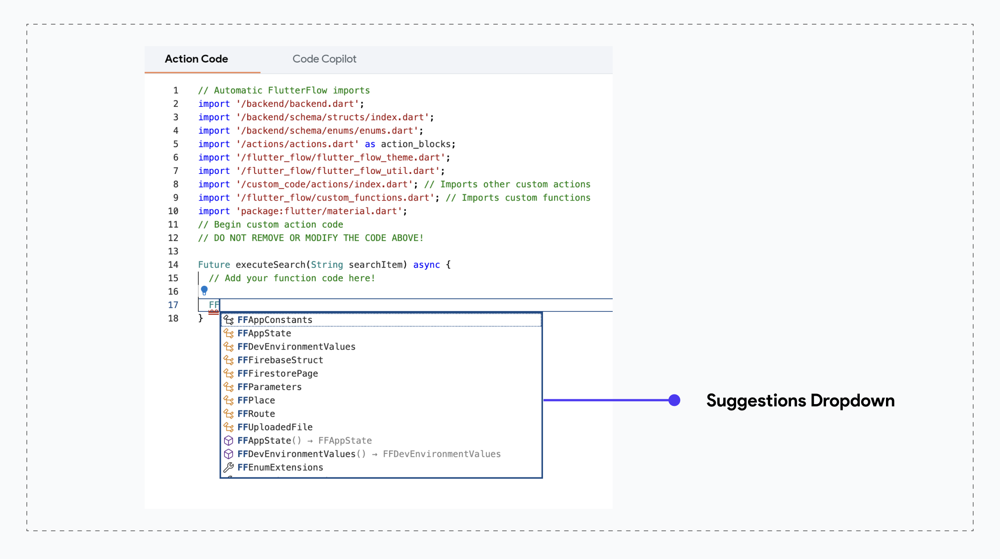
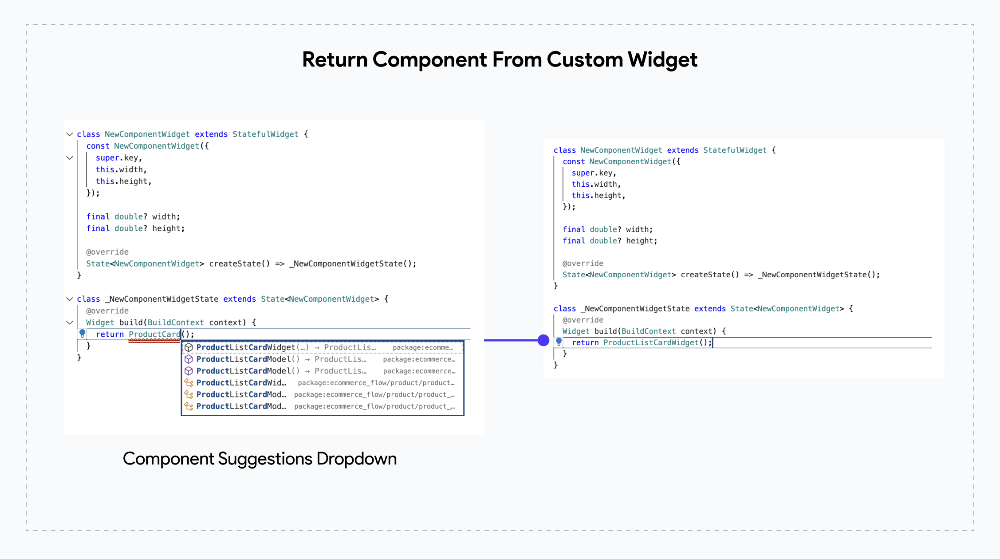

# Common Code Examples

The custom code feature in FlutterFlow allows you to extend functionality by accessing generated classes and modifying global variables like App States and FlutterFlow themes. This guide covers common scenarios where you can leverage custom code to enhance your project by working directly with data models and other resources within your code.

:::warning[Disclaimer]
Custom Functions cannot import new files or packages outside of the default dedicated imports. Therefore, most of the suggestions below that involve adding a new import will not work in Custom Functions due to this restriction. However, they will work for Custom Widgets and Custom Actions.

For example, a new [**Custom Function**](custom-functions.md) typically includes the following packages and files. Your custom function code changes should use only these packages & files:

```js
import 'dart:convert';
import 'dart:math' as math;

import 'package:flutter/material.dart';
import 'package:google_fonts/google_fonts.dart';
import 'package:intl/intl.dart';
import 'package:timeago/timeago.dart' as timeago;
import 'lat_lng.dart';
import 'place.dart';
import 'uploaded_file.dart';
import '/backend/backend.dart';
import 'package:cloud_firestore/cloud_firestore.dart';
import '/backend/schema/structs/index.dart';
import '/backend/schema/enums/enums.dart';
import '/auth/firebase_auth/auth_util.dart';
```

::: 
### Access FlutterFlow Generated Classes

FlutterFlow generates a complete Flutter codebase for you as you build apps in its platform. Part of this code includes custom classes that are designed to streamline common tasks and encapsulate reusable properties or logic.

For example:

- **Button Widgets:** FlutterFlow provides custom button classes like `FFButton` that come with built-in styling and behaviors.
- **Google Places:** The `FFPlace` class encapsulates properties of a Google Place, such as name, address, and coordinates.
- **File Uploads:** The `FFUploadedFile` class represents files uploaded to your app, encapsulating properties like the file name, bytes, and URL.


:::tip[What is a Class?]
In programming, a class is a blueprint for creating objects. It defines properties (data) and methods (functions) that belong to objects of that type. 

For example,

- A `Car` class might have properties like `color` and `speed` and methods like `drive()` and `stop()`.
- In FlutterFlow, a class like `FFPlace` might have properties like `address` and `latLng`, and methods to manipulate or retrieve these values. 
:::

These custom FlutterFlow classes in the generated code are mostly prefixed with `FF<ClassName>` or `FlutterFlow<ClassName>`. If you need to access these classes in your custom code, simply type "FF" or "FlutterFlow" in the code editor to locate them quick.




### Leveraging Components in Custom Widget 

:::warning[Static Components vs Dynamic]
Use this approach only when the component is a fixed element that does not change across different use cases. If the child component needs to change based on user choices, pass it directly [**as a parameter**](custom-widgets.md#creating-a-new-custom-widget).
:::

In a **[Custom Widget](custom-widgets.md)**, you can integrate a previously built **[FlutterFlow Component](../../resources/ui/components/intro-components.md)** directly, saving you from recreating child content in code. For example, if you’re building a Custom Widget to display custom dialog boxes or bottom sheets using a package from 
[pub.dev](custom-code.md#pubdev), you can simply return an existing Component created on the canvas, rather than coding a new one from scratch.

:::tip[Imports]
When referencing a Component class in your code, FlutterFlow will automatically add the necessary import statement.
:::





### Get FlutterFlow Theme in Custom Widget

When building custom widgets, you often need to style parts of the widget, such as setting colors. Instead of using hardcoded color values, you can directly access the **FlutterFlow Theme**. This theme provides consistent styling across your app and reflects colors set by you or your project developer.

To access theme colors in your custom widget, use the `FlutterFlowTheme.of(context)` method. This allows you to retrieve any theme property, such as the default `primary`, `primaryBackground`, or other custom-created colors, as well as text styles like `bodyLarge` or `bodyMedium`, ensuring that your custom widget aligns with the app’s overall theme.

Here’s an example of how to use the primary color from FlutterFlow Theme in a custom widget:

:::tip[Imports]
Ensure you import `import '../flutter_flow/flutter_flow_theme.dart';` when accessing `FlutterFlowTheme` in your custom widgets.
:::


```js
class CustomButton extends StatefulWidget {
  final String label;

  CustomButton({required this.label});

  @override
  _CustomButtonState createState() => _CustomButtonState();
}

class _CustomButtonState extends State<CustomButton> {
  bool isPressed = false;

  void toggleButton() {
    setState(() {
      isPressed = !isPressed;
    });
  }

  @override
  Widget build(BuildContext context) {
    return ElevatedButton(
      style: ElevatedButton.styleFrom(
        backgroundColor: isPressed
            ? FlutterFlowTheme.of(context).primary // Primary color when pressed
            : FlutterFlowTheme.of(context).secondaryBackground, // Default color
        foregroundColor: FlutterFlowTheme.of(context).secondaryText, // Text color
      ),
      onPressed: toggleButton,
      child: Text(
        widget.label,
        style: FlutterFlowTheme.of(context).bodyText1, // Themed text style
      ),
    );
  }
}
```


### Modifying AppState from Custom Code

In FlutterFlow, you can access or update AppState directly from the Action Flow Editor. However, certain scenarios may require you to access or modify AppState within custom code for more control over the operation flow. The `FFAppState` class also provides additional helper functions to modify AppState values. Let’s look at some examples: 

:::tip[Imports]
Ensure you import `import '../../flutter_flow/flutter_flow_util.dart';` when accessing `FFAppState` in custom code resources.
:::

- **Get AppState value in Custom Code** 

```js

Future getCartItems() async {
  // Retrieve the current cart items from AppState
  final currentCartItems = FFAppState().cartItems;
  print('Current Cart Items: $currentCartItems');
}
```

- **Updating AppState Values in Custom Code**

```js
Future enableDarkMode() async {
  // Enable dark mode in AppState
  FFAppState().update(() {
    FFAppState().enableDarkMode = true;
  });
  print('Dark mode enabled');
}
```

- **Modifying a List in AppState Using Helper Functions**

The `FFAppState` class offers a variety of helper functions to easily manage list variables in AppState. For a detailed overview of this generated class, check out **[this guide](../../generated-code/ff-app-state.md#managing-appstatelist)**. Here are some examples of how to use these helper functions to modify an AppState list variable:

```js
Future addLocation(LatLng value) async {
  // Add a new location to the LatLng list
  FFAppState().addToLatLngList(value);
}

Future removeLocation(LatLng value) async {
  // Remove a specific location from the LatLng list
  FFAppState().removeFromLatLngList(value);
}

Future removeLocationAtIndex(int index) async {
  // Remove a location at a specific index from the LatLng list
  FFAppState().removeAtIndexFromLatLngList(index);
}

Future updateLocationAtIndex(int index, LatLng Function(LatLng) updateFn) async {
  // Update a location at a specific index in the LatLng list
  FFAppState().updateLatLngListAtIndex(index, updateFn);
}

Future insertLocationAtIndex(int index, LatLng value) async {
  // Insert a new location at a specific index in the LatLng list
  FFAppState().insertAtIndexInLatLngList(index, value);
}
```


### Leverage Custom Data Types
When you create a custom data type in FlutterFlow, it **[generates a corresponding `<Name>Struct` class](../../generated-code/custom-data-type-gen.md)**. In FlutterFlow's custom code, you can create new instances of such data types, pass instances back into an action, or manipulate and retrieve information from existing objects. Here are some examples to help illustrate working with an example `ProductStruct` class.

#### Example 1: Creating a new Instance of `ProductStruct`
To create a new `ProductStruct` instance, initialize it with the required properties:

```js
// Create a new instance of ProductStruct
final newProduct = ProductStruct(
    productId: '123',
    name: 'Example Product',
    description: 'A sample product description.',
    category: 'Electronics',
    subCategory: 'Mobile Phones',
    price: PriceStruct(amount: 299.99, currency: 'USD'),
    sizes: ['Small', 'Medium', 'Large'],
    colors: [ColorsStruct(colorName: 'Red', colorHex: '#FF0000')],
    images: [ImagesStruct(thumbnail: 'https://example.com/image.jpg')],
    stockStatus: StockStatusStruct(xs: 0, small: 2),
    reviews: [ReviewsStruct(rating: 4, comment: 'Great product!')],
);

```

#### Example 2: Get Properties of an Existing `ProductStruct` object

If you have an existing `ProductStruct` object (e.g., retrieved from a list of products), you can access its properties or return specific values back to the calling Action. 

Let's assume you have an Action that calls a Custom Action to retrieve a field value from the provided `ProductStruct` object.

- **Returning a Single Field from ProductStruct**

This function retrieves and returns the product's name. The return type is `String?` to account for the possibility of a null value.
```js
// Function to return the product name from a ProductStruct instance
String? getProductName(ProductStruct product) {
    // Get and return the product name
    return product.name;
}
```

- **Checking if a Field Exists in a `ProductStruct` Object**
This function determines whether the `ProductStruct` object contains a non-null value for a specific field, such as `description`. It returns `true` if the field exists and is not null, and `false` otherwise.

```js
// Function to check if the description field exists in a ProductStruct instance
bool hasDescription(ProductStruct product) {
    // Return true if the description is not null, false otherwise
    return product.description != null;
}
```

- **Returning a List of Review Comments from ProductStruct**

This function retrieves a list of review comments from the reviews field in the `ProductStruct`. The return type is `List<String>` as it returns a list of comments (or an empty list if there are no reviews).

```js
// Function to return a list of review comments from a ProductStruct instance
List<String> getProductReviewComments(ProductStruct product) {
  // Check if reviews are present and return a list of review comments
  return product.reviews?.map((review) => review.comment ?? '').toList() ?? [];
}
```

#### Example 3: Modifying Properties of an Existing `ProductStruct` Object
You can also modify the properties of an existing `ProductStruct` object. This can be helpful if you want to update a field before saving the data back to Firebase or passing it into an action.

- **Simple Property Modification**
In this example, we’ll modify a single property, like `productName`, of an existing `ProductStruct` object. This example is straightforward and demonstrates how to update a basic field in the object.

```js
// Function to update the product name of a ProductStruct instance
Future updateProductName(ProductStruct product, String newProductName) {
  // Update the product name with the new value
  product.productName = newProductName;
}
```

- **Complex Property Modification - Nested Object Update**
In this more complex example, we’ll modify a nested property within the `ProductStruct`, such as updating the price (which itself is a `PriceStruct` object). This shows how to update a property that itself contains multiple fields.

```js
// Function to update the price of a ProductStruct instance
Future updateProductPrice(ProductStruct product, double newAmount, String currency) {
// Check if price is not null
    if (product.price != null) {
        // Update only the amount field
        product.price!.amount = newAmount;
    } else {
        // If price is null, optionally initialize it if needed
        product.price = PriceStruct(
            amount: newAmount,
            currency: currency,
    );
    }
}
```

- **Complex Property Modification - Updating a List Property**
In this example, we’ll add new items to a list property, like adding new review comments to the `reviews` list in `ProductStruct`. This example shows how to work with a list of nested objects.

```js
Future addNewReviews(ProductStruct product) {
  product.reviews ??= []; // Initialize the reviews list if it's null
  product.reviews!.addAll([
    ReviewStruct(rating: 5, comment: 'Excellent product!'),
    ReviewStruct(rating: 4, comment: 'Good quality, but a bit expensive.'),
    ReviewStruct(rating: 3, comment: 'Satisfactory, meets expectations.'),
  ]);
}
```

or if the new list of reviews is being provided to the Custom Action, then: 

```js
Future addDynamicReviews(ProductStruct product, List<ReviewStruct> newReviews) {
  product.reviews ??= []; // Initialize the reviews list if it's null
  product.reviews!.addAll(newReviews); // Add the new reviews
}

```


### Using Firebase Auth Variables in Custom Code

When using Firebase Authentication for your app, FlutterFlow provides access to key authentication data, such as `currentUserDisplayName`, `currentUserUid`, and more. These variables can be used in your Custom Actions to build additional features that require such common data from authenticated users.

For example, you can check if a user’s email is verified before proceeding with certain actions:

```js
if (currentUserEmailVerified) {
  // Perform action for verified users
}
```

Or, if you need to create a directory path that includes the user’s unique ID:
```js
String directoryPath = '/users/' + currentUserUid + '/files';
```

Here’s a list of other Firebase Auth variables that can be referenced in Custom Code:

- `currentUserEmail` – The email address of the current user.
- `currentUserUid` – The unique ID of the current user.
- `currentUserDisplayName` – The display name set by the user.
- `currentUserPhoto` – The profile photo URL of the current user.
- `currentPhoneNumber` – The user’s phone number, if available.
- `currentJwtToken` – The current user’s JWT token for secure requests.
- `currentUserEmailVerified` – Boolean indicating if the user’s email is verified.

- These variables make it easy to integrate Firebase Auth data into custom functionality, enhancing the user experience.


### Get Dev Environment Values in Custom Code

Similar to `FFAppState`, FlutterFlow generates a singleton `FFDevEnvironmentValues` class in your FlutterFlow generated codebase, if you are using **[Dev Environments](../../testing-deployment-publishing/development-environments/development-environments.md)**. This class can also be accessed from custom code if needed. It is generated based on the environment selected by the user at the time of code generation.

To access any Dev Environment values in custom code, simply use:

```js
Future getWebhookId() async {
  // Add your function code here!
  return FFDevEnvironmentValues().webhookId;
}
```

### Access Library Components in Custom Code

When using a library dependency in your project, you can also access its components, such as Library App State, Library Values, and Library Widgets, in the user project's custom code. Here are a few examples:

#### Get Library Values 

Similar to `FFAppState` or `FFDevEnvironmentValues` class, FlutterFlow generates a singleton `FFLibraryValues` class for library projects, which provides direct access to **[Library Values](../../resources/projects/libraries.md#library-values)**.

To access Library Values directly in custom code:

```js
Future getSchema(StateStruct? syncStatus) async {
  print(FFLibraryValues().schema);
}
```

#### Get Library Custom Code 

When you add a library dependency to your FlutterFlow project, FlutterFlow automatically includes necessary imports, allowing you to utilize custom code resources from the library project in your user project's custom code files.

For example, if you have a library with project ID `library_hybw3o`, FlutterFlow will add the following import to your project:

```js
import 'package:library_hybw3o/flutter_flow/custom_functions.dart' as library_hybw3o_functions;
```


Now, let's use the library’s custom functions in the user project's custom function:

```js
int getRandomIndex(List<int> indexList) {
    final item = library_hybw3o_functions.getRandomItem(); // Library's custom function
    // get Random Index
    final randomNumber = math.Random();
    return ...
}
```

#### Manually Add Library Imports
If the library import doesn’t appear in your project automatically, you can manually add it and assign a custom alias. For example, to import a library’s custom actions into your project’s Custom Widget resource, add the import yourself as shown below:

For example, let's import the library's custom actions into the user project's Custom Widget resource.

If the import is not already available, you can add it manually as follows:

```js
// Custom import
import 'package:library_hybw3o/custom_code/actions/index.dart' as library_hybw3o_actions; // Assigning a custom alias to the import

// Example Widget code
class CustomDialog extends StatefulWidget {
  const CustomDialog({
    super.key,
    this.width,
    this.height,
  });

  final double? width;
  final double? height;

  @override
  State<CustomDialog> createState() => _CustomDialogState();
}

class _CustomDialogState extends State<CustomDialog> {
    @override
    void initState() {
        library_hybw3o_actions.getSchema(StateStruct()); // calling library custom action
        super.initState();
    }
    @override
        Widget build(BuildContext context) {
            return Container(height: 50, width: 50);
    }
}
```

