# Custom Code

While FlutterFlow provides a wide range of pre-built components and functionalities, there may be
times when you need to extend your app with custom logic or UI components that are not available out of the box.
This is where writing custom code comes into play. 

There are a few different ways to make custom code accessible in FlutterFLow:

* **[Custom Functions](custom-functions.md):** Custom Dart functions that can be used to set Widget or Action properties. 
* **[Custom Actions](custom-actions.md):** Custom Dart functions that can be triggered by [Action Triggers](https://docs.flutterflow.io/resources/functions/action-triggers/) or used as nodes in an [Action Flow](https://docs.flutterflow.io/resources/functions/action-flow-editor#action-flow-editor). These are usually `async` functions and are able to import [custom package dependencies](#adding-a-pubspec-dependency).
* **[Custom Widgets](custom-widgets.md):** Custom Flutter widgets that can also import [custom package dependencies](#adding-a-pubspec-dependency) and be used in the same way as [Components](https://docs.flutterflow.io/resources/ui/components) throughout your project. 
* **[Custom Files](custom-files.md):** Within Custom Files, you'll have the ability to edit some parts of the `main.dart` file.


:::tip[Why Write Custom Code?]

- **Extend Functionality:** Add features that are not included in the standard FlutterFlow
  components.
- **Custom Integrations:** Integrate with third-party packages or APIs / databases that require
  specific handling.
- **Unique UI Elements:** Create unique user interface elements that require custom rendering or
  interactions.
  :::

# Writing Custom Code
There are two main ways to write custom code in FlutterFlow:

1. Using the [**In-App Code Editor**](#using-the-in-app-code-editor)
2. Using the [**Visual Studio Code Extension**](vscode-extension.md)


### Using the In-App Code Editor
You can use the In-App Code Editor to view and edit custom code directly in the FlutterFlow application. 

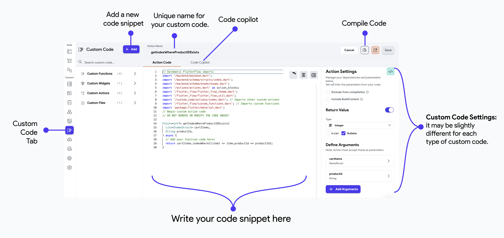

:::tip
To leverage the capabilities that go beyond our in-app code editor, you can click on the **VS Code icon** to open and edit your custom code directly in VS Code using the FlutterFlow [**VSCode extension**](vscode-extension.md).


:::

:::warning[Using the In-App Code Editor on Desktop]
Note that the desktop version of the In-App Code Editor is limited. We recommend using the Web editor
or the **[VSCode Extension](vscode-extension.md)**.
  :::

### Code Copilot

Code Copilot is an AI-assisted feature that helps you generate code snippets,
functions, or entire blocks of code based on natural language descriptions of what you want to
achieve. It simplifies the app-building process by allowing you to describe the functionality you
need, such as 'calculate the total price of items in a cart', and then the Copilot generates the
necessary code.

This can significantly speed up the building process and reduce the need for in-depth programming
knowledge, making it especially useful for custom functions and actions.

**Limitation:** The prompts are limited to 100 characters currently.

<div style={{
    position: 'relative',
    paddingBottom: 'calc(56.67989417989418% + 41px)', // Keeps the aspect ratio and additional padding
    height: 0,
    width: '100%'
}}>
    <iframe 
        src="https://demo.arcade.software/nHrVL2cgyzjIgoSUu36F?embed&show_copy_link=true"
        title=""
        style={{
            position: 'absolute',
            top: 0,
            left: 0,
            width: '100%',
            height: '100%',
            colorScheme: 'light'
        }}
        frameborder="0"
        loading="lazy"
        webkitAllowFullScreen
        mozAllowFullScreen
        allowFullScreen
        allow="clipboard-write">
    </iframe>
</div>

### Compile Code

When you are done adding your code snippets, you can compile it to ensure there are no
compilation errors and that your code can be transformed into something that can execute when your app is running.

To do so, click the **Compile Code** button.

<figure>
    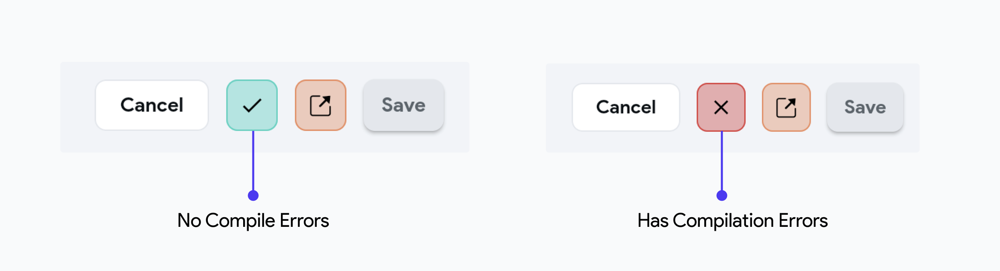
  <figcaption class="centered-caption">How to recognize compile time errors</figcaption>
</figure>

To run your app, you must make sure **Custom Functions** are compiled. 

Custom Widgets and Actions don't need to be compiled to export code or test your app. However, you won't be able to preview Custom Widgets in the builder until they are compiled.  You'll see a project warning if you don't compile Custom Widgets or Actions.

Compiling Custom Functions should be pretty fast, but sometimes, compiling Custom Actions and Widgets takes a while. 

### Code Analyzer

The code analyzer is available in all your custom code snippets and ensures the quality and
correctness of your custom code. It automatically checks your Dart code for errors and warnings,
providing real-time feedback as you write.


When there is a compilation error, the code analyzer will stop running and display the errors caught
by the compiler. Once fixed, save the code and rerun using the Compile Code button. The code analyzer
should then be reconnected. You can also manually reconnect it if needed.

### Automatic FlutterFlow Imports

When creating a new custom code snippet (Actions, Widgets, or Functions) in FlutterFlow, some fundamental imports will be automatically added for you. These imports cannot be modified by the developer. Custom Functions do not allow adding any custom imports, but you can add custom imports in Custom Actions and Widgets after the line **"Do not remove or modify the code above"**.

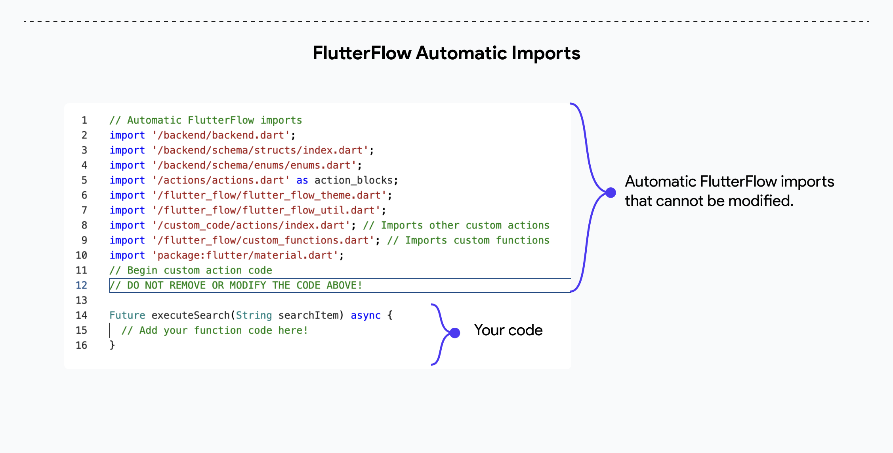

### Custom Code Settings

When you edit a custom code snippet in FlutterFlow, the Settings menu opens on the right. This menu may vary slightly depending on the type of custom code (Actions, Functions, or Widgets), but here, we’ll cover the common settings.

#### Generate Boilerplate Code
This setting allows you to generate boilerplate code, providing a structured starting point with essential code imports and a basic widget or function structure.

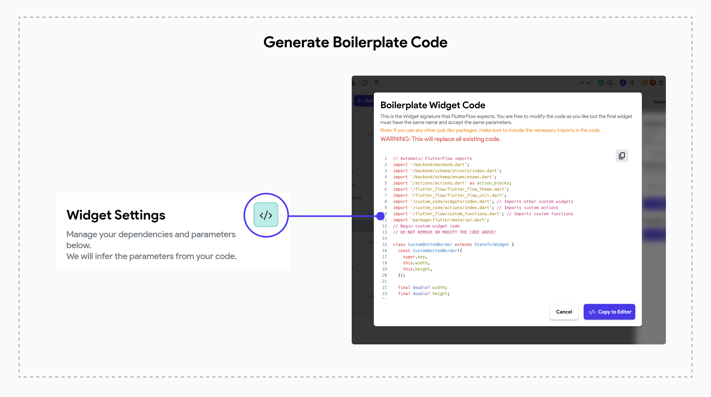

After creating a new resource file, click the code icon on the Widget Settings menu to generate the boilerplate code. Then, click "Copy to Editor" to add the boilerplate to your resource file’s code editor, where you can further customize it.


#### Exclude From Compilation

If, for some reason, your action or widget fails to compile but you still want to compile the rest
of your code, you can enable this toggle. Doing so will exclude the problematic code from the
compile process.

:::tip[Scope]

This option is only available for Custom Widgets and Custom Actions.
:::
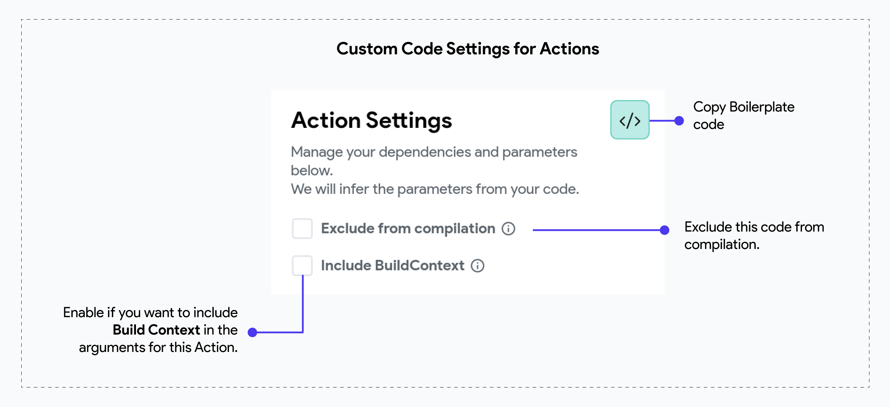

#### Include BuildContext

This setting determines whether to pass the BuildContext of the widget calling this custom action as
an argument. This is useful for actions that need to interact with the widget tree or access
context-specific data.

:::tip[Scope]
This option is only available for Custom Actions.
:::

## Input Arguments

When writing custom code in FlutterFlow, you can define input arguments to make your custom
functions, widgets, or actions more dynamic and reusable. Input arguments allow you to pass data
into your custom code, enabling it to perform different tasks based on the input provided. By using
input arguments, you can create more flexible and powerful custom code that can adapt to various
scenarios within your application.

Here's an example of an action that takes 2 arguments: `cartItems` that is a `List of
ItemsStruct` and `productId` that is a String.
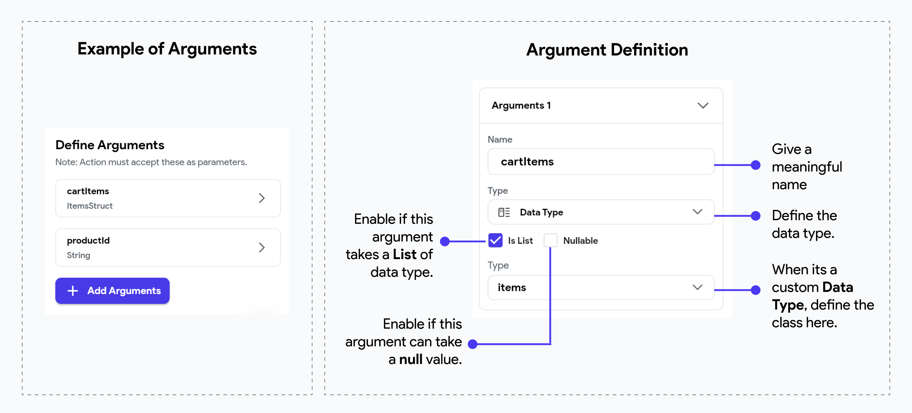

:::tip[Generated Code for custom data types]
When you define a custom data type in FlutterFlow, the generated code will refer to the type
as `<YourTypeName>Struct`. For example, if your custom data type is called `Items`, it will be
referenced in the generated code as `ItemsStruct`.
:::

### Callback Action As Parameter

A callback action is an action passed as a parameter to a custom action or widget and triggered at some point in the future when a specific event occurs.

This is especially helpful when you want to trigger actions from within the custom action or custom widget logic and include them as part of the custom behavior. For example, if an error occurs inside the custom logic, you could trigger an action immediately to inform the user about the error, and then continue execution or end with a default value to return.

:::tip[What are callbacks?]

In programming, callbacks are functions passed to other functions to be called when a specific event
occurs.
:::
In the following example, we have a Custom Action that takes an `onError(searchKeyword)` callback 
action with an Action Parameter `searchKeyword`. This means that the custom action will provide this search keyword back to the callback action when it calls it. 

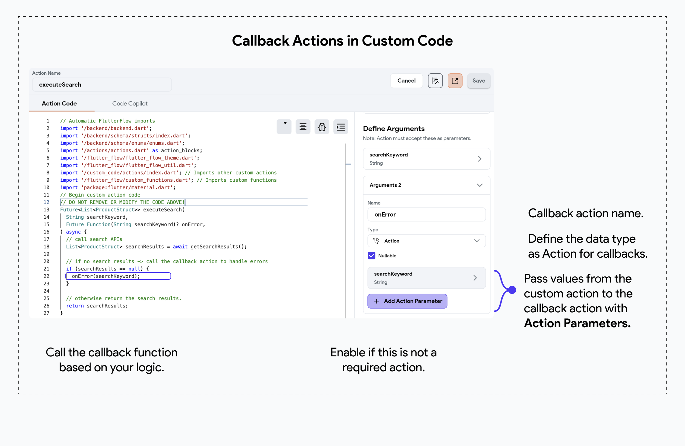

### Add an Action to Callback Action


To provide a callback action to your main custom action, check out this quick guide where we provide a "**Show Snackbar**" action to `onError`, displaying a combined text using the search keyword.

<div style={{
    position: 'relative',
    paddingBottom: 'calc(56.67989417989418% + 41px)', // Keeps the aspect ratio and additional padding
    height: 0,
    width: '100%'
}}>
    <iframe 
        src="https://demo.arcade.software/AwtMj7Y1J8A43ht9BuQI?embed&show_copy_link=true"
        title=""
        style={{
            position: 'absolute',
            top: 0,
            left: 0,
            width: '100%',
            height: '100%',
            colorScheme: 'light'
        }}
        frameborder="0"
        loading="lazy"
        webkitAllowFullScreen
        mozAllowFullScreen
        allowFullScreen
        allow="clipboard-write">
    </iframe>
</div>

## Return Values

In FlutterFlow, custom code can not only take input arguments but also return values, back to
the caller. Return values allow your custom functions, or actions to pass data back to the
main application, enabling further processing or UI updates based on the results of the custom code.

:::warning[Scope]
Return Values are only enabled for Custom functions & Custom Actions. Custom Widgets **cannot**
return a value at the moment.
:::

Here's an example of an Action that returns a _nullable_ integer.

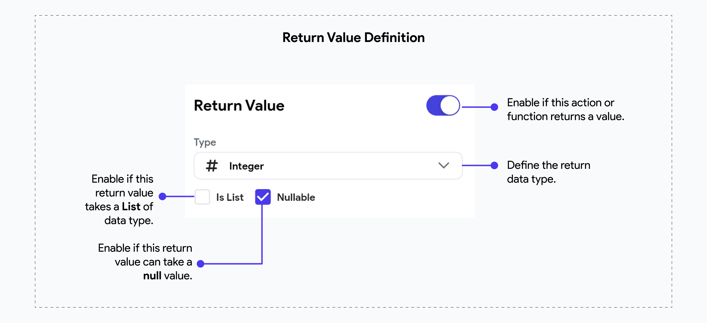

## Adding a Pubspec Dependency
To utilize community-built Flutter solutions in your FlutterFlow projects, you can add a "pubspec dependency". The **pubspec file** is the configuration file in Flutter projects that lists external packages or libraries, along with other project configurations.


:::tip[Scope]
You can only add a pubspec dependency to [**Custom Actions**](custom-actions.md) & [**Custom Widgets**](custom-widgets.md).
:::

####  Pub.dev
[Pub.dev](https://pub.dev) is the official package repository for Dart and Flutter. It hosts a wide range of packages, libraries, and tools that developers can use to extend the functionality of their Dart and Flutter applications.

:::info[Flutter Favorite Packages]

Flutter Favorite packages are a curated set of packages on pub.dev that have been recognized by the Flutter team and the community for their quality, popularity, and usefulness in Flutter development. These packages are marked with a "Flutter Favorite" badge, indicating that they meet a high standard of quality, reliability, and best practices.

You can explore the Flutter Favorite packages on **[pub.dev's Flutter Favorites page](https://pub.dev/packages?q=is%3Aflutter-favorite)**.

:::

To add a pubspec dependency from [**pub.dev**](#pubdev), follow these steps:

1. Create a new Custom Widget or Custom Action resource file, and be sure to give it a meaningful name.

2. [**Generate the boilerplate code**](#generate-boilerplate-code) and copy the basic widget or function structure into the code editor.

3. Select the [**package you want from pub.dev**](#choosing-the-correct-package-from-pubdev) and review its details.

4. Copy the package name and version, and add them to the Custom Code settings in FlutterFlow. Then, copy the import statement and add it to the list of imports in the Custom Code resource. You can also copy example code from the Example tab on the package’s pub.dev page and modify it as needed — see more in the **[Setup Code](#setup-code)** section.

5. Click "Save & **[Compile Code](#compile-code)**" to apply the changes.

### Choosing the correct package from pub.dev

You will find varieties of dependencies for a specific requirement, and choosing the best one can be
challenging. This section helps you identify the right dependency by examining its score.

When you search for any dependency in *pub.dev*, you will get a list of dependencies. You can filter
out the result based on which dependency is more inclined toward your needs. You can do so by
opening and checking each dependency manually.

Once you have a handful of dependencies, consider the following factors while choosing the final
one.

- **WEB**: It must support Web to run your app in our Run/Test Mode.
- **Likes**: This shows how many developers have liked a dependency.
- **Pub Points**: Tells the quality of the dependency (out of 130) based on code style, platform
  support, and maintainability.
- **Popularity**: This metric indicates how many apps use the package. A high popularity score
  (out of 100%) can suggest that the package is stable and trusted by many developers.
- **Documentation:** A well-documented package will save you time and reduce ambiguity. Check if
  the package has clear usage examples, a comprehensive README, and ideally API documentation.
- **Maintenance & Updates**: Check the last update date. A regularly updated package is more
  likely compatible with the latest Dart/Flutter versions and has fewer bugs.

<p></p>

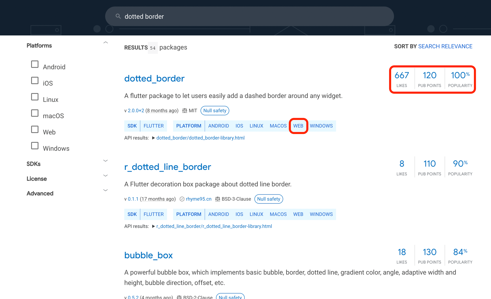

When adding a pubspec dependency to your custom code in FlutterFlow, you’ll need two pieces of [information](#setup-code): the Package name with its Version number and the Import statement.

### Using Unpublished or Private Packages
FlutterFlow supports the use of unpublished packages, which allows you to integrate packages that are not yet available on **pub.dev**. This capability is particularly useful when working with custom, forked, or private packages hosted on public or private repositories. By leveraging this, you can enhance your app’s functionality with customized or proprietary libraries tailored to your specific needs.

:::info[Possible Use Cases]

- **Using a Different Branch of a Package**: When you need to test or use features that are only available on a specific branch of a package.
- **Forked Version for Customizing Features**: When you need to fork a package to customize its functionality or fix issues that the original maintainer hasn’t addressed.
- **Private Packages for Internal Use**: Companies or enterprises may have internal Flutter libraries that they want to use in their FlutterFlow app but cannot publish publicly due to confidentiality or proprietary restrictions.

:::

#### Add Packages from Public Repositories

For packages hosted on public repositories (e.g., GitHub), you can add them to your FlutterFlow project by specifying the repository URL in the following format.

```js
  package_name:
    git:
      url: https://github.com/username/repository_name.git
```

You can also fine-tune the dependency by using additional parameters like `ref` and `path` in the given format. Here are some examples:

- **To use a specific branch** (e.g., `development`):

```js
  package_name:
    git:
      url: https://github.com/username/repository_name.git
      ref: development
```

- **To use from a specific commit**:

```js
dependencies:
  package_name:
    git:
      url: https://github.com/username/repository_name.git
      ref: a1b2c3d4

```

- **To use package located in a subdirectory of the repository**:

```js
  package_name:
    git:
      url: https://github.com/username/repository_name.git
      path: packages/subpackage_name
```

Here’s exactly how you do it:


<div style={{
    position: 'relative',
    paddingBottom: 'calc(56.67989417989418% + 41px)', // Keeps the aspect ratio and additional padding
    height: 0,
    width: '100%'}}>
    <iframe 
        src="https://demo.arcade.software/CgLCKJzdiCuaxMF04pg6?embed&show_copy_link=true"
        title=""
        style={{
            position: 'absolute',
            top: 0,
            left: 0,
            width: '100%',
            height: '100%',
            colorScheme: 'light'
        }}
        frameborder="0"
        loading="lazy"
        webkitAllowFullScreen
        mozAllowFullScreen
        allowFullScreen
        allow="clipboard-write">
    </iframe>
</div>
<p></p>

#### Add Packages from Private Repositories

For packages hosted in private repositories, you’ll need to authenticate access. This can be done using HTTPS with a personal access token.

For GitHub, you can go to your GitHub account’s settings and [generate a token](https://docs.github.com/en/authentication/keeping-your-account-and-data-secure/managing-your-personal-access-tokens#creating-a-personal-access-token-classic) with the necessary permissions and use it in the following format. You can also create and use a [fine-grained access token](https://docs.github.com/en/authentication/keeping-your-account-and-data-secure/managing-your-personal-access-tokens#creating-a-fine-grained-personal-access-token) that only has certain permissions.

```js
package_name:
    git:
      url: https://<username>:<personal-access-token>@github.com/username/private_repo.git
```

Replace `<username>` with your GitHub username and `<personal-access-token>` with the generated token.

### Setup Code
To configure your custom code with the package, copy and paste the following items from the package's pub.dev page:

1. **Copy Package Name & Version** 

To use the dependency in your Custom Action or Custom Widget resource file, go to the package's pub.dev page and click the **Copy to Clipboard** icon next to the package name and version. Then, paste it into the **Pubspec Dependency** section (bottom right) of the FlutterFlow code editor. 

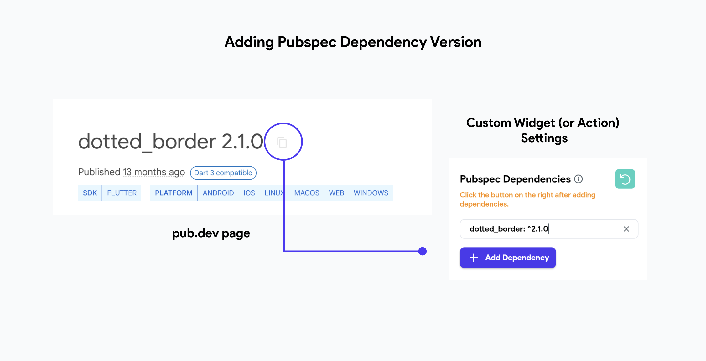


See **[example](#add-pubspec-dependency-to-custom-code-example-guide)** for more information.


:::warning
The current dependency might depend on other dependencies to work. So make sure you also copy the
name and version of all the additional dependencies to specify in the code 

You can check if the current dependency has any additional dependencies inside the '*Dependencies'*
section at the bottom right side.


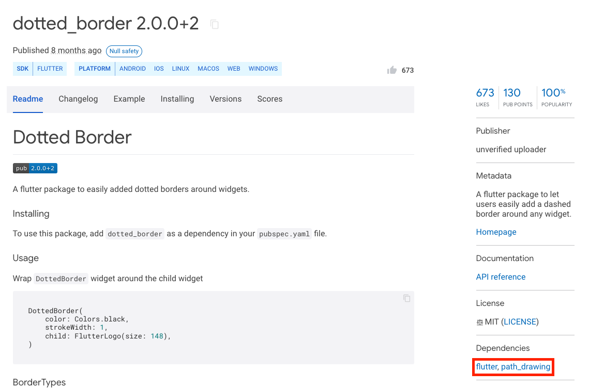
:::

2. **Copying Import Statement**

An import statement specifies the location of the dependency's code. When creating a custom widget or action, add this statement at the end of the default import statements in the code editor.

Open the dependency page and select the **Installing** tab; under the **Import It** section, you'll find
the import statement. To copy, click the **Copy to Clipboard**  icon.

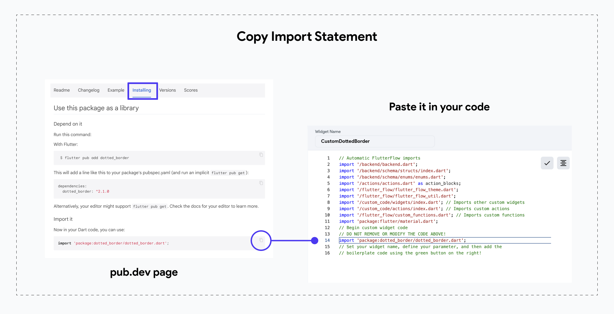

3. **Copy Example Code**

Example code is always available in the **Example** tab on the package’s pub.dev page. Copy any relevant snippets that demonstrate usage, and paste them into your custom widget or function file. You can then modify the code as needed to fit your project.

## Add Pubspec Dependency to Custom Code: Example Guide
In this example, we are using the
[**flutter_rating_bar**](https://pub.dev/packages/flutter_rating_bar) dependency to create a
`ProductRatingBar` custom widget for our
Product pages. See how we utilize the example code from pub.dev and add the customized widget in
FlutterFlow:

<div style={{
    position: 'relative',
    paddingBottom: 'calc(56.67989417989418% + 41px)', // Keeps the aspect ratio and additional padding
    height: 0,
    width: '100%'
}}>
    <iframe 
        src="https://demo.arcade.software/EAqWwTSfjumXzJ3xB6FX?embed&show_copy_link=true"
        title=""
        style={{
            position: 'absolute',
            top: 0,
            left: 0,
            width: '100%',
            height: '100%',
            colorScheme: 'light'
        }}
        frameborder="0"
        loading="lazy"
        webkitAllowFullScreen
        mozAllowFullScreen
        allowFullScreen
        allow="clipboard-write">
    </iframe>
</div>

<p></p>

:::note
This example demonstrates how to add a [**pub.dev**](https://pub.dev) package to a Custom Widget snippet, but you can follow the same process for adding a package to Custom Actions. For a deep dive, explore the detailed documentation on **[Custom Widgets](custom-widgets.md)** and [**Custom Actions**](custom-actions.md).
:::

## Manage Dependencies

You can also add packages directly on the **Dependencies** page (at **Settings and Integrations > Project Setup > Project Dependencies**) and they will be reflected in your custom actions or custom widgets, because packages are managed at the project level.

Additionally, when you create a new custom action or widget, all previously added custom dependencies will be listed on the **Pubspec** **Dependencies** list on the right side. This ensures that you can easily track all custom dependencies in the project, avoiding duplication or conflicts that could override each other or cause project errors.

If any project errors related to packages arise, they will be displayed in both the custom code editor and the Dependencies page. You can also update the version numbers of custom packages directly from the Dependencies page. This streamlined process helps maintain consistency and reduces potential issues related to custom packages.

<div style={{
    position: 'relative',
    paddingBottom: 'calc(56.67989417989418% + 41px)', // Keeps the aspect ratio and additional padding
    height: 0,
    width: '100%'}}>
    <iframe 
        src="https://demo.arcade.software/aaX1a8s4Z1xytVa2DYd5?embed&show_copy_link=true"
        title=""
        style={{
            position: 'absolute',
            top: 0,
            left: 0,
            width: '100%',
            height: '100%',
            colorScheme: 'light'
        }}
        frameborder="0"
        loading="lazy"
        webkitAllowFullScreen
        mozAllowFullScreen
        allowFullScreen
        allow="clipboard-write">
    </iframe>
</div>
<p></p>