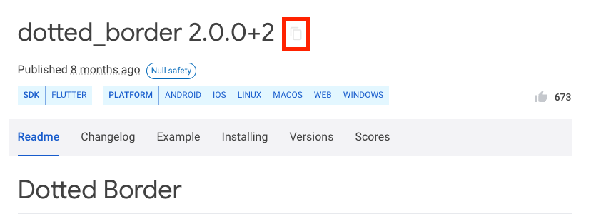
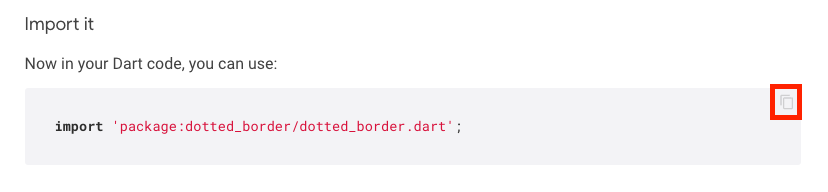

# Custom Code

While FlutterFlow provides a wide range of pre-built components and functionalities, there may be
times when you need to extend your app with custom logic or UI components that are not available out of the box.
This is where writing custom code comes into play. 

There are a few different ways to make custom code accessible in FlutterFLow:

* **[Custom Functions](custom-functions.md):** Custom Dart functions that can be used to set Widget or Action properties. 
* **[Custom Actions](custom-actions.md):** Custom Dart functions that can be triggered by [Action Triggers](https://docs.flutterflow.io/resources/functions/action-triggers/) or used as nodes in an [Action Flow](https://docs.flutterflow.io/resources/functions/action-flow-editor#action-flow-editor). These are usually `async` functions and are able to import custom package dependencies.
* **[Custom Widgets](custom-widgets.md):** Custom Flutter widgets, which can be used in the same way [Components](https://docs.flutterflow.io/resources/ui/components) are used throughout your project. 

:::tip[Why Write Custom Code?]

- **Extend Functionality:** Add features that are not included in the standard FlutterFlow
  components.
- **Custom Integrations:** Integrate with third-party packages or APIs / databases that require
  specific handling.
- **Unique UI Elements:** Create unique user interface elements that require custom rendering or
  interactions.
  :::

# Writing Custom Code
There are two main ways to write custom code in FlutterFlow:

1. Using the [In-App Code Editor](#using-the-in-app-code-editor)
2. Using the [Visual Studio Code Extension](/concepts/custom-code/Visual Studio Code-extension)

### Using the In-App Code Editor
You can use the In-App Code Editor to view and edit custom code directly in the FlutterFlow application. 

:::warning[Using the In-App Code Editor on Desktop]
Note that the desktop version of the In-App Code Editor is limited. We recommend using the Web editor
or the VSCode Extension
  :::

Beyond the custom code resoureces outlined above, you'll also see an additional section in the left 
hand sidebar of the Custom Code page - [Custom Files:](custom-files.md). 

Within Custom Files you'll have the ability to edit some parts of the `main.dart` file.

### Code Copilot

Code Copilot is an AI-assisted feature that helps you generate code snippets,
functions, or entire blocks of code based on natural language descriptions of what you want to
achieve. It simplifies the app-building process by allowing you to describe the functionality you
need, such as 'calculate the total price of items in a cart', and then the Copilot generates the
necessary code.

This can significantly speed up the building process and reduce the need for in-depth programming
knowledge, making it especially useful for custom functions and actions.

**Limitation:** The prompts are limited to 100 characters currently.

    <iframe 
        src="https://demo.arcade.software/nHrVL2cgyzjIgoSUu36F?embed&show_copy_link=true"
        title=""
        style={{
            position: 'absolute',
            top: 0,
            left: 0,
            width: '100%',
            height: '100%',
            colorScheme: 'light'
        }}
        frameborder="0"
        loading="lazy"
        webkitAllowFullScreen
        mozAllowFullScreen
        allowFullScreen
        allow="clipboard-write">
    </iframe>

### Compile Code

When you are done adding your code snippets, you can compile it to ensure there are no
compilation errors and that your code can be transformed into something that can execute when your app is running.

To do so, click the **Compile Code** button.

<figure>
    
  <figcaption class="centered-caption">How to recognize compile time errors</figcaption>
</figure>

To run your app, you must make sure **Custom Functions** are compiled. 

Custom Widgets and Actions don't need to be compiled to export code or test your app. However, you won't be able to preview Custom Widgets in the builder until they are compiled.  You'll see a project warning if you don't compile Custom Widgets or Actions.

Compiling Custom Functions should be pretty fast, but sometimes, compiling Custom Actions and Widgets takes a while. 

### Code Analyzer

The code analyzer is available in all your custom code snippets and ensures the quality and
correctness of your custom code. It automatically checks your Dart code for errors and warnings,
providing real-time feedback as you write.

When there is a compilation error, the code analyzer will stop running and display the errors caught
by the compiler. Once fixed, save the code and rerun using the Compile Code button. The code analyzer
should then be reconnected. You can also manually reconnect it if needed.

### Custom Code Automatic Imports

When creating a new custom code snippet (Actions, Widgets, or Functions) in FlutterFlow, some fundamental imports will be automatically added for you. These imports cannot be modified by the developer. Custom Functions do not allow adding any custom imports, but you can add custom imports in Custom Actions and Widgets after the line **"Do not remove or modify the code above"**.

### Custom Code Settings

When you edit a custom code snippet in FlutterFlow, the Settings block will open on the right. This
block may vary slightly depending on the type of custom code (Actions, Functions, Widgets), but here
we'll discuss the common settings.

#### Exclude From Compilation

If, for some reason, your action or widget fails to compile but you still want to compile the rest
of your code, you can enable this toggle. Doing so will exclude the problematic code from the
compile process.

:::tip[Scope]

This option is only available for Custom Widgets and Custom Actions.
:::

#### Include BuildContext

This setting determines whether to pass the BuildContext of the widget calling this custom action as
an argument. This is useful for actions that need to interact with the widget tree or access
context-specific data.

:::tip[Scope]
This option is only available for Custom Actions.
:::

#### Input Arguments

When writing custom code in FlutterFlow, you can define input arguments to make your custom
functions, widgets, or actions more dynamic and reusable. Input arguments allow you to pass data
into your custom code, enabling it to perform different tasks based on the input provided. By using
input arguments, you can create more flexible and powerful custom code that can adapt to various
scenarios within your application.

Here's an example of an action that takes 2 arguments: `cartItems` that is a `List of
ItemsStruct` and `productId` that is a String.

:::tip[Generated Code for custom data types]
When you define a custom data type in FlutterFlow, the generated code will refer to the type
as `<YourTypeName>Struct`. For example, if your custom data type is called `Items`, it will be
referenced in the generated code as `ItemsStruct`.
:::

##### Add a Callback Action

A callback action is an action passed as a parameter to a custom action or widget and triggered at some point in the future when a specific event occurs.

This is especially helpful when you want to trigger actions from within the custom action or custom widget logic and include them as part of the custom behavior. For example, if an error occurs inside the custom logic, you could trigger an action immediately to inform the user about the error, and then continue execution or end with a default value to return.

:::tip[What are callbacks?]

In programming, callbacks are functions passed to other functions to be called when a specific event
occurs.
:::
In the following example, we have a Custom Action that takes an `onError(searchKeyword)` callback 
action with an Action Parameter `searchKeyword`. This means that the custom action will provide this search keyword back to the callback action when it calls it. 

##### Provide an Action to Callback Action

To provide a callback action to your main custom action, check out this quick guide where we provide a "**Show Snackbar**" action to `onError`, displaying a combined text using the search keyword.

    <iframe 
        src="https://demo.arcade.software/AwtMj7Y1J8A43ht9BuQI?embed&show_copy_link=true"
        title=""
        style={{
            position: 'absolute',
            top: 0,
            left: 0,
            width: '100%',
            height: '100%',
            colorScheme: 'light'
        }}
        frameborder="0"
        loading="lazy"
        webkitAllowFullScreen
        mozAllowFullScreen
        allowFullScreen
        allow="clipboard-write">
    </iframe>

#### Return Values

In FlutterFlow, custom code can not only take input arguments but also return values, back to
the caller. Return values allow your custom functions, or actions to pass data back to the
main application, enabling further processing or UI updates based on the results of the custom code.

:::warning[Scope]
Return Values are only enabled for Custom functions & Custom Actions. Custom Widgets **cannot**
return a value at the moment.
:::

Here's an example of an Action that returns a _nullable_ integer.

## Adding a Pubspec Dependency

:::tip[Scope]
You can only add a pubspec dependency to [**Custom Action**](custom-actions.md) & [**Custom Widgets**](custom-widgets.md).
:::

###  Pub.dev 
[Pub.dev](https://pub.dev) is the official package repository for Dart and Flutter. It hosts a wide range of packages, libraries, and tools that developers can use to extend the functionality of their Dart and Flutter applications.

:::info[Flutter Favorite Packages]

Flutter Favorite packages are a curated set of packages on pub.dev that have been recognized by the Flutter team and the community for their quality, popularity, and usefulness in Flutter development. These packages are marked with a "Flutter Favorite" badge, indicating that they meet a high standard of quality, reliability, and best practices.

You can explore the Flutter Favorite packages on **[pub.dev's Flutter Favorites page](https://pub.dev/packages?q=is%3Aflutter-favorite)**.

:::

### Choosing the correct package from pub.dev

You will find varieties of dependencies for a specific requirement, and choosing the best one can be
challenging. This section helps you identify the right dependency by examining its score.

When you search for any dependency in *pub.dev*, you will get a list of dependencies. You can filter
out the result based on which dependency is more inclined toward your needs. You can do so by
opening and checking each dependency manually.

Once you have a handful of dependencies, consider the following factors while choosing the final
one.

- **WEB**: It must support Web to run your app in our Run/Test Mode.
- **Likes**: This shows how many developers have liked a dependency.
- **Pub Points**: Tells the quality of the dependency (out of 130) based on code style, platform
  support, and maintainability.
- **Popularity**: This metric indicates how many apps use the package. A high popularity score
  (out of 100%) can suggest that the package is stable and trusted by many developers.
- **Documentation:** A well-documented package will save you time and reduce ambiguity. Check if
  the package has clear usage examples, a comprehensive README, and ideally API documentation.
- **Maintenance & Updates**: Check the last update date. A regularly updated package is more
  likely compatible with the latest Dart/Flutter versions and has fewer bugs.

When adding a pubspec dependency to your custom code in FlutterFlow, you’ll need two pieces of information: the [package name with its version number](#copy-package-name--version-) and the [import statement](#copying-import-statement).

#### Copy Package Name & Version 

To use the dependency code in our code editor, copy its name with the version. To do so, click
the **Copy to Clipboard** icon.

:::warning
The current dependency might depend on other dependencies to work. So make sure you also copy the
name and version of all the additional dependencies to specify in the code editor.
:::

You can check if the current dependency has any additional dependencies inside the '*Dependencies'*
section at the bottom right side.

#### Copying import statement

An import statement points to where the dependency's code is located. When making a custom widget or
action, place this statement at the beginning of the code editor.

Open the dependency page and select the installing tab; under the Import it section, you'll find
the import statement. To copy, click the **Copy to Clipboard**  icon.

### Add Pubspec Dependency to Custom Code: Guide
In this example, we are using the
[**flutter_rating_bar**](https://pub.dev/packages/flutter_rating_bar) dependency to create a
`ProductRatingBar` custom widget for our
Product pages. See how we utilize the example code from pub.dev and add the customized widget in
FlutterFlow:

    <iframe 
        src="https://demo.arcade.software/EAqWwTSfjumXzJ3xB6FX?embed&show_copy_link=true"
        title=""
        style={{
            position: 'absolute',
            top: 0,
            left: 0,
            width: '100%',
            height: '100%',
            colorScheme: 'light'
        }}
        frameborder="0"
        loading="lazy"
        webkitAllowFullScreen
        mozAllowFullScreen
        allowFullScreen
        allow="clipboard-write">
    </iframe>

:::note
This example demonstrates how to add a [pub.dev](https://pub.dev) package to a Custom Widget snippet, but you can follow the same process for adding a package to Custom Actions. For a deep dive, explore the detailed documentation on **[Custom Widgets](custom-widgets.md)** and [Custom Actions](custom-actions.md).
:::

