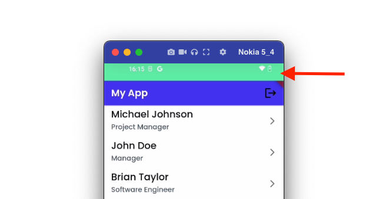
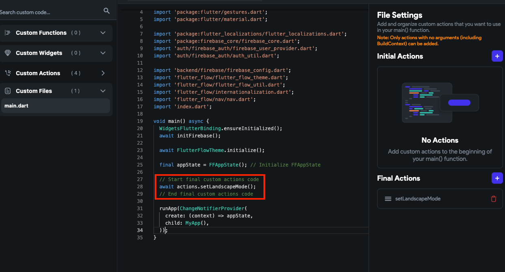
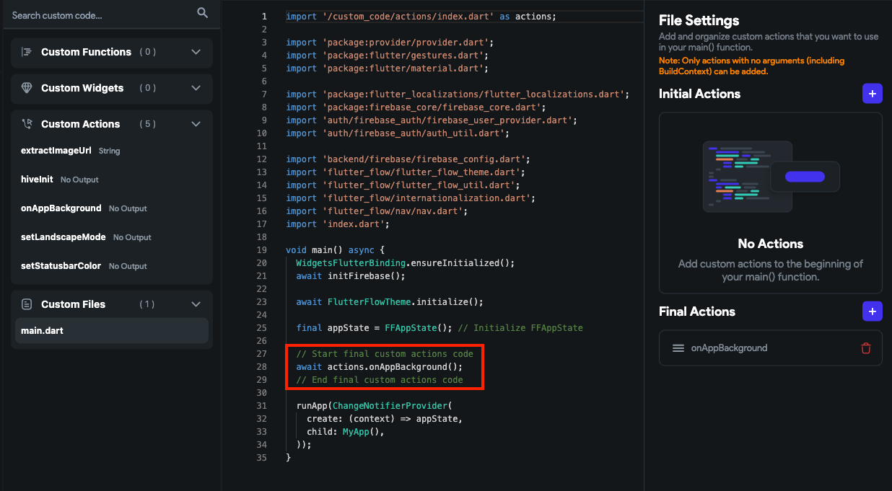

# Custom Files

We allow you to add a custom code directly into the `main.dart` file of your app. This means that you can easily implement specific functionalities and customize your app as per your requirements without downloading the entire project and manually modifying the file.

By default, the file you want to edit is in 'read-only' mode. However, using our editor, you can 
add a code snippet in the form of [Custom Actions](custom-actions.md).

:::warning[Please note]
You can only add custom actions that have no arguments (including *BuildContext*).
:::

## Edit `main.dart`

The **main.dart** is a critical file in your project, as it serves as the entry point for the 
application. This file contains the `main()` function, which is responsible for starting the application by running the code that builds the UI and initializes any other necessary components.

You can edit the **main.dart** file to include anything in `main()` function that we don't yet 
support. For example, initializing third-party plugins or libraries and setting up system-level configurations, such as changing the status bar color or orientation.

Let's see an example of how you can add a code in **main.dart** file to change the status bar 
color for the mobile app. Here's how it looks:

<figure>
    
  <figcaption class="centered-caption">Changing the status bar color for the mobile device</figcaption>
</figure>

To do so, you can edit *main.dart* file by following the steps below:

1. Create a [Custom Action](custom-actions.md) for the code you want to include in a `main.
   dart` file. For this 
   example, here's code in a custom action named 'setStatusbarColor'.

```js
// Automatic FlutterFlow imports
import '/backend/backend.dart';
import '/flutter_flow/flutter_flow_theme.dart';
import '/flutter_flow/flutter_flow_util.dart';
import '/custom_code/actions/index.dart'; // Imports other custom actions
import '/flutter_flow/custom_functions.dart'; // Imports custom functions
import 'package:flutter/material.dart';
// Begin custom action code
// DO NOT REMOVE OR MODIFY THE CODE ABOVE!

import 'package:flutter/services.dart';

Future setStatusbarColor() async {
  // Add your function code here!

  // Set status bar color
  SystemChrome.setSystemUIOverlayStyle(
    SystemUiOverlayStyle(
      statusBarColor: Colors.redAccent, // <-- see here
      statusBarIconBrightness:
          Brightness.dark, //<-- For Android see here (dark icons)
      statusBarBrightness: Brightness.light, //<-- For iOS see here (dark icons)
    ),
  );
}
```

1. Now click on **Custom Functions** from the 
[**Navigation Menu**](../../../docs/intro/ff-ui/builder.md#navigation-menu) and open the **Custom Files > main.dart**.
2. Determine where to place the code (i.e., **Initial Action** or **Final Action**), click the **+** button, and select the custom action.
3. Click **Save**.

<div class="video-container"><iframe src="https://www.loom.
com/embed/e8e12fad4fce42bba29080f83a1f4b74?sid=3f01f3b7-38f0-4f01-8bec-6442db66fe07" frameborder="0" allow="accelerometer; autoplay; clipboard-write; encrypted-media; gyroscope; picture-in-picture; web-share" referrerpolicy="strict-origin-when-cross-origin" allowfullscreen></iframe></div>


## More examples

Let's see some more examples of adding code to the *main.dart* file to solidify understanding and use it in real-world scenarios.

### Example 1: Lock device orientation

You might want to lock the device orientation in portrait or landscape mode to prevent it from rotating the screen automatically when the user tilts or rotates the device. This is useful in scenarios where the layout of the app is designed to work only in one specific orientation or when you want to ensure that the app is always displayed in a consistent manner.

To set the device orientation in landscape-only mode, [create a custom action](custom-actions.md) with the 
following code and [add it to a `main.dart`](#edit-maindart) file.

```js
// Automatic FlutterFlow imports
import '/backend/backend.dart';
import '/flutter_flow/flutter_flow_theme.dart';
import '/flutter_flow/flutter_flow_util.dart';
import '/custom_code/actions/index.dart'; // Imports other custom actions
import '/flutter_flow/custom_functions.dart'; // Imports custom functions
import 'package:flutter/material.dart';
// Begin custom action code
// DO NOT REMOVE OR MODIFY THE CODE ABOVE!

import 'package:flutter/services.dart';

Future setLandscapeMode() async {
  // Add your function code here!
  await SystemChrome.setPreferredOrientations([
    DeviceOrientation.landscapeLeft,
    DeviceOrientation.landscapeRight,
  ]);
}
```

<figure>
    
  <figcaption class="centered-caption">Edit main.dart file to lock the device orientation</figcaption>
</figure>


### Example 2: Getting app lifecycle callback

If you want to ensure that your app appropriately manages its lifecycle and handles any necessary actions when it transitions between different states, such as 'resumed' and 'paused,' you can add the `AppLifecycleObserver` in the *main.dart* file.

To do so, [create a custom action](custom-actions.md) with the following code and [add it to a `main.dart`](#edit-maindart) file.


```js
// Automatic FlutterFlow imports
import '/backend/backend.dart';
import '/flutter_flow/flutter_flow_theme.dart';
import '/flutter_flow/flutter_flow_util.dart';
import '/custom_code/actions/index.dart'; // Imports other custom actions
import '/flutter_flow/custom_functions.dart'; // Imports custom functions
import 'package:flutter/material.dart';
// Begin custom action code
// DO NOT REMOVE OR MODIFY THE CODE ABOVE!

Future onAppBackground() async {
// Add your function code here!
   WidgetsBinding.instance.addObserver(AppLifecycleObserver());
}

class AppLifecycleObserver with WidgetsBindingObserver {
@override
   void didChangeAppLifecycleState(AppLifecycleState state) {
      if (state == AppLifecycleState.resumed) {
// Do something when app is resumed
         print('App is in foreground');
      } else if (state == AppLifecycleState.paused) {
// Do something when app is paused
         print('App is in background');
      }
   }
}

```
<figure>
    
  <figcaption class="centered-caption">Edit main.dart file to get lifecycle callback</figcaption>
</figure>
