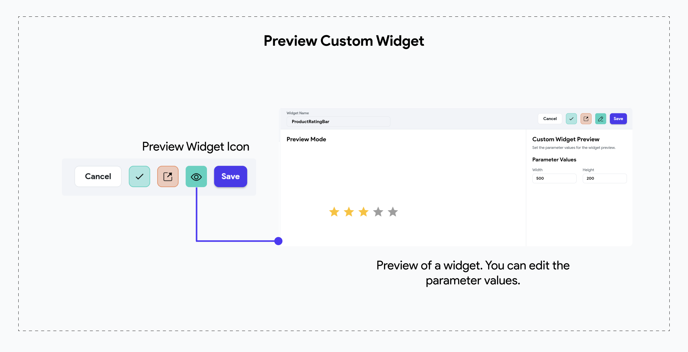

# Custom Widgets

Custom Widgets allow you to create unique and reusable UI components that extend beyond the
standard widget offerings in FlutterFlow. By leveraging Custom Widgets, you can achieve a higher
level of
customization and control over your app's user interface.

In most cases, you can create a reusable component with the basic widget set available in
FlutterFlow. However, when you want to include a UI package from [**pub.dev**](https://pub.dev),
**Custom Widgets** are the better choice.

## Key Use Cases

- **Unique UI Elements:** Create complex UI components that are not available in the default
  FlutterFlow widget set.

- **Third-Party Integrations:** Integrate external UI packages from pub.dev to enhance the
  functionality and appearance of your app.

## Creating a New Custom Widget

To create a new custom widget, add a new Custom Code snippet and follow the quick guide below. In 
this example, we will create a `ProductRatingBar` widget that uses a pub.dev dependency to display the rating bar UI. It will also take a callback action to provide the rating value back to the caller.

    <iframe 
        src="https://demo.arcade.software/zBBJiIaTBpoBWErwvpbd?embed&show_copy_link=true"
        title=""
        style={{
            position: 'absolute',
            top: 0,
            left: 0,
            width: '100%',
            height: '100%',
            colorScheme: 'light'
        }}
        frameborder="0"
        loading="lazy"
        webkitAllowFullScreen
        mozAllowFullScreen
        allowFullScreen
        allow="clipboard-write">
    </iframe>

:::info[Widget Builder as Parameter]
You can also leverage [**Widget Builders**](../../resources/ui/components/widget-builder-parameters.md) that allow you to pass in widgets to be used within the custom widget tree. This is especially useful when you want to dynamically substitute content for some part of a custom widget - like displaying an item in a custom widget popup.
:::

### Properties: Width & Height

For custom widgets, it is mandatory to specify both width and height. These properties are required to size the custom widget appropriately. Without setting these dimensions, the custom widget will not render correctly within your application.

## Add Dependency to Custom Widgets

In this example, we are using the 
[**flutter_rating_bar**](https://pub.dev/packages/flutter_rating_bar) dependency to create a 
`ProductRatingBar` widget for our 
Product pages. See how we utilize the example code from pub.dev and add the customized widget in 
FlutterFlow: 

    <iframe 
        src="https://demo.arcade.software/EAqWwTSfjumXzJ3xB6FX?embed&show_copy_link=true"
        title=""
        style={{
            position: 'absolute',
            top: 0,
            left: 0,
            width: '100%',
            height: '100%',
            colorScheme: 'light'
        }}
        frameborder="0"
        loading="lazy"
        webkitAllowFullScreen
        mozAllowFullScreen
        allowFullScreen
        allow="clipboard-write">
    </iframe>

:::tip[Choosing a Pubspec Dependency]
For a comprehensive guide on navigating external packages using pub.dev, evaluating packages, and making the best choices for your app, [**follow the guide**](custom-code.md#adding-a-pubspec-dependency).
:::

## Using a Custom Widget
To add a custom widget to your page, you can drag and drop it from the Widget Palette's Components section or through the Widget Tree section. Here is a demo:

    <iframe 
        src="https://demo.arcade.software/9xerjlQ5oweTvZwEYFpC?embed&show_copy_link=true"
        title=""
        style={{
            position: 'absolute',
            top: 0,
            left: 0,
            width: '100%',
            height: '100%',
            colorScheme: 'light'
        }}
        frameborder="0"
        loading="lazy"
        webkitAllowFullScreen
        mozAllowFullScreen
        allowFullScreen
        allow="clipboard-write">
    </iframe>

### Providing the Callback Actions

Since we created the `onRating` callback action in our custom widget, we must provide an action 
when setting the widget in page. In this example, we set the `ratingValue` to the page state 
variable `userRating`. 

    <iframe 
        src="https://demo.arcade.software/GB1Y3wH0MeIvJcu9EL4S?embed&show_copy_link=true"
        title=""
        style={{
            position: 'absolute',
            top: 0,
            left: 0,
            width: '100%',
            height: '100%',
            colorScheme: 'light'
        }}
        frameborder="0"
        loading="lazy"
        webkitAllowFullScreen
        mozAllowFullScreen
        allowFullScreen
        allow="clipboard-write">
    </iframe>

## Preview Widget

FlutterFlow also allows you to view your custom widget once it is successfully compiled. 

:::tip[LOOKING for other CUSTOM action properties?]
To learn more about Custom Widget settings, such as the
[**Exclude From Compilation toggle**](custom-code.md#exclude-from-compilation),
and other properties like [**Callback Actions**](custom-code.md#callback-action-as-parameter),
[**Pub Dependencies**](custom-code.md#adding-a-pubspec-dependency), please check out this
[**comprehensive guide**](custom-code.md).
:::

