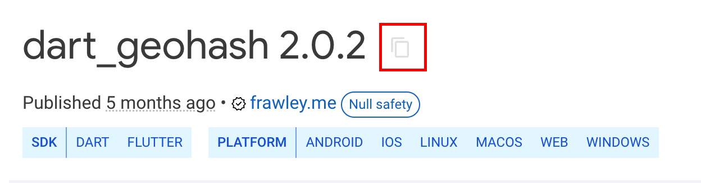

# Import Flutter Packages

Flutter packages extend app functionality by adding dependencies hosted on [pub.dev](https://pub.dev). These can be used in [Custom Widgets](/custom-widgets) and [Custom Actions](/custom-actions) to introduce new features or libraries into a project.  

This guide explains how to add a package dependency and import it into your custom code.  

:::info[Prerequisites]
- Access to **[pub.dev](https://pub.dev)**.  
- An existing **Custom Widget** or **Custom Action** in your project.  
:::

## Steps to Add a Package Dependency

1. Open **[pub.dev](https://pub.dev)** and search for the desired package.  
2. Copy the **package name and version** by selecting the **Copy** icon next to the dependency string.  

     

3. In FlutterFlow, open the **Custom Widget** or **Custom Action** editor.  
4. Paste the copied dependency into the **Required Pubspec Dependencies** field.  
   ```yaml
   package_name: ^version
5. 5. If no version is specified, FlutterFlow uses the latest version available on pub.dev.

Steps to Import the Package:

    1. On the pub.dev package page, select the Installing tab.

    2. Under the Import it section, copy the provided import statement.

    3. Paste the import statement at the top of your Custom Widget or Custom Action code.

:::note
- Ensure the package supports Flutter Web. Otherwise, it will not run in Run Mode or Test Mode.
- After adding new parameters in a Custom Widget, compile it before use.
- A Custom Widget or Action cannot be deleted if it is currently being used in the app. Remove all references before deleting.
:::