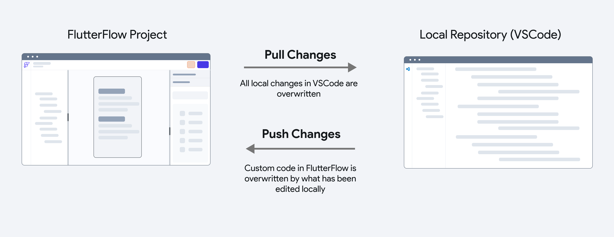
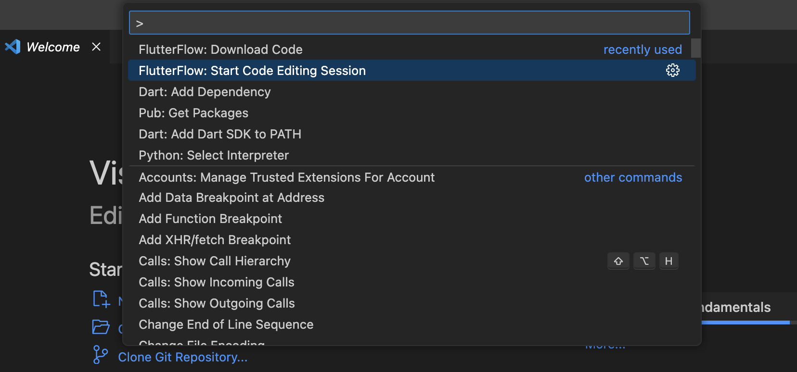
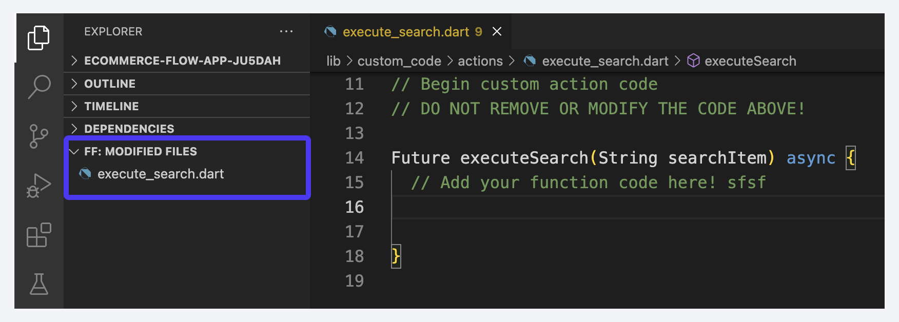
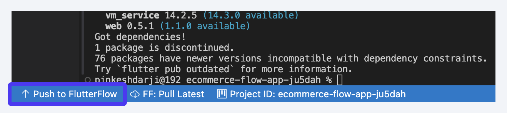
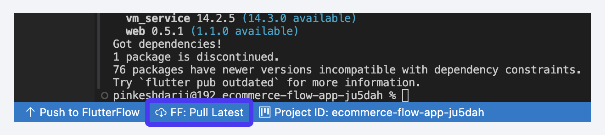
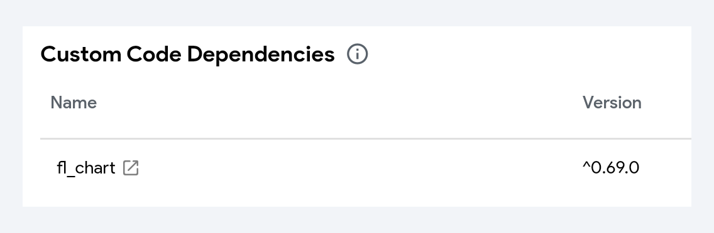

# FlutterFlow Visual Studio Extension

The **Visual Studio Code (VSCode) extension** allows you to work with your FlutterFlow project’s custom code directly in [Visual Studio Code](https://code.visualstudio.com/) (a local code editor). This extension facilitates easy editing, pushing, and pulling of custom code changes between FlutterFlow and your local development environment.

While you can edit custom code inside FlutterFlow's in-app code editor, editing the code in Visual Studio Code may be preferable for a few reasons:

1. **Access to the Entire Codebase**: When writing custom code in Visual Studio Code, you'll have full access to your app's entire codebase, making it easier to reference component widget classes, custom data types, enums, and more.

2. **Real-time Autocomplete and Error Detection**: Working on a local machine typically provides more reliable access to real-time error detection and autocomplete features within the code editor, which can make your development process more efficient. 
3. **Leverage Flutter & Dart Tooling**: Using Visual Studio Code allows you to take advantage of existing Flutter and Dart tools, making it easier to develop and refactor your custom code. 
4. **Leverage the AI Ecosystem**: Additionally, you can easily utilize AI tools available in the Visual Studio ecosystem, such as Copilot.

:::info
The VS Code extension requires downloading code, for which you must be on the [**paid plan**](https://www.flutterflow.io/pricing).
:::

## Installation

To fully leverage the Flutter, Dart, and AI tools in Visual Studio Code while editing your FlutterFlow custom code files, you can install the 	
**FlutterFlow: Custom Code Editor** extension. Here are a few easy methods to set it up.

### Install from Marketplace

You can install the FlutterFlow extension from the [Visual Studio Code marketplace](https://marketplace.visualstudio.com/items?itemName=FlutterFlow.flutterflow-custom-code-editor&ssr=false#overview) site. 

To install the extension directly from Visual Studio Code, open the editor, click on the **Extensions** icon (or press `Ctrl + Shift + X` / `Cmd + Shift + X`), search for "**FlutterFlow: Custom Code Editor**," and click **Install** to add the extension to your workspace.

<div style={{
    position: 'relative',
    paddingBottom: 'calc(56.67989417989418% + 41px)', // Keeps the aspect ratio and additional padding
    height: 0,
    width: '100%'}}>
    <iframe 
        src="https://demo.arcade.software/MXKy9ufwjxNYoYcJuBiI?embed&show_copy_link=true"
        title=""
        style={{
            position: 'absolute',
            top: 0,
            left: 0,
            width: '100%',
            height: '100%',
            colorScheme: 'light'
        }}
        frameborder="0"
        loading="lazy"
        webkitAllowFullScreen
        mozAllowFullScreen
        allowFullScreen
        allow="clipboard-write">
    </iframe>
</div>
<p></p>

### Add API Keys

To use the extension, you must set your **API key** in the editor's **Extension Settings**. You can generate an API key from the [FlutterFlow account page](https://app.flutterflow.io/account) and then add it to the extension settings page in Visual Studio Code. Here’s exactly how you do it:

<div style={{
    position: 'relative',
    paddingBottom: 'calc(56.67989417989418% + 41px)', // Keeps the aspect ratio and additional padding
    height: 0,
    width: '100%'}}>
    <iframe 
        src="https://demo.arcade.software/JdhNiXWDLVCw3h0cB2E6?embed&show_copy_link=true"
        title=""
        style={{
            position: 'absolute',
            top: 0,
            left: 0,
            width: '100%',
            height: '100%',
            colorScheme: 'light'
        }}
        frameborder="0"
        loading="lazy"
        webkitAllowFullScreen
        mozAllowFullScreen
        allowFullScreen
        allow="clipboard-write">
    </iframe>
</div>
<p></p>

:::tip

You can configure optional settings such as specifying the **Project ID** and **Branch** to pull and update code from. Additionally, you can set a **Download Location** to determine the initial directory where the code will be downloaded.

:::


### Downloading Code
The first step in editing custom code for your FlutterFlow project is to download its code. To download the code for your project, use the  Visual Studio Code command palette (`cmd` + `shift` + `p` or `ctrl` + `shift` + `p`).

In the command palette, you can use the `FlutterFlow: Download Code` command. 

This command will prompt you for three pieces of information:
- **Project ID**: This is the Project ID, or unique identifier, for your FlutterFlow project. You can find the Project ID by hovering over the Project Name in the top left corner inside the FlutterFlow builder.
- **Branch Name:** The name of the FlutterFlow project branch you want to work on. You can leave this blank to work on the main branch.
- **Download Location:** A file picker will be presented for you to choose where to download your project code, the code will be downloaded to 
`thisdirectory`/`projectID`. 

<div style={{
    position: 'relative',
    paddingBottom: 'calc(56.67989417989418% + 41px)', // Keeps the aspect ratio and additional padding
    height: 0,
    width: '100%'}}>
    <iframe 
        src="https://demo.arcade.software/tRbwCQRIHtyiSHn9HujN?embed&show_copy_link=true"
        title=""
        style={{
            position: 'absolute',
            top: 0,
            left: 0,
            width: '100%',
            height: '100%',
            colorScheme: 'light'
        }}
        frameborder="0"
        loading="lazy"
        webkitAllowFullScreen
        mozAllowFullScreen
        allowFullScreen
        allow="clipboard-write">
    </iframe>
</div>
<p></p>

### Initializing a Code Editing Session
After the code has been downloaded, you will need to initiate a **Code Editing** session using the extension. When a Code Editing session has been initiated, you’ll be able to pull and push code from Visual Studio Code to FlutterFlow. 



To start a Code Editing session, run the command `FlutterFlow: Start Code Editing Session` from the Visual Studio Code Command Palette.
This command will also automatically run `flutter pub get`.



:::tip[Editing Flutter & Dart Files]
It’s recommended that you install the [**Flutter & Dart Extensions**](https://docs.flutter.dev/tools/vs-code) which will make it easier to edit Flutter and Dart code.
:::

## Editing Custom Code 

After successfully [installing](#installation) the Visual Studio Code extension and [downloading the code](#downloading-code), you can [initialize your session](#initializing-a-code-editing-session) to start adding or editing custom code.

Currently, the following resources are available for customization:
- **Custom Actions**: in the `lib/custom_code/actions` directory 
- **Custom Widgets**: in the `lib/custom_code/widgets` directory
- **Custom Functions**: in `lib/flutter_flow/custom_functions.dart`
- **Package Dependencies**: in `pubspec.yaml`

### Testing Changes Locally
When working with custom code, it's important to test your implementations. We recommend integrating your Custom Function, Action, or Widget directly within your FlutterFlow project—for example, by adding the Custom Widget to a FlutterFlow Page.

You can then choose to test your app from FlutterFlow, using a [Test Mode session](https://docs.flutterflow.io/testing/run-your-app/#test-mode) or [Local Run](https://docs.flutterflow.io/testing/local-run), or run your app locally from Visual Studio Code.

Before testing from FlutterFlow, ensure you’ve [pushed your changes](#push-changes-to-flutterflow).

To run your project from Visual Studio Code, make sure the Flutter extension is installed. Once set up, you can simply click the Run (play) button. For further details, refer to [Flutter’s official documentation](https://docs.flutter.dev/tools/vs-code#running-and-debugging).

### Push Changes to FlutterFlow
To make your custom code available in FlutterFlow, you need to push your changes.

When you push changes, all the files you've edited in Visual Studio Code will be updated in FlutterFlow.

You can see which files have been changed in the **FF: Modified Files section** of the Explorer. This section updates whenever you save a file, showing what has been added, removed, or changed.




To push changes click the `Push to FlutterFlow` status bar icon, or run the `FlutterFlow: Push to FlutterFlow` command in the command palette.




:::warning
This action can’t be undone. Make sure you don’t overwrite any changes in FlutterFlow that you want to keep. 

To avoid this, pull the latest changes from FlutterFlow before editing in Visual Studio Code, and push your updates once you're done.
:::

### Pull Latest Changes from FlutterFlow
Before editing any custom files, it's important to pull the latest changes from FlutterFlow into your local repository. This ensures you have the most up-to-date components, app state variables, and custom data types/enums that you might need to reference in your custom code.

To pull the latest changes, click the `Pull Latest` icon in the lower status bar, or run the `FlutterFlow: Pull Latest Changes` command.




:::warning
Pulling changes will also overwrite any local modifications made in the code editor.
:::

## Updating Files

The VSCode Extension allows you to update **custom code resources**, including entire files or specific Dart/Flutter functions.

For Custom Actions and Custom Widgets, there’s a one-to-one relationship between each action/widget and its corresponding file. If you create a new file in the `lib/custom_code/actions` or `lib/custom_code/widgets` directory, it will automatically add a new action or widget to your FlutterFlow project.

For Custom Functions, all functions are contained within a single file: `lib/flutter_flow/custom_functions.dart`. You can add, edit, or delete custom functions directly within this file.

For Package Dependencies, you can [add new dependencies](#adding-new-dependencies) in the `pubspec.yaml` file, but you cannot modify the existing ones. When you add a new dependency, it will appear in **Settings and Integrations > Project Dependencies > Custom Code Dependencies** section.



### Renaming Files

To rename Custom Actions or Custom Widget, use the Visual Studio Code rename symbol functionality. Simply, right-click the name of a Custom Action or Widget and select **Rename Symbol**, then type the new name.

If you change the name without doing this, you’ll need to update the name in the file where the Widget or Action is defined, as well as the index file that exports the Widget (`lib/custom_code/widgets/index.dart`) or Action (`lib/custom_code/actions/index.dart`).

### Creating New Resource

To add a new Custom Action or Widget, create a new Dart file in the `lib/custom_code/widgets` or `lib/custom_code/actions` directory and the boilerplate should appear within the new file.

To add a new Custom Function, simply create a new Dart function in the `lib/flutter_flow/custom_functions.dart` file. We do not have automatic support for Custom Function boilerplate code in Visual Studio Code at this time.


### Deleting Files
To delete a Custom Action or Widget, delete the associated file. 

### Adding New Dependencies
You can add custom [pub.dev](https://pub.dev/) package dependencies with the `Dart: Add Dependency` command from the Visual Studio Code command palette. This will update the `pubspec.yaml` file.

## Using Flutter Version Management (FVM)
If you want to manage Flutter versions with [**Flutter Version Management (FVM)**](https://fvm.app/), you need to install it and add it to your system’s PATH. Follow these steps to get started:

### Install FVM

To install **FVM**, run the following command in your terminal. This installs FVM globally using Dart’s package manager.

```
dart pub global activate fvm
```

### Add FVM to Your System’s PATH

After installation, you need to add the directory containing FVM’s executables to your **PATH variable** so that it can be accessed globally.

#### For macOS & Linux

1. Open the Terminal and run the following command. It adds the `~/.pub-cache/bin` directory to your system's `PATH` permanently by updating your `~/.zshrc` file. This ensures that the FVM installed in `~/.pub-cache/bin` is accessible from anywhere in the terminal.
    
    ```bash
    echo 'export PATH="$PATH":"$HOME/.pub-cache/bin"' >> ~/.zshrc  # For Zsh
    echo 'export PATH="$PATH":"$HOME/.pub-cache/bin"' >> ~/.bashrc # For Bash
    ```
    
2. Restart your terminal or run `source ~/.zshrc` (or `source ~/.bashrc`) to apply the changes.

#### For Windows

1. Locate the **FVM executable path**, typically:
    
    ```
    C:\Users\YourUsername\AppData\Local\Pub\Cache\bin
    ```
    
2. Add this path to your **System’s PATH variable**:
    1. Open **System Properties** → **Advanced system settings**.
    2. Click **Environment Variables**.
    3. Under **System variables**, select **Path** → **Edit**.
    4. Click **New** and add the above path.
    5. Click **OK** and restart your terminal.


### Verify the Installation

To check if FVM is correctly installed and accessible, run:

```bash
fvm --version
```

If this command prints the installed version of FVM, it means FVM is successfully installed and added to PATH.


### Configure FVM in Your Flutter Project

Once FVM is installed, navigate to your Flutter project folder and set up FVM:

```bash
cd your-flutterflow-project
fvm init
fvm install <flutter_version>
fvm use <flutter_version>
```

*(Replace `<flutter_version>` with the required Flutter version.)*


## FAQs
<details>
<summary>How do I download code from the Beta or Enterprise version of FlutterFlow?</summary>
<p>
If you're using a different version of FlutterFlow, such as *Beta* or *Enterprise*, you can override the URL by modifying the **Extension Settings > settings.json** file.

For example:

- For the **Beta** version, set the `flutterflow.urlOverride` value to `https://api-beta.flutterflow.io/v1`.
- For the **Enterprise** version, set the `flutterflow.urlOverride` value to `https://api-enterprise-[region].flutterflow.io/v1` (replace [region] with your specific region).

<div style={{
    position: 'relative',
    paddingBottom: 'calc(56.67989417989418% + 41px)', // Keeps the aspect ratio and additional padding
    height: 0,
    width: '100%'}}>
    <iframe 
        src="https://demo.arcade.software/nt5zn8DE5GxLPbKeZVL3?embed&show_copy_link=true"
        title=""
        style={{
            position: 'absolute',
            top: 0,
            left: 0,
            width: '100%',
            height: '100%',
            colorScheme: 'light'
        }}
        frameborder="0"
        loading="lazy"
        webkitAllowFullScreen
        mozAllowFullScreen
        allowFullScreen
        allow="clipboard-write">
    </iframe>
</div>
<p></p>

</p>
</details>
