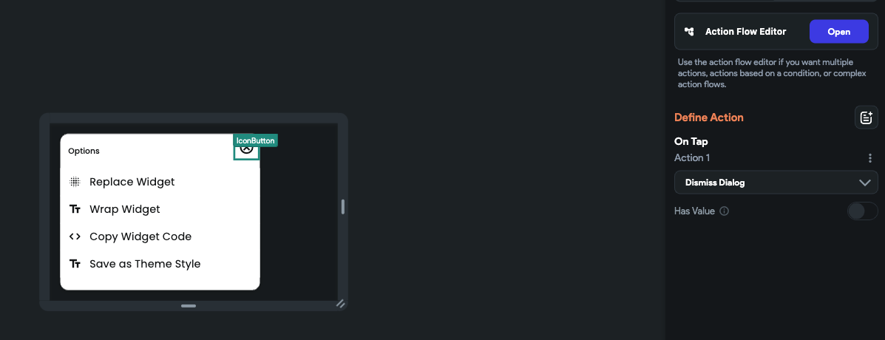

# Dismiss Custom Dialog

With this action, you can easily close the [custom dialog](alert-dialog.md#adding-custom-dialog-action), providing a convenient way for users to dismiss it. This functionality is handy when you want to give users the option to close the dialog from any widget within it, like a close button.

    <iframe 
        src="https://demo.arcade.software/ihrcUlB3vJ7L6Oog2Ob0?embed&show_copy_link=true"
        title=""
        style={{
            position: 'absolute',
            top: 0,
            left: 0,
            width: '100%',
            height: '100%',
            colorScheme: 'light'
        }}
        frameborder="0"
        loading="lazy"
        webkitAllowFullScreen
        mozAllowFullScreen
        allowFullScreen
        allow="clipboard-write">
    </iframe>

## Adding Dismiss Custom Dialog [Action]

Follow the steps below to add this type of action to any widget:

1. Select the **Widget** (e.g., Button) on which you want to add the action.
2. Select **Actions** from the Properties panel (the right menu), and click **+ Add Action**.
3. Search and select the **Dismiss Custom Dialog** (under *Alerts/Notifications*) action.
4. You can set a default value to be sent when the user closes the custom dialog. You can do so by enabling the **Has Value** option. For instance, if the dialog provides a list of colors and the user closes it without selecting any color, you can set a default color value of "Black" to be sent as the default selection.

