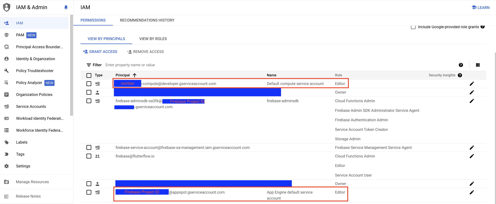
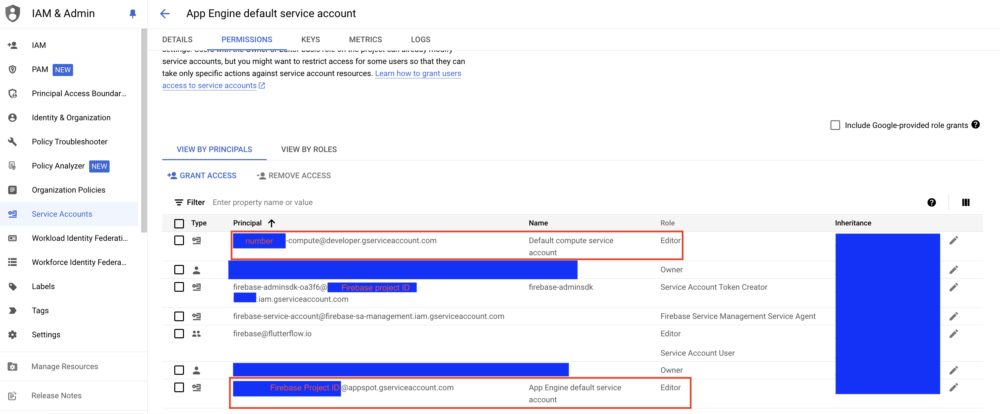

# Push Notifications

Push notifications allow you to send timely and relevant information to a user's phone. From this page, you can enable the push notification feature in your app. After enabling it, you can send the push notification instantly or schedule it to be delivered to the user's device at a specific time.

:::info[Behind the scenes]
FlutterFlow uses [**Firebase Cloud Messaging**](https://firebase.google.com/docs/cloud-messaging) (A Firebase product) to send push notifications.
:::

:::note[General Prerequisites]

Before getting started with this section, ensure you have:

* Completed all steps in the 
[**Firebase Setup**](../../ff-integrations/firebase/connect-to-firebase-setup.md).
* Upgraded to a [**Blaze plan**](https://firebase.google.com/pricing) for your Firebase project.
:::

:::note[iOS Prerequisites]

These steps are mandatory if you want to send push notifications to iOS devices:

* Created an [**Apple account**](https://appleid.apple.com/account?appId=632&returnUrl=https%3A//developer.apple.com/account/).
* [**Purchased an Apple Developer membership**](https://developer.apple.com/programs/enroll/). Please see [this link](https://developer.apple.com/programs/) for more details on the Apple Developer program and how to sign up.

:::

## Add push notifications

Here are the steps to send push notifications:

### Enabling push notification

:::warning
**Please note, push notifications will not work in these scenarios:**

* Push notifications will not work on an iOS simulator. To test you will need to use a real device.
* Push notifications will not be delivered to users who are logged out of your app. To send push notifications to users who are not logged in, consider implementing [**Anonymous Firebase Login**](../../ff-integrations/authentication/firebase-auth/anonymous-login.md) within your app
* Push notifications will not work if you have the app open on your device.
:::

To enable push notifications:

1. Navigate to the **Settings and Integrations -> App Settings -> Push Notifications** and 
**Enable Push Notifications**.
2. Now, click on the **Deploy** button. This will create and deploy the *Cloud Functions* in your 
   Firebase project that are necessary for push notifications to work.

:::info
By default, the **Automatically Prompt Users for Permission** option is enabled, meaning your app will automatically prompt users requesting for permission to receive push notifications when the app is started. However, this may be disruptive to your user sign-in flow.

If you disable it, you can control when the permission is requested. To do so, you will need to manually [**Request Permission**](../../resources/projects/settings/project-setup.md#request-permission-action) at the appropriate point in your app. **It is recommended to keep this option always enabled**.
:::

### Only for iOS: Configuring iOS app

To receive the push notifications in an iOS app, you need to perform the following additional steps.

#### 1. Creating a key

Apple requires developers to create a key for the push notifications inside the *Apple Developer Console* to verify the push notification's sender.

To create a key:

1. From your Apple developer account, open the [**keys**](https://developer.apple.com/account/resources/authkeys/list) section.
2. Click on the **(+)** button on the right side of the **Keys** label.
3. Enter the **Key Name**.
4. Select the **Apple Push Notifications service (APNs)** from the list below.
5. Click on **Continue** and then **Register**.
6. Click **Download** and save the file. It will be needed to add to your Firebase project.

<iframe src="https://www.loom.
com/embed/d17a807b1cc44f6caaa9b606f70819ed?sid=c983c35a-66d3-460f-8898-3329581d2801" frameborder="0" allow="accelerometer; autoplay; clipboard-write; encrypted-media; gyroscope; picture-in-picture; web-share" referrerpolicy="strict-origin-when-cross-origin" allowfullscreen></iframe>

#### 2. Add APNs key to Firebase project

To add APNs key to Firebase project:

1. From the Firebase dashboard from your project, navigate to the far left menu. Select Project 
   Settings( ) --> Project Settings.

2. Select the **Cloud Messaging** tab.

3. Scroll down and find your iOS app under the **Apple app configuration** section.

4. Under the **APNs Authentication Key** section, click on **Upload**. A popup will appear to 
   upload and enter the key details.

5. Click on the **Browse** button to locate and upload the APNs auth key file.

6. Enter the *Key ID*. You can find your Key ID in the Apple Developer Center under [Certificates, 
   Identifiers & Profiles](https://developer.apple.com/account/resources) -> [Keys](https://developer.apple.com/account/resources/authkeys/list) -> Click on **Key**.

7. Enter the *Team ID*. You can find your Team ID in the Apple Member Center under the [membership 
   tab](https://developer.apple.com/account/#/membership).

<iframe src="https://www.loom.
com/embed/03c8dd166901446cb8667e60acadb0de?sid=d63319fe-6c4f-4219-9448-97aeb1777c7d" frameborder="0" allow="accelerometer; autoplay; clipboard-write; encrypted-media; gyroscope; picture-in-picture; web-share" referrerpolicy="strict-origin-when-cross-origin" allowfullscreen></iframe>

#### 3. Adding identifier

You must add an Identifier to be able to send the push notifications to the iOS devices after you deploy your app to the app store.

To add an Identifier:

1. From your *Apple developer account* open the [**Identifiers**](https://developer.apple.com/account/resources/identifiers/list) section.

2. Click on the **(+)** button on the right side of the **Identifiers** label.

3. Select the **App IDs** and click **Continue**.

4. Select the *Type* **App** and click **Continue.**

5. Enter the **Description** as **ImageNotification.**

6. Enter the **Bundle ID** as your package name and add **.ImageNotification** in the end.

7. Click **Continue** and then click **Register**.

<iframe src="https://www.loom.
com/embed/5a93753eab644628a4bf67a35cf0eea8?sid=01d57898-deec-4ba6-af29-7d87f1b4ab30" frameborder="0" allow="accelerometer; autoplay; clipboard-write; encrypted-media; gyroscope; picture-in-picture; web-share" referrerpolicy="strict-origin-when-cross-origin" allowfullscreen></iframe>

#### 4. Enable push notifications in your App ID

:::note
Continue with this step only if you have an APP or Bundle ID created in your developer account.
:::

Add the 'Push Notifications' capability to your existing App ID in order to avoid any issues when you re-deploy your app. Here's how you do it:

1. From your *Apple developer account,* open the [**Identifiers**](https://developer.apple.com/account/resources/identifiers/list) section.

2. Open the identifier with your existing APP ID.

3. Select **Push Notifications** from the list and click **Save**.

<iframe src="https://www.loom.
com/embed/06916f7d74d1418d9fdb818d1e001635?sid=bb4c6e0e-ea37-48d7-b52f-d4a81db15dc9" frameborder="0" allow="accelerometer; autoplay; clipboard-write; encrypted-media; gyroscope; picture-in-picture; web-share" referrerpolicy="strict-origin-when-cross-origin" allowfullscreen></iframe>

### Sending push notifications

Use these steps to create and send push notifications:

1. Click on the **Settings and Integrations** -> App Settings -> **Push Notifications**.

2. Find the **Manually Trigger Notifications** section and click on it to expand the section.

3. In the **Notification Title**, enter the text that you want to set as a title for notification.

4. In the **Notification Text**, enter the content of your notification.
5. Optional: Click on the **Upload Notification Image** to set the image that you want to appear in the notification.
6. Find the **Target Audience** dropdown. Keep the **All** option selected if you want to send notifications to both *Android* and *iOS* users. You can select **Android** or **iOS** if you wish to target OS-specific users.
7. Enable **Deliver With Sound** if you wish to.
8. If you have more than 10K users, you might want to enable the **Batch Notifications**.
9. To send push notifications to a specific or few users, enter the user document reference (from the 'users' collection in Firestore) into the *User References*.
10. Find the **Initial Page** dropdown and select a page that you would like to open when a user clicks on the notification.
11. Click on **Send Notification**.
12. To confirm you want to send this notification, a popup will appear. You need to enter the text '**Send Notification**' and click on **Send Notification** again.

<iframe src="https://www.loom.
com/embed/e60604c910ca45f58e995407c16110e9?sid=2c8fa30b-3b43-42fe-a12f-e09f82868953" frameborder="0" allow="accelerometer; autoplay; clipboard-write; encrypted-media; gyroscope; picture-in-picture; web-share" referrerpolicy="strict-origin-when-cross-origin" allowfullscreen></iframe>

## Push notifications with data

Sometimes you might want to include additional data with your push notifications, which can then be used to display more detailed information on the page when it's opened through a push notification.

For instance, consider a news app that sends push notifications for breaking news. When the user taps the notification, the additional data could include the news article's title, summary, and image.

:::warning[Note]
Currently we only support sending *Firestore document references* as data.
:::

To send a push notification with data:

1. You must have a page that accepts a parameter of type 'DocumentReference'.
2. Build a notification using the instructions [here](#add-push-notifications).
3. Set the **Initial Page** to the one that accepts the parameter.
4. Find the **Parameter Data** section, copy the document reference from the Firestore, and paste it into the input box below.
5. Click on **Send Notification**.

<iframe src="https://www.loom.
com/embed/f6a0aa69b9274b1c965a85d72dcfdda5?sid=dfdebe15-61bf-4bf1-8cd6-238c7b9a5744" frameborder="0" allow="accelerometer; autoplay; clipboard-write; encrypted-media; gyroscope; picture-in-picture; web-share" referrerpolicy="strict-origin-when-cross-origin" allowfullscreen></iframe>

## Trigger push notification

You might want to send a push notification when something happens in your app. For example, sending a push notification on a message sent, a push notification on a new appointment booked, a push notification on a price change, etc.

You can send the push notification on such event occurrence by adding the **Trigger Push Notification** action.

For demonstration purposes, consider an example of sending a push notification to a post creator when someone comments on a post.

<iframe src="https://www.loom.
com/embed/4e4e92b55f6948b58db2dd9dbb0929d4?sid=99960bc1-143e-4cb6-918b-75f0eecf29b4" frameborder="0" allow="accelerometer; autoplay; clipboard-write; encrypted-media; gyroscope; picture-in-picture; web-share" referrerpolicy="strict-origin-when-cross-origin" allowfullscreen></iframe>

Here are the steps:

### 1. Retrieve the document reference of the user

The document reference of the user is required to send a push notification to a specific user, in this case, it would be the document reference of the post creator.

Normally, you would obtain the user document reference from the Firestore document, where a field like 'created_by' stores the document reference of the post creator. However, for the sake of simplicity, let's assume that we are storing this reference in an app state variable, which looks like this:

<figure>
    
  <figcaption class="centered-caption">User document reference in app state variable</figcaption>
</figure>

If you need to send push notifications to multiple users, consider a scenario where you want to notify all users who liked a post when someone comments on it. You can retrieve the list or array of user document references from the Firestore document or any app state variable within your app. Here's what a list of document references in an app state variable might look like:

<figure>
    
  <figcaption class="centered-caption">Multiple user document references in app state variable</figcaption>
</figure>

:::info
Learn more about working with 
[**App State variables**](../../resources/data-representation/app-state.md).
:::

### 2. Trigger Push Notification [Action]

Using this action, you can trigger the push notification when an event occurs in your app. For example, sending the push notification to the post creator when someone comments on a post.

Follow the steps below to add this action to any widget.

1. Select the **Widget** (e.g., IconButton, Button, etc.) on which you want to add the action.

2. Select **Actions** from the Properties Panel (the right menu), and click **Open**. This will open an **Action Flow Editor** in a new popup window.
    1. Click on the **+ Add Action**.
   
    2. On the right side, search and select the **Trigger Push Notification** action.
    3. To set who should receive the push notification, set the **Audience** to **Single 
       Recipient** or **Multiple Recipient**.
        * If you want to send a notification to a single user, set it to 'Single Recipient'. For example, sending a notification only to the group creator when someone joins the group.
        * If you want to send a notification to multiple users, set it to 'Multiple Recipients'. For example, sending a notification to all group members when someone joins the group.
    4. Set the **Source** of user document reference (e.g., app state variable or Firestore document).
    5. Further options are available based on the selected source.
    6. To set the specific notification title text, enter the **Notification Title**.
    7. You can set the **Notification Text** from a variable.
    8. Optional: Open the **Notification Image** section to set the image that you want to appear in the notification.
    9. Turn on the **Deliver with Sound** if you want to send a notification with the user's default sound/vibration.
    10. To set which page to open when a user taps the notification, set the **Initial Page** to the page you would like to open. You can also [pass on the parameters](#push-notifications-with-data) if page requests.

<iframe src="https://www.loom.
com/embed/5a6fa52d6802486fa0581f5ced56899e?sid=ca075c66-1b9a-4938-b882-0b3d7c803cb5" frameborder="0" allow="accelerometer; autoplay; clipboard-write; encrypted-media; gyroscope; picture-in-picture; web-share" referrerpolicy="strict-origin-when-cross-origin" allowfullscreen></iframe>

---

## FAQs

Push notifications not working; Getting cloud function error: PERMISSION_DENIED: Missing or insufficient permissions

If you encounter an error with push notifications, specifically a cloud function failure due to permission issues, it might be related to your Google Cloud organization's settings. Organizations can disable automatic IAM grants for default service accounts, leading to this error.

To fix this issue, manually grant the Editor role to the default service account used by your project. You can do this by visiting the GCP IAM page and assigning the Editor role to the following service account:

- For App Engine (Gen 1): `{firebase-project-id}@appspot.gserviceaccount.com`
- For Compute Engine (Gen 2): `{project-number}-compute@developer.gserviceaccount.com`

Also, ensure that these principals (emails) and their roles are present in the permissions tabs in *App Engine Default service account*, *Default compute service account*, and *firebase-adminsdk*. You can do this by visiting the GCP Service Accounts page, clicking on each service account email, and granting access to these principals in the permissions tab.

Below is a sample image for App Engine Default service account.

