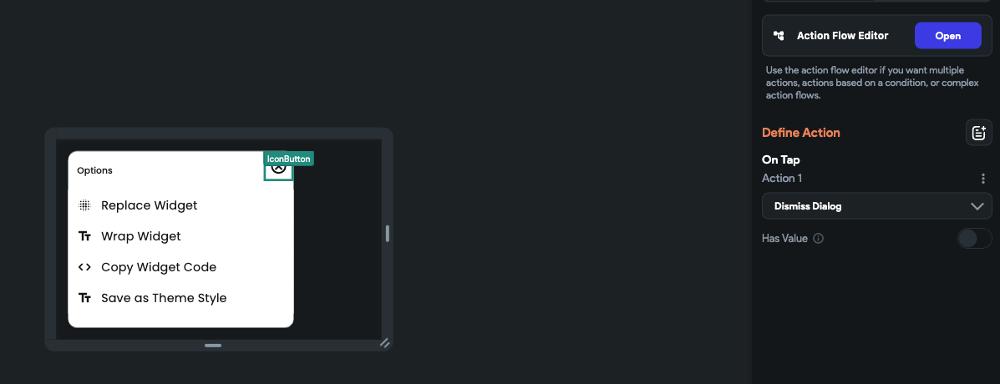

# Dismiss Custom Dialog

Use **Dismiss Custom Dialog** on a widget inside the component displayed by a [custom dialog](alert-dialog.md#adding-custom-dialog-action). The action closes the active dialog. It can also return a typed result—such as a selected color, record, or confirmation status—to the **Custom Dialog** action that opened the component.

    <iframe
        src="https://demo.arcade.software/ihrcUlB3vJ7L6Oog2Ob0?embed&show_copy_link=true" title="Dismiss Custom Dialog interactive tutorial"
        style={{
            position: 'absolute',
            top: 0,
            left: 0,
            width: '100%',
            height: '100%',
            colorScheme: 'light'
        }}
        frameborder="0"
        loading="lazy"
        webkitAllowFullScreen
        mozAllowFullScreen
        allowFullScreen
        allow="clipboard-write">
    </iframe>

## Adding Dismiss Custom Dialog [Action]

Follow the steps below to add this type of action to any widget:

1. Open the component used by the custom dialog and select the widget that should close it, such as a **Save**, **Select**, or close button.
2. Select **Actions** in the Properties panel, then select **+ Add Action**.
3. Search for and select **Dismiss Custom Dialog** under *Alerts/Notifications*.
4. To return data, enable **Has Value**, choose the result's data type, and set its value. This is the actual value returned by this dismissal path; it is not automatically a fallback for every way the dialog can close.
5. On the parent page, select the action that opens the **Custom Dialog** and set **Action Output Variable Name**. Later actions can read the result from **Action Outputs**.

For example, a color-picker component can return the selected color from its **Select** button. A separate **Cancel** button can dismiss without a value. If multiple dismiss actions in one component return values, they must all return the same data type.

:::important
Leave **Non-Blocking** disabled on the opening **Custom Dialog** action when the following action needs the returned value. With **Non-Blocking** enabled, the action flow continues immediately instead of waiting for the dialog to close.
:::

The dismiss action is intended for a custom-dialog component. FlutterFlow reports a project error if the project uses **Dismiss Custom Dialog** without any action that opens a custom dialog, and it does not allow dismiss actions inside action blocks.

