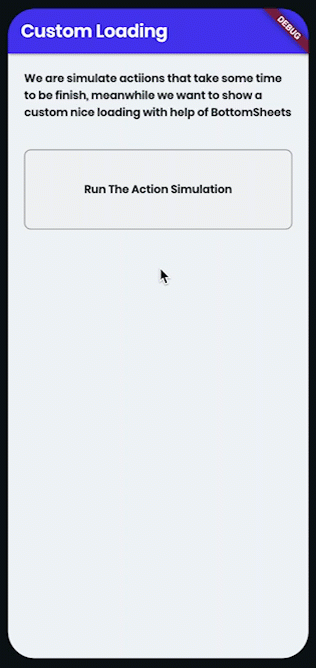
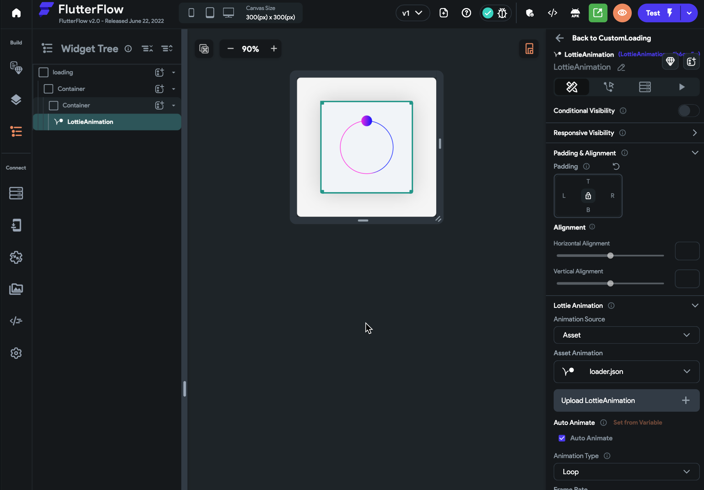
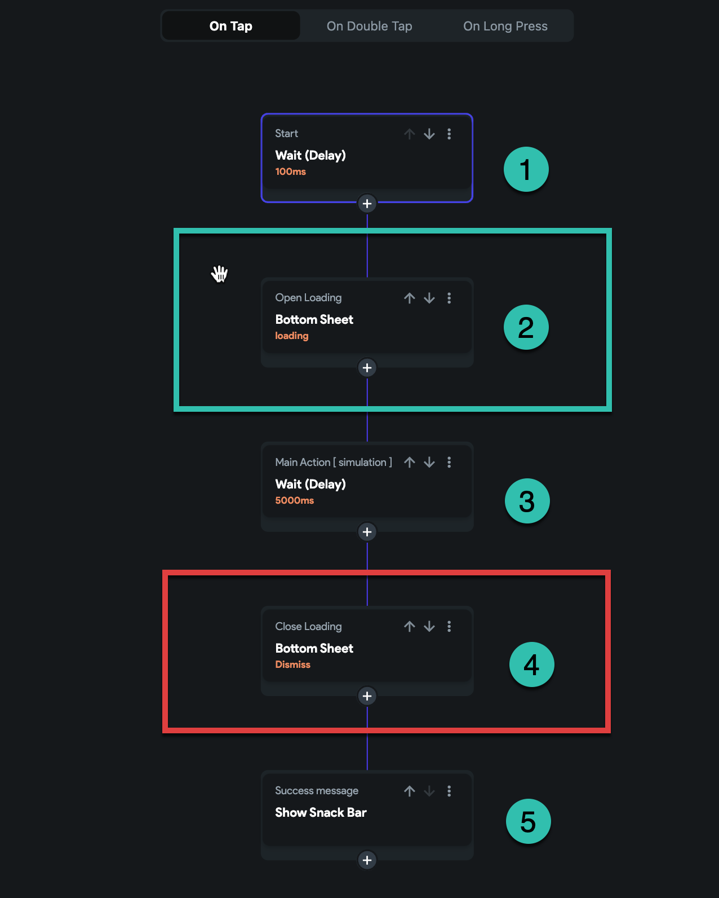
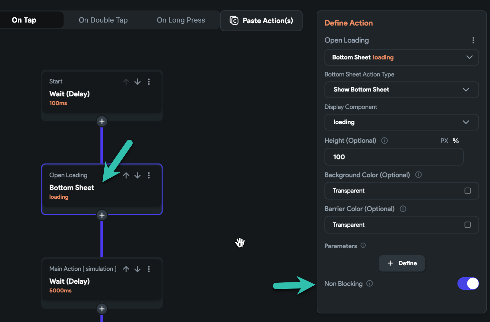
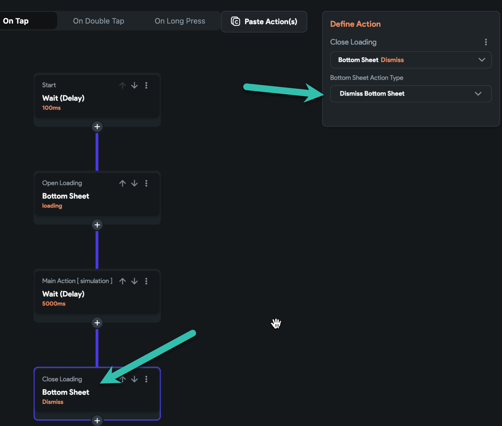

# Create a Custom Loading Animation Using a Bottom Sheet

Use a custom `Bottom Sheet` to display a loading animation while performing long-running actions such as API calls, database writes, or chained workflows. This guide walks through how to build a non-blocking custom loading indicator.

:::info[Prerequisites]
- A `Bottom Sheet` component with a loading animation (e.g., Lottie, GIF, or static image)
- A page where you want to trigger the loading sequence
:::

1. **Create a Bottom Sheet Component**

   1. Go to the **UI Builder** and create a new `Component`.
   2. Select the **Bottom Sheet** layout.
   3. Add a loading animation:
      - Use a **Lottie** animation, **GIF**, or any custom UI for the loading indicator.
      - You can also include a `Text` widget to display a status message.

      

   This component will serve as the visual loading indicator during your action chain.

2. **Set Up the Action Workflow**

   On the page where you want to trigger the loading sequence:

      1. **Trigger the workflow** (e.g., on button press).
      2. Add a `Delay` action to simulate a task (optional).
      3. Add the `Open Bottom Sheet` action and configure it to be **non-blocking**.

      

      

      :::warning
      Enable the **Non Blocking** option in the `Open Bottom Sheet` action. This allows the workflow to continue running while the bottom sheet is visible.
      :::

3. **Add the Main Actions**

      1. Add the primary actions you want to perform while the loading indicator is active.
         - These could include `API Calls`, `Create Document`, `Update Document`, or chained actions.
      2. For demonstration, a `Delay` of 5 seconds is used to simulate long-running tasks.

4. **Dismiss the Bottom Sheet**

   Once all actions are complete:

      1. Add a `Close Bottom Sheet` action to remove the loading indicator.

      

5. **Show a Confirmation Message**

   1. Add a `Show SnackBar` action to display a success message to the user.

   This confirms that the actions are complete and the bottom sheet has been dismissed.

   

You can test this implementation in the public project:
   - Navigate to the **CustomLoading** page
   - Tap **Login** on the login screen using the test account
   - Select **Custom Loading** from the home page to view it in action

