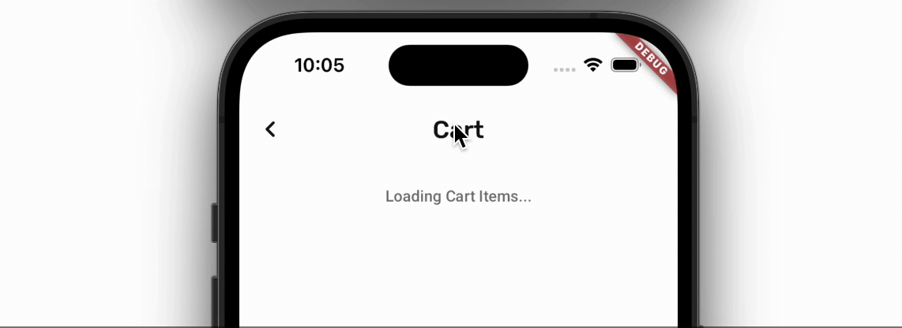
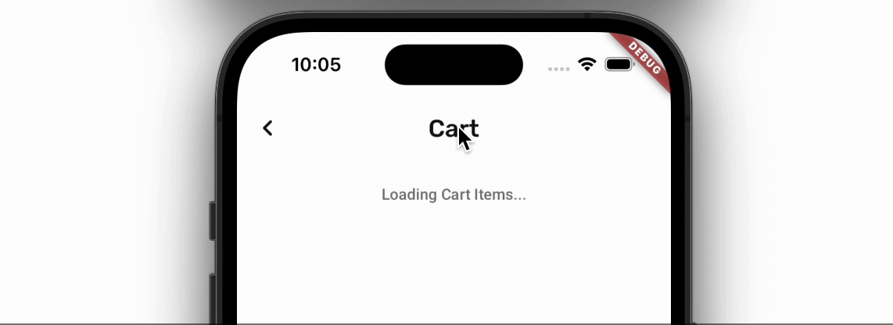
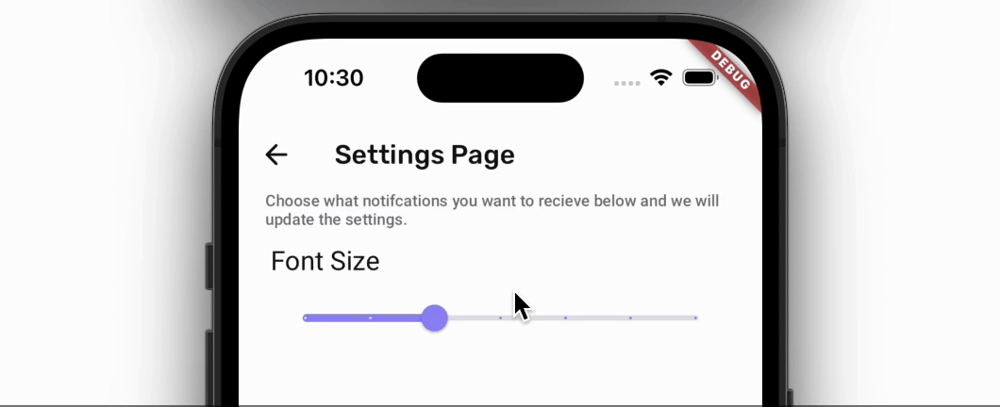
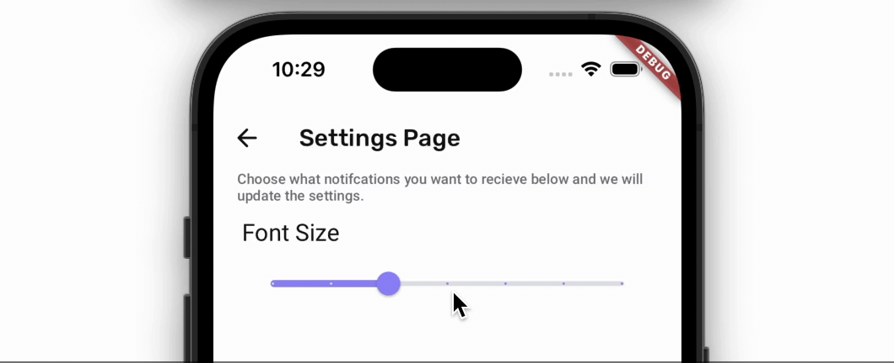

import Tabs from '@theme/Tabs';
import TabItem from '@theme/TabItem';

# Implicit Animations
In Implicit Animation, the widget automatically animates to a new property's value when they are updated. For example, the container widget animates whenever you change its size and colors.

:::info
Implicit Animation is recommended only when you want to run the animation once (after the properties are changed).
:::

Here are some examples of how it looks when you update the widget properties with and without Implicit Animation.

|  | Without Implicit Animation | With Implicit Animation |
| --- | --- | --- |
| **Container** |  |  |
| **Text** |  |  |

Here's an example of how you add the Implicit Animation on Container widget:

    <iframe 
        src="https://demo.arcade.software/3rbT4yu7bm4fXgLSpzXU?embed&show_copy_link=true"
        title=""
        style={{
            position: 'absolute',
            top: 0,
            left: 0,
            width: '100%',
            height: '100%',
            colorScheme: 'light'
        }}
        frameborder="0"
        loading="lazy"
        webkitAllowFullScreen
        mozAllowFullScreen
        allowFullScreen
        allow="clipboard-write">
    </iframe>

