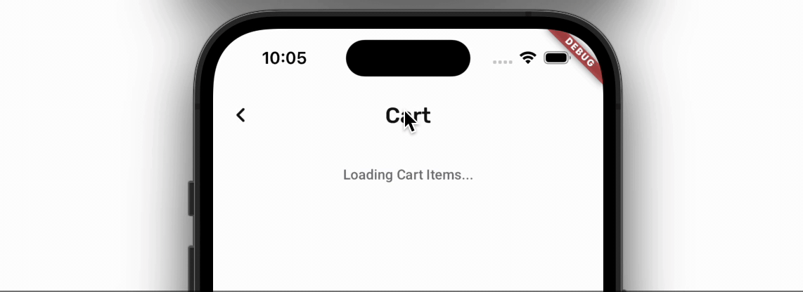
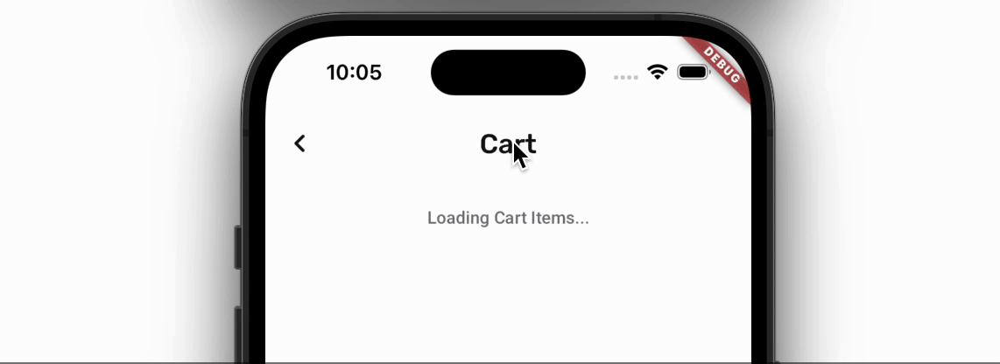

import Tabs from '@theme/Tabs';
import TabItem from '@theme/TabItem';

# Implicit Animations

An implicit animation automatically interpolates a supported widget property from its current value to a new runtime value. For example, an animated Container can transition its dimensions, constraints, decoration, or child alignment when an action or state change supplies a different value.

:::info
Implicit animation is not limited to one run. It runs whenever a supported property changes to a new value while the widget remains mounted. Use a [Widget Animation](widget_animations.md) when you need an explicit start, stop, reset, reverse, loop, or page-load sequence instead.
:::

Here are some examples of how it looks when you update the widget properties with and without Implicit Animation.

|  | Without Implicit Animation | With Implicit Animation |
| --- | --- | --- |
| **Container** |  |  |

## Add an implicit animation to a Container

1. Select the **Container**.
2. In its properties, enable **Implicit Animated**.
3. Select an **Animation Curve** and set **Duration (ms)**.
4. Bind a supported Container property to state or update it from an action, then test the transition in a running app.

The generated widget is an `AnimatedContainer`. If a property changes but is not one of the properties supported by `AnimatedContainer`, it changes without this interpolation.

You can also wrap a widget in **Transform** and enable its **Implicit Animation** setting for Scale or Rotate transforms. Skew and Translate transforms do not support this setting.

Here is an example of configuring a Container:

    <iframe
        src="https://demo.arcade.software/3rbT4yu7bm4fXgLSpzXU?embed&show_copy_link=true" title="Implicit Animations interactive tutorial"
        style={{
            position: 'absolute',
            top: 0,
            left: 0,
            width: '100%',
            height: '100%',
            colorScheme: 'light'
        }}
        frameborder="0"
        loading="lazy"
        webkitAllowFullScreen
        mozAllowFullScreen
        allowFullScreen
        allow="clipboard-write">
    </iframe>

## Related documentation

See [Animations](/concepts/animations) for a related FlutterFlow workflow.
