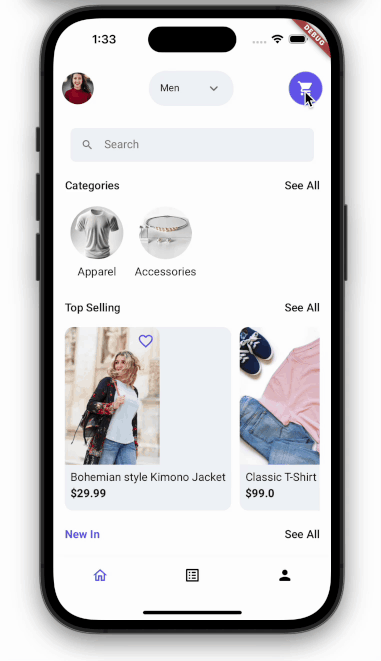
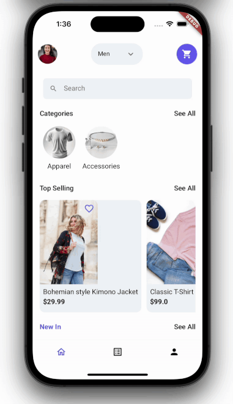
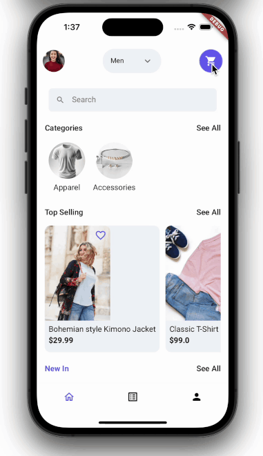

The animation that plays while transitioning from one page of the app to another is known as a page transition. In FlutterFlow, you can customize this animation to enhance the user experience.

You can choose from any of the following transition animations:

:::info
Here, the transitions are recorded with the duration set to 1000ms to make the animation clearly visible. But inside the app, it's recommended to keep the duration between 200-400ms.
:::

| Transition Type | Description                                    | Example                   |
|-----------------|------------------------------------------------|---------------------------|
| Instant         | Transition with no animation, switching pages immediately. |  |
| Fade In         | Gradually fades the new page into view.        |  |
| Slide Up        | Slides the new page up from the bottom.        |  |
| Slide Down      | Slides the new page down from the top.         |  |
| Slide Left      | Slides the new page in from the right.         |  |
| Slide Right     | Slides the new page in from the left.          |  |
| Scale           | Scales the new page in from a smaller size to full screen. |  |

## Animate single navigate transition

To set a transition animation for a single navigate action, first, ensure that you have added a [**Navigate To**](../../ff-concepts/navigation-routing/page-navigation.md#navigate-to-action) action and then select an animation from the **Transition Type** dropdown. By default, the animations use 300 milliseconds as the duration for which it plays but you can change it by specifying a value inside the **Duration** (ms) field.

## Change global navigate transition

To change the default transition animation of your entire app, follow the steps below:

    <iframe 
        src="https://demo.arcade.software/n5nw5nnzrgEQ5pRdwYBh?embed&show_copy_link=true"
        title=""
        style={{
            position: 'absolute',
            top: 0,
            left: 0,
            width: '100%',
            height: '100%',
            colorScheme: 'light'
        }}
        frameborder="0"
        loading="lazy"
        webkitAllowFullScreen
        mozAllowFullScreen
        allowFullScreen
        allow="clipboard-write">
    </iframe>

