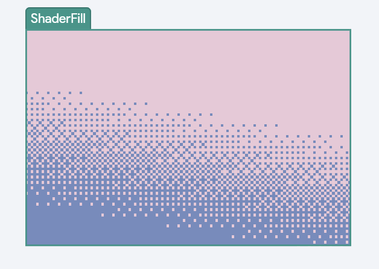
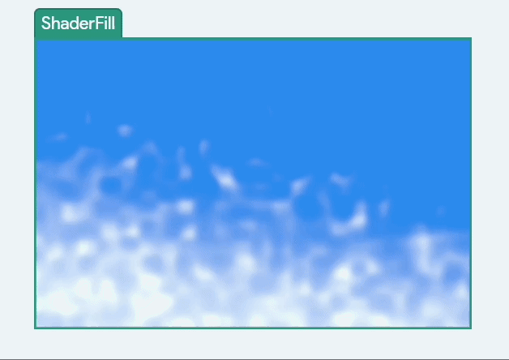
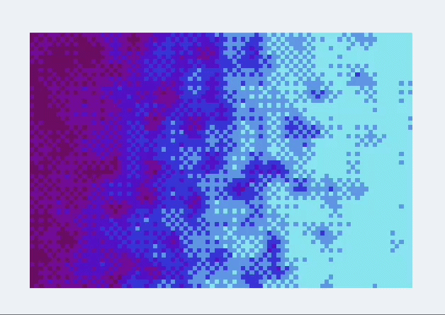
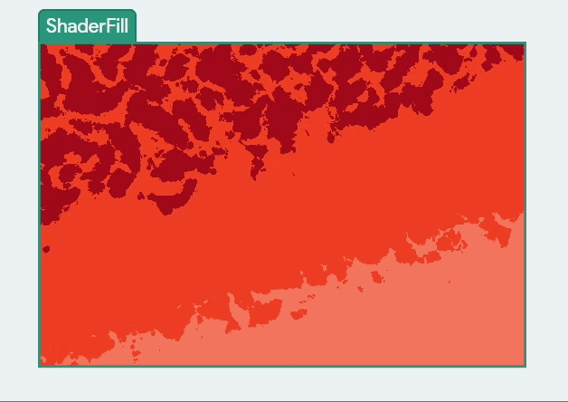
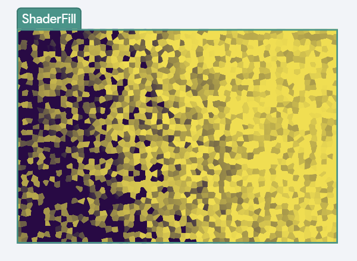
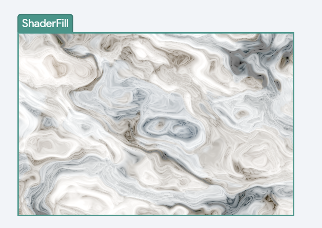
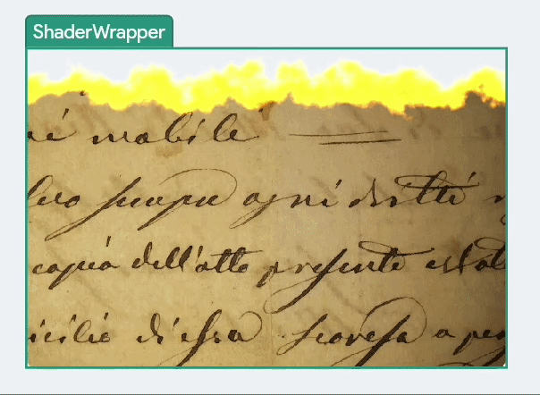
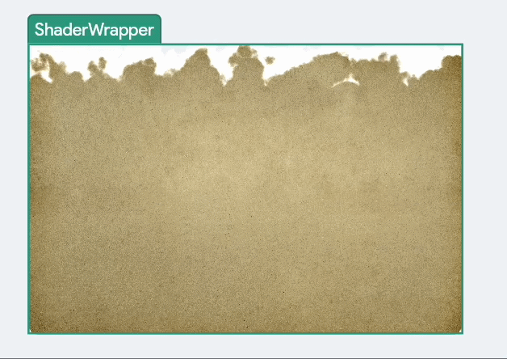

# Shaders

Shaders let you add rich visual effects to your app, such as animated gradients, ripple distortions, dissolve transitions, and interactive touch effects. Instead of using static images or simple color backgrounds, shaders generate visuals in real time using the device’s graphics processor (GPU). This makes it possible to create smooth animations and procedural textures that feel dynamic and alive.

    <iframe 
        src="https://demo.arcade.software/u8ydfkhmQQBEWppH87Sf?embed&show_copy_link=true"
        title=""
        style={{
            position: 'absolute',
            top: 0,
            left: 0,
            width: '100%',
            height: '100%',
            colorScheme: 'light'
        }}
        frameborder="0"
        loading="lazy"
        webkitAllowFullScreen
        mozAllowFullScreen
        allowFullScreen
        allow="clipboard-write">
    </iframe>

## Shader Widgets

FlutterFlow provides two shader widgets, each designed for a different purpose. Choose the one that best matches how you want to apply the visual effect in your UI.

### ShaderFill

The **ShaderFill** widget creates a standalone shader effect that fills a rectangular area. It does not contain any child widgets and works as its own visual element in the UI. This makes it ideal for decorative effects such as animated gradients, procedural textures, or dynamic backgrounds. You can control its size directly using the width and height properties.

For example, you can use the **ShaderFill** widget to create a visually engaging animated gradient background for an onboarding or welcome screen.

    <iframe 
        src="https://demo.arcade.software/cdXDHhay4ItCe6Y2i64m?embed&show_copy_link=true"
        title=""
        style={{
            position: 'absolute',
            top: 0,
            left: 0,
            width: '100%',
            height: '100%',
            colorScheme: 'light'
        }}
        frameborder="0"
        loading="lazy"
        webkitAllowFullScreen
        mozAllowFullScreen
        allowFullScreen
        allow="clipboard-write">
    </iframe>

### ShaderWrapper

The **ShaderWrapper** widget applies a shader effect on top of an existing widget. Instead of rendering a standalone visual, it wraps a child widget and modifies how it appears on screen. This is useful when you want to add effects like ripples, burn transitions, or dissolve animations to elements such as images, containers, or other UI components.

:::info

The **ShaderWrapper** widget automatically takes the size of the child widget it contains.

:::

For example, instead of instantly removing UI elements, you can use the **Shader Wrapper** widget to create a visual effect showing that something has been removed.

    <iframe 
        src="https://demo.arcade.software/x5Pt3n7yNA1IGnnfchKb?embed&show_copy_link=true"
        title=""
        style={{
            position: 'absolute',
            top: 0,
            left: 0,
            width: '100%',
            height: '100%',
            colorScheme: 'light'
        }}
        frameborder="0"
        loading="lazy"
        webkitAllowFullScreen
        mozAllowFullScreen
        allowFullScreen
        allow="clipboard-write">
    </iframe>

:::note

Internally, it uses the [**material_palette**](https://github.com/FlutterFlow/material_palette) package, developed by the FlutterFlow team, to power the shader-based visual effects.

:::

## Shader Mode

Every shader widget includes a **Shader Mode** setting that lets you choose how the shader is defined and applied. You can either use ready-made effects or bring your own custom shader.

- **Preset:** Select from a library of built-in shader effects. Each preset includes adjustable parameters such as colors, speed, intensity, and more, allowing you to easily customize the look and behavior directly from the properties panel.
- **Custom:** Upload your own `.frag` (fragment shader) file to create fully custom effects. You can define and control inputs using uniform values, which are exposed as sliders in FlutterFlow. Custom shaders appear as a checkerboard placeholder in the builder, but render with full visuals in Test or Run mode.

## Preset

Presets are ready-to-use shader effects that you can quickly apply and customize without writing any code.

:::tip

You can explore and try out all available [**presets here**](https://flutterflow.github.io/material_palette/).

:::

### ShaderFill Preset

The following presets are available on the ShaderFill Widget:

#### Gradient Presets

Gradient presets combine color transitions with procedural noise to create rich, animated visuals. Each gradient type is available in both **linear** and **radial** variants, and all share a common set of customizable property groups for fine-tuning the look and motion via the properties panel.

| Gradient Type | Description | Example |
| --- | --- | --- |
| **Gritty Gradient** | A rough, grainy gradient with a textured, stippled feel |  |
| **Perlin Gradient** | Smooth, natural-looking noise blended into a gradient |  |
| **Simplex Gradient** | Similar to Perlin, but sharper and more structured |  |
| **FBM Gradient** | Layered noise that creates soft, cloud-like detail |  |
| **Turbulence Gradient** | A more chaotic, high-energy version of FBM |  |
| **Voronoi Gradient** | Distinct cell-like patterns based on geometric regions |  |
| **Voronoise Gradient** | A hybrid of cell structures and smooth noise |  |

#### Marble Smear Preset

A procedural marble texture that reacts to user input. When **Interactive** is enabled, users can drag or touch the surface to smear and distort the marble pattern in real time, creating a fluid, organic visual effect. This is ideal for playful backgrounds, creative demos, or experiences where you want users to directly interact with the visuals.

### ShaderWrapper Preset

The following presets are available on the ShaderWrapper Widget:

#### Ripple / Clickable Ripple

Creates a wave-like distortion on the child widget, similar to water ripples. The standard ripple animates continuously, while the clickable version triggers ripples from the user’s tap location, adding responsive visual feedback to interactions.

#### Burn / Radial Burn / Tappable Burn

A dramatic dissolve effect that makes the widget appear to burn away. It can progress in a direction, radiate from a center point, or originate from user taps, with glowing edges that resemble fire.

#### Smoke / Radial Smoke / Tappable Smoke

A softer version of the burn effect, where the widget fades away like drifting smoke. It supports directional, radial, and tap-based variations for smooth and subtle transitions.

#### Pixel Dissolve / Radial Pixel Dissolve / Tappable Pixel Dissolve

Breaks the widget into pixel blocks that scatter and disappear. This effect works for directional, radial, or tap-based dissolves, making it ideal for stylized removal or transition animations.

#### Tappable Slurp

A playful distortion effect that pulls the widget toward tap points, like a whirlpool. Each interaction creates a dynamic suction effect, adding a fun and interactive feel to the UI.

## Implicit Animated

When [**Implicit Animated**](implicit_animations.md) is enabled, changes to shader parameters (such as colors or slider values) animate smoothly instead of updating instantly. This is especially helpful when parameters are driven by app state, allowing for seamless transitions like gradually shifting gradient colors or intensities.

## Time Animation Behavior

Time Animation Behavior controls how a shader animates over time. It defines whether the animation runs automatically, is controlled manually, or follows a custom timeline.

### Continuous (default)

The shader animates automatically in a smooth, endless loop with no setup required. This is ideal for ambient effects like animated backgrounds, gradients, or subtle motion that should always be running.

### Implicit

You control the shader’s animation manually using a **Time** slider [0–10]. This is useful when you want to connect the animation to app state or user interaction, such as syncing it with scroll position, triggering it through actions, or freezing the effect at a specific point in time.

### Explicit

Provides full control over the animation timeline. You can define how the animation plays by configuring properties like duration, delay, easing curve, looping, and direction. This mode is useful for choreographed animations that need to start, stop, or respond to events using a **Shader Animation** action.

## Interactive Mode

Some shader presets support touch and tap interactions, allowing users to directly influence the visual effect. When **Interactive** is enabled, users can tap or drag on the shader to trigger dynamic responses such as ripples, burn marks, distortions, or smearing effects, making the UI feel more engaging and responsive.

**The following presets are Interactive:**

- **Fill:** Marble Smear (drag to smear)
- **Wrap:** Clickable Ripple, Tappable Burn, Tappable Smoke, Tappable Pixel Dissolve, Tappable Slurp

### Persist Taps

Available for tappable wrap presets. When enabled, the effects created by taps remain visible even after the user lifts their finger. When disabled, the effects gradually fade away, creating a more temporary interaction.

### Tap Animation

For interactive wrap presets, you can control how each tap effect animates. This is separate from the main time animation and lets you define properties like curve, duration, delay, and playback behavior for each interaction, giving you finer control over how tap responses feel.

## Cache

The **Cache** option improves performance by storing the shader’s rendered output. When enabled, the shader is rendered once and reused until its parameters change. This is enabled by default for ShaderFill.

:::tip

Disable caching if your shader needs to update continuously, such as in animations or real-time interactive effects that change every frame.

:::