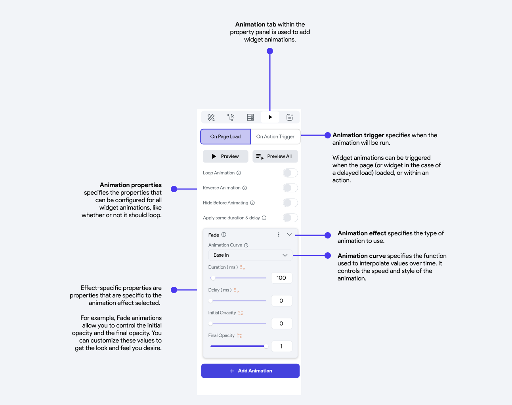
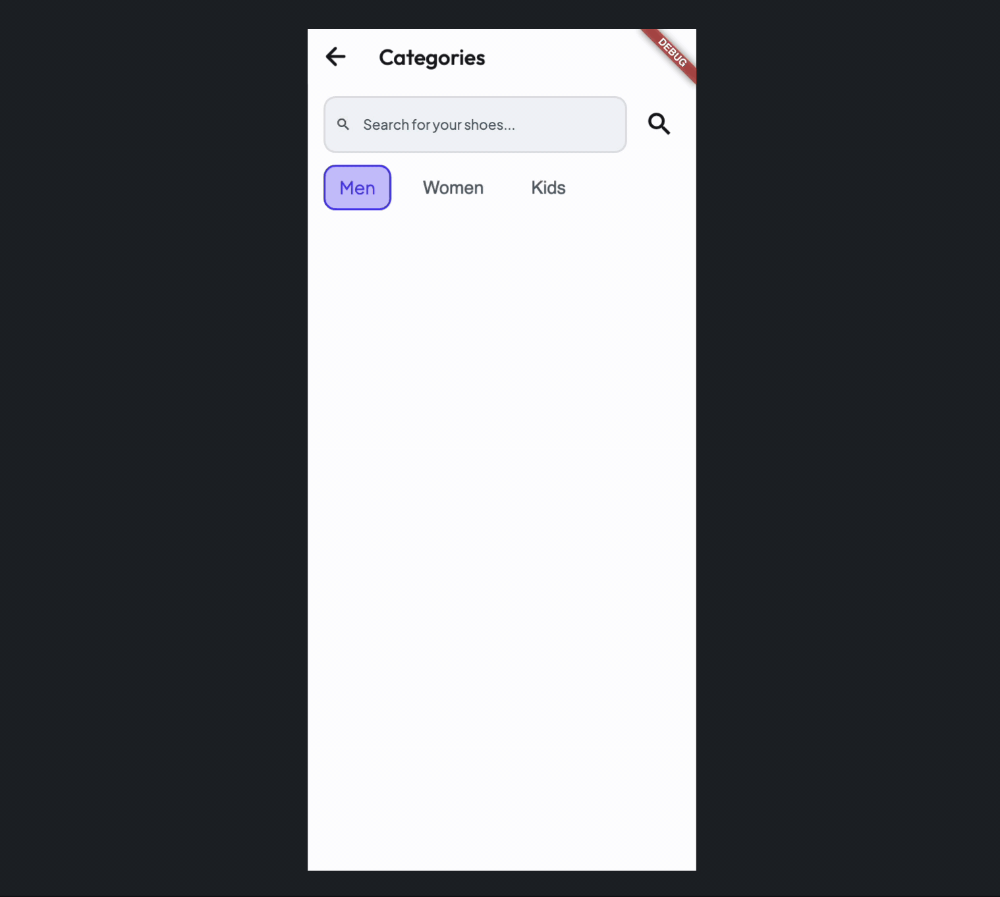

import fadeGif from '@site/static/img/animations/animation_gifs/fade.gif';
import scaleGif from '@site/static/img/animations/animation_gifs/scale.gif';
import slideGif from '@site/static/img/animations/animation_gifs/slide.gif';
import rotateGif from '@site/static/img/animations/animation_gifs/rotate.gif';
import shakeGif from '@site/static/img/animations/animation_gifs/shake.gif';
import blurGif from '@site/static/img/animations/animation_gifs/blur.gif';
import saturateGif from '@site/static/img/animations/animation_gifs/saturate.gif';
import tiltGif from '@site/static/img/animations/animation_gifs/tilt.gif';
import flipGif from '@site/static/img/animations/animation_gifs/flip.gif';
import shimmerGif from '@site/static/img/animations/animation_gifs/shimmer.gif';
import tintGif from '@site/static/img/animations/animation_gifs/tint.gif';
import animationCurves from '@site/static/img/animations/animation_gifs/animation_curves.gif';

import animationsOverview from '@site/static/img/animations/animations_overview.png';
import shimmerAnimationFinal from '@site/static/img/animations/animation_gifs/shimmerAnimationFinal.gif';
import fadeEaseIn from '@site/static/img/animations/animation_gifs/fade-easein.gif';
import fadeEaseInOut from '@site/static/img/animations/animation_gifs/fade-easeinout.gif';
import fadeEaseOut from '@site//static/img/animations/animation_gifs/fade-easeout.gif';

Widget animations allow you to add animation effects at the widget level.
To add an animation to a widget, you'll need to go to the property panel for the widget and select the animations tab.

<figure>
    
  <figcaption class="centered-caption">Animation Overview</figcaption>
</figure>

<!-- When you create a widget animation, you'll sepcify:

- The animation effect
- The animation's curve
- Any variables specific to the animation -->

## Animation effects & properties
FlutterFlow supports a variety of animation effects and properties for widget animations.

Most animations have core properties you can edit, like the `Duration`, which specifies how long the animation should run for, and the `Delay`, which specifies what delay the animation should have before it starts to run. 

In addition, there are animation-specific properties that usually have both a start and end value, which are mentioned in the table below.

| Effect | Description  |  
Example
 | Effect-Specific properties
| ----- | ----- | ----- | ----- |
| **Fade** | Makes the widget gradually appear or disappear.  It's widely used for smooth introductions of elements on the screen and to focus user attention by fading in or out content or UI elements.| | `Opacity`: the starting or ending visibility of the widget, where 0 is fully transparent and 1 is fully visible|
| **Slide** | Changes the widget's position on the screen. Typically used to introduce widget in a dynamic, visually engaging way, like sliding in menus, pages, or notifications. FlutterFlow supports both vertical and horizontal slide. |  | `Position`: where 0 specifies the widget's current position, -100 specifies 100px to the left (horizontal) or down (vertical), and 100 specifies 100px to the right (horizontal) or up (vertical).       *To make the widget come and go off the screen, make the start and/or final position greater than the width of the device.* |
| **Scale** | Changes the size of the widget. Often used to draw attention to UI components, like magnifying buttons on hover or animating dialog boxes to appear from a central point. ||`Scale`: the starting or ending multiple to scale the widget horizontally (X) or vertically (Y), where 1 represents the current size of the widget. |
| **Rotate** | Turns the widget clockwise or anticlockwise.  It's often used for simple effects like spinning a loading icon.|  | `Turns`: specifies the number of 360 degree rotations. |
| **Shake** | Creates the shake effect on a widget. Often used to draw attention to an element or indicate an error, like when a user enters incorrect information in a form field.| |`Frequency`: Number of shakes per second      `Offset`: Shake distance, a higher value intensifies and a negative value shakes the opposite direction      `Rotation Angle`: Angle of the shake|
| **Blur** | Creates a focus or un-focus effect on a widget |  | `Radius (X or Y)`: Size of the blur.       *To create an unfocus effect, `Final Radius` should be greater than `Initial Radius`. To create a focus effect, `Initial Radius` should be greater than `Final Radius`*. |
| **Saturate** | Used to enhance visual appeal by making colors more vibrant for focused content or creating a muted effect for background elements. | | `Strength`: 0 indicates fully desaturated, 100 represents normal saturation and >100 represents the percent saturation |
| **Tilt** | Creates a transforming effect (3D perspective) on your widget. Typically used to add a subtle interactive element to UI components, like buttons or cards, indicating user interaction or focus. |  | `Tilt`: The angle at which the widget is viewed. |
| **Flip** | Flip animation rotates an element around its horizontal or vertical axis, creating a mirror effect. It's often used for flipping cards in a UI to reveal hidden information. |  | `Flip`: The angle at which the widget is viewed. |
| **Shimmer** | Creates a "shiny" effect moving across the screen, often used to signify that data or content is in the process of loading or being fetched.       **Note** that this animation doesn't run on the Test mode.  |  | `Color`: The color of the "shiny" line or gradient that sweeps of the widget. A common practice is to use a slightly lighter shade than the content.       `Angle`: Determines the direction of the shimmer effect across the content. 0 degrees for horizontal and 90 for vertical. |
| **Tint** | Adds a color overlay effect to your content. | | `Color`: Color of the overlay.       `Strength`: Intensity of the tint. |

## Animation curves
When applying an animation, you'll also be able to specify the curve. An animation curve is essentially a mathematical formula used to interpolate values over time. Changing the animation curve allows you to control the speed and style of the animation.

 

  
  
FlutterFlow supports a variety of animation curves:

| Curve | Description  
| ----- | ----- |
| **Ease In** | Starts the animation slowly and then accelerates towards the end. It's useful for creating an effect where the motion begins gently and speeds up.| 
| **Ease In Out** | Starts the animation slowly, accelerates in the middle, and then decelerates towards the end. It's ideal for creating smooth, natural-looking animations that don't have abrupt starts or stops.|
| **Ease Out** | Begins the animation quickly and then slows down towards the end. It gives the effect of a rapid start that gently comes to a stop.|
| **Bounce** | Adds a bouncing effect at the end of the animation. The animated object overshoots its final position and then bounces back, mimicking the physical behavior of a bouncing ball.|
| **Elastic** | Creates an elastic effect where the animation overshoots its target value and oscillates before settling. It's useful for animations that need a springy, elastic feel.|
| **Linear** | Progresses at a constant speed throughout the animation. It provides a uniform transition from start to end, with no acceleration or deceleration.|

## Animation on Page Load
There are many cases when you might want to trigger an animation when a page or (in the case of a delayed load) widget is loaded onto the screen. 

Consider an eCommerce use case, where a backend query is used to retrieve a list of trending products. There may be some delay between when the page is first loaded and when the actual results are displayed. To improve the user experience we can add some animations to let users know when content is loading.

To create an experience like this, you need to add a shimmer animation to a widget, and display that widget conditionally (i.e. when the query is loading). Here's how you do it:

    <iframe 
        src="https://demo.arcade.software/dvZkJOnXC562J4wt7jbI?embed&show_copy_link=true"
        title=""
        style={{
            position: 'absolute',
            top: 0,
            left: 0,
            width: '100%',
            height: '100%',
            colorScheme: 'light'
        }}
        frameborder="0"
        loading="lazy"
        webkitAllowFullScreen
        mozAllowFullScreen
        allowFullScreen
        allow="clipboard-write">
    </iframe>

<!-- add aracde -->

## Animation on Action Trigger
Beyond triggering widget animations on load, you can trigger an animation to occur as part of an action. For example, say you want a like button to be animated when a user clicks it.

Here's how you do it:

    <iframe 
        src="https://demo.arcade.software/5ylV8lViDw9WvZo60wUm?embed&show_copy_link=true"
        title=""
        style={{
            position: 'absolute',
            top: 0,
            left: 0,
            width: '100%',
            height: '100%',
            colorScheme: 'light'
        }}
        frameborder="0"
        loading="lazy"
        webkitAllowFullScreen
        mozAllowFullScreen
        allowFullScreen
        allow="clipboard-write">
    </iframe>

<!-- add aracde -->

:::note 
You can give a name to the widget that you want to animate using the action, this will make it easier to find in the action menu.
:::

## Applying multiple animations
You can apply multiple animations to a single widget. By default, when you add multiple animations, they are executed in a series (one after another) creating staggered animation. However, you can define to run all animations at the same time.

### Run multiple animations simultaneously
If you want to run multiple animations together for the same amount of time (e.g., slide and scale widget at the same time), enable the **Apply same duration & delay** while adding animation.

### Create staggered animation
A staggered animation is multiple animations executed subsequently. Adding staggered animations can help you create a stunning visual effect.

To create staggered animation, ensure you **disable** the **Apply same duration & delay** option and keep adding animations. The delay property will be auto adjusted based on the duration of all previously added animations.
:::tip
For manually controlling the staggered animation, set the delay for your new animation based on the total duration of all previously added animations. For instance, if the first two animations each last 1000ms (1 second), the delay for the third animation should be 2000ms (2 seconds). This ensures the third animation begins only after the completion of the first two, each lasting 1 second.
:::

Here's an example of creating a staggered animation:

    <iframe 
        src="https://demo.arcade.software/Vr5RhGCjJXisfMUgkigY?embed&show_copy_link=true"
        title=""
        style={{
            position: 'absolute',
            top: 0,
            left: 0,
            width: '100%',
            height: '100%',
            colorScheme: 'light'
        }}
        frameborder="0"
        loading="lazy"
        webkitAllowFullScreen
        mozAllowFullScreen
        allowFullScreen
        allow="clipboard-write">
    </iframe>

## Setting animation values from variables
You can set animation values dynamically using the variables of your app. This flexibility allows you to create more sophisticated animations.
Let's see an example of creating a beautiful animation where a list of items is sliding in from left to right. Here's how it looks:

If you notice carefully, the items appear in a staggered fashion. This can be achieved by setting the delay value of each item based on its position (index) in the list. Here's how exactly you do it:

Select the item in the list and add the Slide animation.

In the Delay property, open the variable menu and add a [code expression](../../resources/control-flow/functions/utility-functions.md#code-expressions) to calculate the delay value based on the item's index. For this example, we use the formula `[index] * 100`, where `index` represents the position of the item, and `100` is the delay in milliseconds. This means the first item will slide in after 100 ms, the second after 200 ms, and so on, creating a staggered animation effect.

    <iframe 
        src="https://www.loom.com/embed/6cc7bc3180e1415ab609b233f12333c2?sid=4420b3fb-1fd8-4c4e-a0dc-b2f9165724cb"
        title=""
        style={{
            position: 'absolute',
            top: 0,
            left: 0,
            width: '100%',
            height: '100%',
            colorScheme: 'light'
        }}
        frameborder="0"
        loading="lazy"
        webkitAllowFullScreen
        mozAllowFullScreen
        allowFullScreen
        allow="clipboard-write">
    </iframe>

<!-- add arcade -->
