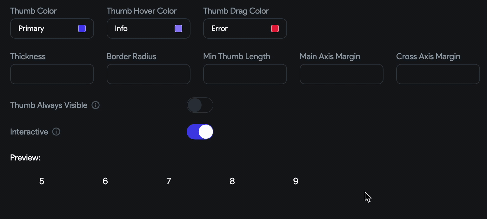

import Tabs from '@theme/Tabs';
import TabItem from '@theme/TabItem';

# Design System

A design system is a guideline to create a consistent UI/UX across the app. A design system includes colors, typography, fonts, icons, app assets, a nav bar, an app bar, and pre-designed UI components such as buttons and text widgets.

This is especially helpful when you are working in a team of builders and designers in a large company. Let's say you have an app with several different features and pages, each with its unique design. However, you notice that you are starting to create inconsistencies in the design across different pages, such as using different colors, fonts, and layouts.

To solve this issue, you can create a design system outlining common design guidelines. Then, the team members can use this design system, which ensures the design remains consistent.

    <iframe 
        src="https://www.youtube.com/embed/moP9VtkoyjY"
        title="Sharing a Project with a User"
        style={{
            position: 'absolute',
            top: 0,
            left: 0,
            width: '100%',
            height: '100%',
            colorScheme: 'light'
        }}
        frameborder="0"
        loading="lazy"
        webkitAllowFullScreen
        mozAllowFullScreen
        allowFullScreen
        allow="clipboard-write">
    </iframe>

## Adding Design System
You can add a design system from the [Library](../../resources/projects/libraries.md) dependencies added to your project. A library can serve as a central repository for your design assets, components, and styles—effectively becoming a Design Library for your application(s).

:::tip[possible use cases]

- **Enterprise Applications:** Large organizations can develop a centralized design system as a library to ensure all internal applications maintain a cohesive look and feel, enhancing brand identity and user experience.
- **Startup MVPs:** Startups can expedite the development of Minimum Viable Products (MVPs) by leveraging a pre-built design system library like [**shadcn**](https://marketplace.flutterflow.io/item/cNlm0zWW1Nfq11cFXBmp), allowing them to focus on functionality and user validation.
- **Cross-Platform Consistency:** Teams aiming to deploy apps across multiple platforms (iOS, Android, Web) can use a popular platform based design system library to ensure uniformity in design, reducing the effort required for platform-specific adjustments.

:::

To add a design system from a library, start by creating the design system in a new FlutterFlow project and [publishing it as a library](../../resources/projects/libraries.md#publishing-a-library). Next, [import](../../resources/projects/libraries.md#importing-a-library) that library into the project where you want to use the design system. Then, navigate to **Theme Settings > Design System** and click **No Design System Selected**. From the dropdown that appears, **Select a library** you’ve just imported to apply its design system to your project.

    <iframe 
        src="https://demo.arcade.software/G3PekDcZNsWYrKoz3xnE?embed&show_copy_link=true"
        title=""
        style={{
            position: 'absolute',
            top: 0,
            left: 0,
            width: '100%',
            height: '100%',
            colorScheme: 'light'
        }}
        frameborder="0"
        loading="lazy"
        webkitAllowFullScreen
        mozAllowFullScreen
        allowFullScreen
        allow="clipboard-write">
    </iframe>

## Import Figma Theme

You might use Figma to design your app and build it accordingly in our builder. If you have a lot of colors and text styles, importing them manually can take some time. You can now import the whole Figma theme, which includes the colors and text styles, directly into our builder.

:::info

Before you import the Figma theme, ensure you have access to the Figma design file and [**generate the access token**](https://help.figma.com/hc/en-us/articles/8085703771159-Manage-personal-access-tokens).

:::

To import the Figma theme:

1. Open the **Theme Settings > Design System**.
2. Click the **Import Figma Theme** button. This will open a new popup.
3. Enter your **Figma File URL** and **Personal Access Token**. The *Personal access tokens* allow us to access all of your files and data in Figma.
4. Click **Import Figma Theme**.
    1. Now, you'll see a list of colors from your Figma file, and here you can decide which one to keep. If everything looks good to you, Click **Import & Continue**.
    2. You can replace the current theme colors with new/imported ones. Click on any color, and the dropdown will display all imported colors. Click on the new color to replace it. When done, click **Save & Continue**.
    3. If you have custom text styling in your Figma file, it will be displayed here, and you can choose which one to import. Click **Import & Continue**.
    4. Replace any existing style with the new one and click **Save & Finish**.
5. Finally, click **Finish & Close**.

    <iframe 
        src="https://demo.arcade.software/gEry2KO5BeoZkflYHm8f?embed&show_copy_link=true"
        title="Sharing a Project with a User"
        style={{
            position: 'absolute',
            top: 0,
            left: 0,
            width: '100%',
            height: '100%',
            colorScheme: 'light'
        }}
        frameborder="0"
        loading="lazy"
        webkitAllowFullScreen
        mozAllowFullScreen
        allowFullScreen
        allow="clipboard-write">
    </iframe>

If you prefer watching a video tutorial, here is the guide for you:

    <iframe 
        src="https://www.youtube.com/embed/kWvWa5PSWhw"
        title="Sharing a Project with a User"
        style={{
            position: 'absolute',
            top: 0,
            left: 0,
            width: '100%',
            height: '100%',
            colorScheme: 'light'
        }}
        frameborder="0"
        loading="lazy"
        webkitAllowFullScreen
        mozAllowFullScreen
        allowFullScreen
        allow="clipboard-write">
    </iframe>

---

## Loading Indicators

To customize the **Loading Indicators** used in the app, you can make changes in this section. You have the option to specify the **Indicator Type**, **Color**, and **Radius**, and the preview of the changes will be displayed below.

    <iframe 
        src="https://demo.arcade.software/6OiSlYPiCEY1p3fg0kpG?embed&show_copy_link=true"
        title="Sharing a Project with a User"
        style={{
            position: 'absolute',
            top: 0,
            left: 0,
            width: '100%',
            height: '100%',
            colorScheme: 'light'
        }}
        frameborder="0"
        loading="lazy"
        webkitAllowFullScreen
        mozAllowFullScreen
        allowFullScreen
        allow="clipboard-write">
    </iframe>

:::tip
Avoid mis-sized loading indicators or components, which lead to jumping layouts. Ensure loading components match the size and position of the content they replace.
:::

If you prefer watching a video tutorial, here is the guide for you:

    <iframe 
        src="https://www.youtube.com/embed/3sG-O1lkv0M"
        title="Sharing a Project with a User"
        style={{
            position: 'absolute',
            top: 0,
            left: 0,
            width: '100%',
            height: '100%',
            colorScheme: 'light'
        }}
        frameborder="0"
        loading="lazy"
        webkitAllowFullScreen
        mozAllowFullScreen
        allowFullScreen
        allow="clipboard-write">
    </iframe>

---

## Scrollbar Theme

From here, you can customize the appearance of the scrollbar that shows up on scrollable elements like ListView, GridView, StaggeredView, Row, and Column.

:::note

The scrollbar currently shows up by default only on platforms where Flutter natively supports it, such as web and desktop environments.

:::

You can modify its color, adjust its thickness, give it a rounded border, and more. In the 'Preview' section, you'll also be able to see the immediate visual effect of your changes.

Here are all the properties you can customize:

1. **Thumb Color:** This changes the color of the draggable portion of the scrollbar, often called the "thumb".
    
    
    
2. **Thickness:** This increases width (in a vertical scrollbar) or height (in a horizontal scrollbar).
    
    

3. **Border Radius:** This sets the curvature of the scrollbar's corners. By adjusting the border-radius, you can give the scrollbar a more rounded appearance (higher values) or a more squared appearance (lower values).
    
    

4. **Min Thumb Length:** This refers to the smallest size that the draggable portion (thumb) of a scrollbar can be. This ensures that users can always see and interact with the thumb, even when the content is very long.
    
    

5. **Main Axis Margin:** This refers to the space or gap along the primary direction of the scrollbar. For instance, in a vertically scrolling list, it refers to the top and bottom spacing, and in a horizontally scrolling list, it refers to the left and right spacing.
        
    

6. **Cross Axis Maring:** This refers to the space or gap along the cross direction of the scrollbar. For instance, in a vertically scrolling list, it refers to the left and right spacing, and in a horizontally scrolling list, it refers to the top and bottom spacing.

    

7. **Thumb Always Visible:** This determines whether the draggable "thumb" element of the scrollbar constantly remains visible or fades out when not in use. When enabled, you can also specify whether to show the track as well with custom color and border color.
8. **Interactive**: Using this property, you can set different colors for different states of the thumb, including when it's hovered over or being dragged.
    
    

---

## Pull to Refresh Style

From here, you can customize the appearance of the pull to refresh (i.e., the loading circle).

You can modify its color, background color, and stroke width. In the 'Preview' section, you'll also be able to see the immediate visual effect of your changes.

    <iframe 
        src="https://demo.arcade.software/KHdvetH4Eg46TfDmZQUJ?embed&show_copy_link=true"
        title="Sharing a Project with a User"
        style={{
            position: 'absolute',
            top: 0,
            left: 0,
            width: '100%',
            height: '100%',
            colorScheme: 'light'
        }}
        frameborder="0"
        loading="lazy"
        webkitAllowFullScreen
        mozAllowFullScreen
        allowFullScreen
        allow="clipboard-write">
    </iframe>

## Colors

This section allows you to customize the colors of your app, giving you control over the visual appearance of your application. From here, you can configure colors for both light and dark themes. Additionally, you can preview existing theme colors, import colors from Coolors, and even extract colors from images.

### Add or replace color

By default, we add 16 predefined colors for light and dark themes. However, you might want to add a new color or replace the existing color to align better with your brand identity.

To add a new color:

1. Click **Add Color** button.
2. The new color will be added as **Custom Color.** Click on it and enter the [Hex color value](https://www.w3schools.com/colors/colors_hexadecimal.asp).
3. You can also edit the name of the custom color.
4. Click **Use Color**.

    <iframe 
        src="https://demo.arcade.software/TM3a3VZXOAqip3SiayYS?embed&show_copy_link=true"
        title=""
        style={{
            position: 'absolute',
            top: 0,
            left: 0,
            width: '100%',
            height: '100%',
            colorScheme: 'light'
        }}
        frameborder="0"
        loading="lazy"
        webkitAllowFullScreen
        mozAllowFullScreen
        allowFullScreen
        allow="clipboard-write">
    </iframe>

To update an existing color in a light and dark mode theme, click on the color and enter the hex color value.

    <iframe 
        src="https://demo.arcade.software/l7w7ZcWyULeWPZ3isSSf?embed&show_copy_link=true"
        title=""
        style={{
            position: 'absolute',
            top: 0,
            left: 0,
            width: '100%',
            height: '100%',
            colorScheme: 'light'
        }}
        frameborder="0"
        loading="lazy"
        webkitAllowFullScreen
        mozAllowFullScreen
        allowFullScreen
        allow="clipboard-write">
    </iframe>

### Explore Project Colors

We allow you to browse through the commonly used colors in your app and some pre-defined color schemes that might align with your app branding.

To do so:

1. Click on the **Explore Project Colors**.
2. **Select page** you want to preview.
3. To find common colors, scroll down and click **Find Common Colors**. This will list out all the colors being used in the app. Use the 'done' and 'cancel' icons to accept or reject colors.
4. To explore the pre-defined color schemes, switch to the **Explore** tab, scroll through all the schemes, and tick to see the preview.
5. Click the 'refresh' button to get back to the original theme.
6. To proceed further, click **Save Changes**.

    <iframe 
        src="https://demo.arcade.software/hisiTB9yPaaJCYQmHowL?embed&show_copy_link=true"
        title=""
        style={{
            position: 'absolute',
            top: 0,
            left: 0,
            width: '100%',
            height: '100%',
            colorScheme: 'light'
        }}
        frameborder="0"
        loading="lazy"
        webkitAllowFullScreen
        mozAllowFullScreen
        allowFullScreen
        allow="clipboard-write">
    </iframe>

### Import from Coolors

Importing colors from [Coolors](https://coolors.co/) website is a quick and easy way to add your preferred color scheme to your app. Coolors offers a vast library of color palettes that you can import with just a few clicks, saving you time and effort in creating your own custom color palette.

To import from Coolors:

1. Go to the [coolors.co](https://coolors.co/palettes/trending), identify the palette you would like to add, click on the **options menu** (three dots), and then click on the **Export palette**.
2. Now, select the **Code**, and then copy the contents below the `/* Object */` section.
3. Open your project, and navigate to **Theme Settings > Colors**.
4. Click on the **Import from Coolors** button. This will open a new popup window.
5. Paste the copied content and then click **Import**. New colors will be displayed under the **Custom Colors** section.

    <iframe 
        src="https://demo.arcade.software/3DVzE5PVlDbxEm77zvI6?embed&show_copy_link=true"
        title=""
        style={{
            position: 'absolute',
            top: 0,
            left: 0,
            width: '100%',
            height: '100%',
            colorScheme: 'light'
        }}
        frameborder="0"
        loading="lazy"
        webkitAllowFullScreen
        mozAllowFullScreen
        allowFullScreen
        allow="clipboard-write">
    </iframe>

### Extract from Image

This feature provides an easy way to create visually striking themes by utilizing the colors present in an image. You can generate a color palette that harmonizes perfectly with the colors in the image, resulting in stunning designs that capture the essence of your image.

To extract and use color from the image:

1. Navigate to **Theme Settings > Colors**.
2. Click the **Extract from Image** button and select the image.
3. A pop-up will appear that displays the extracted color from the image. To proceed further, click **Extract & Continue**.
4. In the next step, click on any color to see and select the extracted color.
5. Click **Done**.

    <iframe 
        src="https://demo.arcade.software/ASEzke6PpaugRWSqRh3X?embed&show_copy_link=true"
        title=""
        style={{
            position: 'absolute',
            top: 0,
            left: 0,
            width: '100%',
            height: '100%',
            colorScheme: 'light'
        }}
        frameborder="0"
        loading="lazy"
        webkitAllowFullScreen
        mozAllowFullScreen
        allowFullScreen
        allow="clipboard-write">
    </iframe>

### AI Generated Theme Colors

With 'AI Gen Theme,' simply describe the desired color theme for your app, such as 'Tiger in the Jungle' or 'Kids bedtime story,' and watch as a comprehensive color scheme tailored to your needs magically appears.

    <iframe 
        src="https://www.loom.com/embed/629f5ee88e26466eaa07b956a7c8a963?sid=38a0ec79-0fa6-4de6-a5fe-58a016f40921"
        title=""
        style={{
            position: 'absolute',
            top: 0,
            left: 0,
            width: '100%',
            height: '100%',
            colorScheme: 'light'
        }}
        frameborder="0"
        loading="lazy"
        webkitAllowFullScreen
        mozAllowFullScreen
        allowFullScreen
        allow="clipboard-write">
    </iframe>

### Video guide

If you prefer watching a video tutorial, here's the one for you:

    <iframe 
        src="https://www.youtube.com/embed/FEulLd7YaNc"
        title=""
        style={{
            position: 'absolute',
            top: 0,
            left: 0,
            width: '100%',
            height: '100%',
            colorScheme: 'light'
        }}
        frameborder="0"
        loading="lazy"
        webkitAllowFullScreen
        mozAllowFullScreen
        allowFullScreen
        allow="clipboard-write">
    </iframe>

## Typography & Icons

This section puts you in complete control of your app's text styling. With options to add responsive and custom fonts, you can ensure your app looks unique and consistent across all screen sizes. Moreover, you can also add custom icons to your app, allowing you to create unique and visually appealing user interfaces.

### Define Text Styles (Typography/Fonts)

To change the font family at the project level, open the **Theme Settings** (from the navigation menu) **> Typography & Icons**, click on the button below the **Primary Font Family** or **Secondary Font Family,** and search and select the new font.

:::info
The *Primary Font Family* is the font that you will use the most throughout your app. The *Secondary Font Family* is the font that you will use to serve slight variation or contrast to the primary font.
:::

You can customize the following properties of each text style:

- **Font Size** - Use this to specify the size of the text.
- **Letter Spacing** - Use this to set the space between characters.
- **Italic** - Checkbox for enabling *Italic* font style.
- **Font Weight** Choose the font weight among *Thin, Extra Light, Light, Normal, Medium, Semi Bold, Bold, Extra Bold & Black*.
- **Color** - Set the color of the text using either the color picker or by specifying a Hex value.
- **Font Family** - You can change the Font Family for any style from here. Click here to set the font family from [*Google Fonts*](https://fonts.google.com/) or choose from the uploaded Custom Fonts. You can also choose whether this style is a *Primary* or *Secondary Font Family*.

    <iframe 
        src="https://demo.arcade.software/JOD7EaZpTUgqzuvLT876?embed&show_copy_link=true"
        title=""
        style={{
            position: 'absolute',
            top: 0,
            left: 0,
            width: '100%',
            height: '100%',
            colorScheme: 'light'
        }}
        frameborder="0"
        loading="lazy"
        webkitAllowFullScreen
        mozAllowFullScreen
        allowFullScreen
        allow="clipboard-write">
    </iframe>

#### Adding responsive text styles

When developing a mobile app, it's important to consider the different platforms on which it will run. You might notice that the text looks smaller on platforms with higher screen resolution, such as tablets, web, or desktops. This can impact the user experience and make your app difficult to read. To solve this issue, you can add responsive text that adjusts the font size based on the platform.

See how the texts are displayed with and without responsive font style:

<Tabs>
<TabItem value="1" label="With responsive Text" default>

</TabItem>
<TabItem value="2" label="Without responsive text">

</TabItem>
</Tabs>

You can add the responsive style by following the instructions below:

1. Open the **Theme Settings** (from navigation menu) **> Typography & Icons**.
2. Click on the **Make Responsive** button.
3. Now, all the styles are available under the three tabs. *Mobile*, *Tablet*, and *Desktop*. Modify each style under the different platform tabs that you are supporting.
4. Run the app and see how the texts are displayed by changing the platform.

    <iframe 
        src="https://demo.arcade.software/dVqO19q7mZlQZLpkdW9r?embed&show_copy_link=true"
        title=""
        style={{
            position: 'absolute',
            top: 0,
            left: 0,
            width: '100%',
            height: '100%',
            colorScheme: 'light'
        }}
        frameborder="0"
        loading="lazy"
        webkitAllowFullScreen
        mozAllowFullScreen
        allowFullScreen
        allow="clipboard-write">
    </iframe>

### Adding Custom Fonts

Adding Custom Fonts to your app makes it stand out from others. This section allows you to upload your own fonts. You can upload the custom font files of types `.ttf`, `.otf`, and `.woff.` Once the font is uploaded, you can use it directly from the widget or add it to the text style section to create a general theme.

:::info
Before you upload the *Custom Fonts*, make sure you have permission to use the font in your application.
:::

To add the *Custom Fonts*:

1. Open the **Theme Settings** (from navigation menu) **> Typography & Icons**.
2. Scroll down to the **Custom Fonts** section.
3. Click on the **+ Add Font** button.
4. Enter the **Font Family Name** and click the **Upload File(s)** button.
5. Select and upload your font.
6. Click **Add Font**. The newly added font will be displayed.
7. To use a custom font directly in a widget, move to the property panel, click on the already applied font family, select the **Custom Fonts** tab, and then choose the font.
8. To use a custom font for a common text style, open the Text Styles section, click on the already applied font family, select the **Custom Fonts** tab, and then choose the font.

    <iframe 
        src="https://demo.arcade.software/Gdq0Nfk15VFWuQT6Evsb?embed&show_copy_link=true"
        title=""
        style={{
            position: 'absolute',
            top: 0,
            left: 0,
            width: '100%',
            height: '100%',
            colorScheme: 'light'
        }}
        frameborder="0"
        loading="lazy"
        webkitAllowFullScreen
        mozAllowFullScreen
        allowFullScreen
        allow="clipboard-write">
    </iframe>

If you prefer watching a video tutorial, here's the one for you:

    <iframe 
        src="https://www.youtube.com/embed/NsR7f1OZeSY"
        title=""
        style={{
            position: 'absolute',
            top: 0,
            left: 0,
            width: '100%',
            height: '100%',
            colorScheme: 'light'
        }}
        frameborder="0"
        loading="lazy"
        webkitAllowFullScreen
        mozAllowFullScreen
        allowFullScreen
        allow="clipboard-write">
    </iframe>

### Adding Custom Icons

Adding *Custom Icons* to your app helps you build the brand identity. Before you add the Custom Icons in FlutterFlow, you need to generate them from any icon generation site (like [fluttericon](https://www.fluttericon.com/) and [iconmoon](https://icomoon.io/)) and export them using appropriate settings.

:::info
Make sure you have permission to use the icons in your application.
:::

To add custom icons:

1. Head over to the [iconmoon](https://icomoon.io/app/#/select).
2. Import your custom icon (.svg) or select from the free icons set.
3. Select the **Generate Font** tab.
4. Click on the Settings button (gear icon) beside the download text on the bottom right side.
5. Enable **Generate Dart class for Flutter**.
6. Click on the **Download** button and then extract the downloaded file.

    <iframe 
        src="https://demo.arcade.software/oMAqsibJi8B9EdLgVanQ?embed&show_copy_link=true"
        title=""
        style={{
            position: 'absolute',
            top: 0,
            left: 0,
            width: '100%',
            height: '100%',
            colorScheme: 'light'
        }}
        frameborder="0"
        loading="lazy"
        webkitAllowFullScreen
        mozAllowFullScreen
        allowFullScreen
        allow="clipboard-write">
    </iframe>

7. Open your FlutterFlow project, navigate to the **Theme Settings** (from navigation menu) **> Typography & Icons**.
8. Scroll down to the **Custom Icons** section.
9. Click on the **+ Add Icons** button.
10. Click on the **Upload Icon File** button.
11. Select and upload `.ttf` file under the downloaded folder > fonts.
12. Now click on the **Upload Icon Info** button.
13. Select and upload the `filename.dart` under the downloaded folder (besides the fonts folder).
14. Click **Add Icons**.
15. To use a custom icon, add the **Icon** widget, move to the properties panel, and scroll down to the **Icon** section.
16. Click on the already selected icon, select the **Custom Icons** tab, and then select your icon.

    <iframe 
        src="https://demo.arcade.software/DYKzHIQ27EaCiQArRlCT?embed&show_copy_link=true"
        title=""
        style={{
            position: 'absolute',
            top: 0,
            left: 0,
            width: '100%',
            height: '100%',
            colorScheme: 'light'
        }}
        frameborder="0"
        loading="lazy"
        webkitAllowFullScreen
        mozAllowFullScreen
        allowFullScreen
        allow="clipboard-write">
    </iframe>

If you prefer watching a video tutorial, here is the guide for you:

    <iframe 
        src="https://www.youtube.com/embed/rlGkbnhP75g"
        title=""
        style={{
            position: 'absolute',
            top: 0,
            left: 0,
            width: '100%',
            height: '100%',
            colorScheme: 'light'
        }}
        frameborder="0"
        loading="lazy"
        webkitAllowFullScreen
        mozAllowFullScreen
        allowFullScreen
        allow="clipboard-write">
    </iframe>

## Theme Widgets

Creating a theme for widgets ensures that your app looks consistent and has a cohesive design. The Theme widgets can be reused, making it easy to update the styles of your app. If you decide to change any property of the widget, such as color scheme or fonts, you can update the theme widget instead of going through every widget individually. This can save a lot of time and effort, especially in larger projects.

For example, creating theme widgets for different types of buttons such as 'primary_button', 'secondary_button', and 'tertairy_button' with specific attributes like width, color, icon, border radius, and padding. Then, these widgets can be directly added to a page or applied to an existing widget.

### Adding theme widgets

To add a theme widget to your app, you must create it and then use it on your page by dragging it from the Widget Palette or applying it to the existing widget.

Here's how you do it:

1. Open the **Theme Settings** (from the navigation menu) > **Theme Widgets**.
2. Click **Create Widget** button.
3. Enter the **Theme Widget Name** and then select the widget.
4. Create a theme for the widget using its properties available on the right side and then click **Save**.

    <iframe 
        src="https://demo.arcade.software/Os2t1MTQEeyJ0CfSfpSJ?embed&show_copy_link=true"
        title=""
        style={{
            position: 'absolute',
            top: 0,
            left: 0,
            width: '100%',
            height: '100%',
            colorScheme: 'light'
        }}
        frameborder="0"
        loading="lazy"
        webkitAllowFullScreen
        mozAllowFullScreen
        allowFullScreen
        allow="clipboard-write">
    </iframe>

5. You can also make any widget a theme widget by right-clicking and selecting **Save as Theme Style Widget**.

    <iframe 
        src="https://demo.arcade.software/2zr01BrhFOXNYpNDhv85?embed&show_copy_link=true"
        title=""
        style={{
            position: 'absolute',
            top: 0,
            left: 0,
            width: '100%',
            height: '100%',
            colorScheme: 'light'
        }}
        frameborder="0"
        loading="lazy"
        webkitAllowFullScreen
        mozAllowFullScreen
        allowFullScreen
        allow="clipboard-write">
    </iframe>

6. Now, you can add this widget directly from the widget tree or Widget Palette.

    <iframe 
        src="https://demo.arcade.software/bILuxIsASoJTFyUflxYD?embed&show_copy_link=true"
        title=""
        style={{
            position: 'absolute',
            top: 0,
            left: 0,
            width: '100%',
            height: '100%',
            colorScheme: 'light'
        }}
        frameborder="0"
        loading="lazy"
        webkitAllowFullScreen
        mozAllowFullScreen
        allowFullScreen
        allow="clipboard-write">
    </iframe>

7. To apply this widget styling to an existing widget, select the widget, move the **Properties Panel > Widget Styling >** click **Theme Style Unset >** select the theme widget.

:::warning
After applying theme widget styling, any previously set properties will be overridden except the properties with *Set from Variable*. However, you are free to modify the existing widget properties as you like.
:::

    <iframe 
        src="https://demo.arcade.software/JlRWSMnrxi5ehHvkRrVH?embed&show_copy_link=true"
        title=""
        style={{
            position: 'absolute',
            top: 0,
            left: 0,
            width: '100%',
            height: '100%',
            colorScheme: 'light'
        }}
        frameborder="0"
        loading="lazy"
        webkitAllowFullScreen
        mozAllowFullScreen
        allowFullScreen
        allow="clipboard-write">
    </iframe>

### Video guide

If you prefer watching a video tutorial, here's the one for you:

    <iframe 
        src="https://www.youtube.com/embed/Wcg3FVNkon8"
        title=""
        style={{
            position: 'absolute',
            top: 0,
            left: 0,
            width: '100%',
            height: '100%',
            colorScheme: 'light'
        }}
        frameborder="0"
        loading="lazy"
        webkitAllowFullScreen
        mozAllowFullScreen
        allowFullScreen
        allow="clipboard-write">
    </iframe>

## FAQs

How is the theme widget different from creating a template and component?

The Theme Widget allows you to customize the visual appearance of a single widget, whereas templates consist of multiple widgets that create a unique UI layout with a specific purpose. On the other hand, components are fully-featured custom widgets that combine multiple widgets and actions to complete a task.

