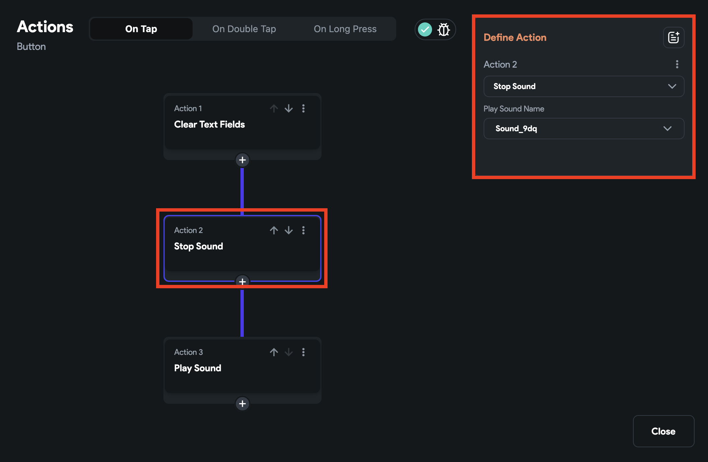

# Play / Stop Sound
The Play and Stop Sound actions allow you to enhance your app with audio effects.

## Play Sound

Using this action, you play a sound that notifies users about the action they have taken—for example, playing a sound after refreshing a list or sending a message.

:::tip
It is advisable to use this action only for short audio. To play the more extended audio, consider adding the [**AudioPlayer**](audio-player.md) widget.
:::

### Adding Play Sound [Action]

Follow the steps below to add this action to any widget.

1. Select the **Widget** (e.g., Button) on which you want to add the action.
2. Select **Actions** from the properties panel, If it's the first action, click **+ Add Action** button. Otherwise, click the "**+**" button below the previous action tile (inside *Action Flow Editor*) and select **Add Action**.
3. Search and select the **Play Sound** (under *Alerts/Notifications*) action.
4. By default, this action will be given a random **Name** so it can be stopped by the [Stop Sound](#adding-stop-sound-action) action.
5. Find the **Audio Type** dropdown and select **Network** or **Asset**.
6. If you choose *Network*:
    1. Inside the **Network Path** section,
        1. To set the static audio, select the **Value Source > Specific** **Value** and enter the **Value** as a URL that will play the sound.
        2. To set the dynamic audio, select the **Value Source > From Variable** > click **UNSET** and set the URL from a variable.
7. If you choose *Asset,* click the **Upload Audio** button, select the sound and upload it.
8. You can also control the sound volume using the **Volume** slider. It ranges from 0.0 to 1.0, where 0 is mute and 1 is full volume.
9. By default, this action is 'non-blocking'**,** meaning it will trigger the following/next action (if any) as soon as this one is triggered. If you want to wait until the sound playing is finished before triggering any further action, enable **Await Playback** option.

    <iframe 
        src="https://demo.arcade.software/xUYHeyG23buf8g7rWm1p?embed&show_copy_link=true"
        title=""
        style={{
            position: 'absolute',
            top: 0,
            left: 0,
            width: '100%',
            height: '100%',
            colorScheme: 'light'
        }}
        frameborder="0"
        loading="lazy"
        webkitAllowFullScreen
        mozAllowFullScreen
        allowFullScreen
        allow="clipboard-write">
    </iframe>

## Stop sound

Using this action, you can stop a sound that is currently playing, which was started by the [Play Sound](#play-sound) action. For example, If your app is playing any sound effects, you may need to stop them when the app is paused or stopped.

:::info
This action only works if you have added a [**Play Sound**](#adding-play-sound-action) action on a page.
:::

### Adding Stop Sound [Action]

Follow the steps below to add this action to any widget.

1. Select the **Widget** (e.g., Button) on which you want to add the action.
2. Select **Actions** from the properties panel (the right menu), If it's the first action, click **+ Add Action** button. Otherwise, click the "**+**" button below the previous action tile (inside *Action Flow Editor*) and select **Add Action**.
3. Search and select the **Stop Sound** (under *Alerts/Notifications*) action, and then choose the sound *Name* that you want to stop.

