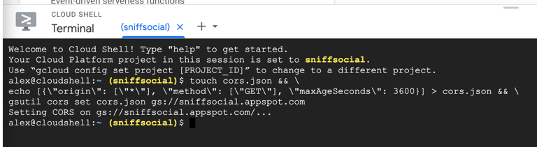

# Displaying Media

Displaying media efficiently is crucial for enhancing user experience in your FlutterFlow app. Whether you're working with images, audio, video, or PDFs, FlutterFlow provides flexible options for integrating and managing media. This guide covers how to set media sources, customize playback settings, and implement best practices like lazy loading, caching, and BlurHash to optimize performance.

## Media Types
To display media on widgets, navigate to the **Properties Panel** and specify the media source under the **[Media] Type** option (e.g., ImageType, AudioType, VideoType). Here are the available options:

### Network

Enter the URL of the media directly into the **Path** input field. This is for media hosted online.


If your media is uploaded to Firebase or Supabase, click **Set from Variable** on the **Path** input field, and select **Source** as **Widget State > Uploaded File URL**.


For media uploaded via an API, choose **Source** as **Action Outputs > [Action Output Variable Name] (API Response)**. Ensure that the API response contains the URL of the uploaded file. Learn how to extract the URL using [JSON path](../../resources/control-flow/backend-logic/api/rest-api.md#json-path).


:::info

To handle scenarios where media takes time to load or fails to load, you can set a placeholder. Click **Set from Variable** on the **Path** field and specify a placeholder URL under the **Default Value** property.

:::

### Asset

You can also display media files uploaded to your **Assets**. Assets are resources such as images, videos, documents, fonts, and other files that you include locally in your project. To upload assets, click on **Media Assets** in the left-side navigation menu and add files directly from your device. Alternatively, you can directly upload and display files when configuring media widgets by clicking the upload icon.

:::tip
For more details on how assets are stored in your project, see the directory [**Assets**](../../generated-code/directory-structure.md#assets) in the generated code.
:::


### Uploaded File

You can also access media files within your app that are stored temporarily in your application. For example, if you'd like to preview an image before sending it to cloud storage, you can do so by setting the source to **Widget State -> Uploaded Local File**.


## AudioPlayer

The **AudioPlayer** widget allows you to integrate audio playback into your apps. You can play audio from both uploaded assets and external URLs. Refer to the [**Displaying Media**](#media-types) section for more details on accessing media.

:::tip[Generated Code]
The AudioPlayer widget in FlutterFlow uses the [**assets_audio_player**](https://pub.dev/packages/assets_audio_player) package for audio playback.
:::

**Customization Options**

- **Title:** Specify the audio title in the **Title** property. You can set this directly or bind it to a variable, such as an app state variable, API response, or Firestore document.
- **Pause on Forward Navigation:** By default, the audio stops when navigating to another page.
- **Play in Background:** Define how the audio behaves when the app moves to the background:
    - **Enabled:** The audio continues to play.
    - **Disabled, restore on foreground:** The audio pauses and resumes when the app becomes active again.
    - **Disabled, pause:** The audio stops immediately when the app goes into the background.
- **Colors:**
    - **Background Color:** Customize the background using the **Fill Color** property.
    - **Playback Button Color:** Adjust the colors of the play and pause buttons.
    - **Active/Inactive Track Color:** Change the progress bar color that indicates the current playback position.
- **Elevation:** Use the **Elevation** property to modify the shadow beneath the audio tile. A higher value increases the shadow size, while setting it to 0 removes the shadow.
- **Text Styling:**
    - **Title Text:** Personalize the title’s font, size, and color in the **Title Text Style** section.
    - **Playback Duration Text:** Adjust the style of the playback duration text in the **Playback Duration Text Style** section.

## Audio Recording

You can implement audio recording functionality using the **Start Audio Recording** and **Stop Audio Recording** actions.

:::warning

Currently, audio recording is not supported in **Run** or **Test** modes due to certain limitations.

:::

### Start Audio Recording [Action]

This action starts the recording. It also provides a name to the recording, which you can use later to stop the recording using the [Stop Audio Recording](#stop-audio-recording-action) *action.*

Before adding this action, ensure you [request microphone permission](../../resources/projects/settings/project-setup.md#request-permission-action). Within the **TRUE** block of the permission condition check, add the **Start Audio Recording** action. By default, the **Name** field value is a randomly generated string. You can change it to a more descriptive name for easier identification.

:::tip

After starting recording, you might want to update the state variables to reflect changes on the UI. For instance, you can enable/disable buttons or start recording animations to provide a visual cue of the ongoing process. This step allows you to enhance the user experience and provide real-time feedback during the recording.

:::


### Stop Audio Recording [Action]

If you have multiple audio recording actions, all the Recorder object names (either auto-generated by FlutterFlow or manually set by the user) are listed under the Recorder Name dropdown. Choose the recorder object you want to stop, and it will stop the ongoing recording.

 To capture and play the recorded audio, make sure to specify the *Action Output Variable Name*, which can be used with the audio player.

Here’s how you can setup this action:

1. When you add this action, choose the **Recorder Name** from the dropdown. This will be the name you provided in the Start Audio Recording action.
2. Specify the **Action Output Variable Name**. This will store the actual audio recording, which you can use with any audio player. It stores recording in an **Audio Path** data type.
3. If you want to upload the audio recording to Firebase or Supabase, you can use the [Upload file](uploading-files.md#upload-or-save-media-action) action. When you add this action:
    1. Set the **Upload Type** to the preferred one.
    2. Set **File Type** to **Uploaded File** because the *Stop Audio Recording* action internally stores recorded audio bytes (inside widget state).
    3. Set the **File to Upload** to **Widget State > Recorded File**.
4. For uploading via API, *you don't need to add the Upload file action*. Just directly add the [**API call**](../../resources/control-flow/backend-logic/api/rest-api.md) and select the API that will upload the file to your server. **Note** that the request body for this API must be in *Multipart* format. You can pass the audio recording via **Widget State > Recorded File** in the API variable. See how to [configure an API for the multipart request body](../../resources/control-flow/backend-logic/api/rest-api.md#multipart-format).

:::tip

- After stopping the recording, you might want to update the state variables to reflect changes on the UI. For instance, you can enable/disable buttons or stop recording animations.
- It's always a good idea to have a fail-safe mechanism to ensure recordings are properly stopped, even if the user forgets to do so manually. For example, you can use the [**On Dispose**](../../resources/ui/pages/page-lifecycle.md#on-dispose-action-trigger) action trigger to stop recording when a user closes the app without manually stopping it.

:::


<div style={{
    position: 'relative',
    paddingBottom: 'calc(56.67989417989418% + 41px)', // Keeps the aspect ratio and additional padding
    height: 0,
    width: '100%'}}>
    <iframe 
        src="https://demo.arcade.software/QCY6j8EesBXaT4YZ5VNE?embed&show_copy_link=true"
        title=""
        style={{
            position: 'absolute',
            top: 0,
            left: 0,
            width: '100%',
            height: '100%',
            colorScheme: 'light'
        }}
        frameborder="0"
        loading="lazy"
        webkitAllowFullScreen
        mozAllowFullScreen
        allowFullScreen
        allow="clipboard-write">
    </iframe>
</div>
<p></p>

### Playing audio recording

After you have stopped the recording, you can simply provide the *Action Output Variable Name* to the [Audio Player](#audioplayer) widget to start playing the recorded audio.

## Play or Stop Sound

The **Play Sound** and **Stop Sound** actions offer flexibility for enhancing the user experience with audio effects or background sounds.

### Play Sound [Action]

The **Play Sound Action** allows you to play a sound that notifies users about the action they have taken—for example, playing a sound after refreshing a list or sending a message.

:::tip

It is advisable to use this action only for short audio. To play the more extended audio, consider adding the [**AudioPlayer**](#audioplayer) widget.

:::

By default, this action is assigned a random **Name** to be stopped later using the [Stop Sound](#stop-sound-action) action. You can adjust the volume using the **Volume** slider (0.0 = mute, 1.0 = full volume). The action is non-blocking by default, allowing subsequent actions to trigger immediately. To wait until playback finishes before proceeding, enable the **Await Playback** option.

:::info[Use cases]

- **Feedback Sounds:** Play sounds for button clicks, form submissions, or error alerts to improve user interaction and feedback.
- **Notifications:** Play sound alerts for reminders, messages, or task completion.
- **Gamification:** Enhance gaming experiences with sound effects for achievements, levels, or interactions.

:::

### Stop Sound [Action]

You can stop a sound that is currently playing, which was started by the [Play Sound](#play-sound-action) action. For example, If your app is playing any sound effects, you may need to stop them when the app is paused or stopped.

:::info

This action is enabled only when you have added a [**Play Sound**](#play-sound-action) action on a page.

:::

## VideoPlayer

The **VideoPlayer** widget is used to show a video from uploaded assets or the URL link. The VideoPlayer widget can play various video formats such as MP4, MOV, WAV, MPEG, and JPEG motion photos. Refer to the [**Displaying Media**](#media-types) section for more details on accessing media.

:::tip[Generated Code]
The VideoPlayer uses the [**video_player**](https://pub.dev/packages/video_player) package for reliable video playback across different platforms.
:::

**Customization Options**

The **VideoPlayer** widget includes several options to align with your app's design and functionality:

- **Aspect Ratio:** Set the desired aspect ratio (e.g., 1.7 for a 16:9 ratio) to ensure the video displays correctly.
- **AutoPlay:** Enable this option to automatically start playing the video when the page loads.
- **Loop Video:** Choose whether the video should replay automatically after it ends.
- **Show Controls:** Display playback controls, including play/pause buttons and the seek bar.
- **Allow Full Screen:** Enable users to expand the video to full-screen mode.
- **Playback Speed Menu:** Let users adjust the video playback speed.
- **Load on Page Load:** When enabled, the video will preload when the page loads, reducing buffering time when the user starts playback.
- **Pause on Forward Navigation:** If enabled, the video will pause automatically when the user navigates away from the page.

## YoutubePlayer

The **YouTubePlayer** widget in FlutterFlow allows you to integrate and play YouTube videos within your app. It offers customizable playback options and an intuitive interface for enhancing the user experience.

:::tip[Generated Code]
The YoutubePlayer uses a custom version of the [**youtube_player_iframe**](https://pub.dev/packages/youtube_player_iframe) package, hosted on FlutterFlow's GitHub repository.
:::

**Customization Options**

- **Loop Video:** When enabled, the video will automatically replay after it finishes.
- **Mute Video:** Starts the video in a muted state.
- **Show Controls:** Displays playback controls such as play/pause, volume, subtitles, and fullscreen options.
- **Show Full Screen Control:** This specifically displays the fullscreen toggle button among the controls.
- **Pause on Forward Navigation:** Automatically pauses the video when the user navigates away from the page.
- **Strict Related Videos:** Ensures that related videos shown at the end of playback come from the same channel as the currently played video.

## PdfViewer

In FlutterFlow, the **PdfViewer** widget enables you to display PDF files within your app, supporting both network URLs and locally uploaded assets. Refer to the [**Displaying Media**](#media-types) section for more details.

:::tip[Generated Code]
The PdfViewer in FlutterFlow uses the [**pdfx**](https://pub.dev/packages/pdfx) package for rendering PDFs.
:::

**Customization Options**

- **Horizontal Scroll:** By default, the PdfViewer allows vertical scrolling through pages. Enable this option to allow horizontal scrolling.
- **Use Proxy:** By default, FlutterFlow routes PDF fetching through a proxy in **Run Mode** and **Test Mode** to avoid CORS (Cross-Origin Resource Sharing) issues. **Switch this off** if you do not want the PDF request to be routed through the proxy.
- **Use Custom Proxy URL:** If you need a specific proxy, enable this option and provide your own proxy URL instead of using FlutterFlow’s default proxy.

## Web Access for PDFs and Other Files

Some types of files require additional configuration to be accessed on the web. In particular, the PDF Viewer requires network-hosted files (such as uploaded PDFs) to allow Cross-Origin Resource Sharing (CORS). For a deeper understanding of Cross-Origin Resource Sharing (CORS), you can refer to this guide.

The key takeaway is that to allow users to upload and view PDFs using Firebase Storage, follow the steps below.


You'll need to run a few commands to enable CORS for your Firebase project. No programming experience is required, but if you're comfortable with Firebase, you can refer to the official guide here: [Firebase CORS Configuration](https://firebase.google.com/docs/storage/web/download-files#cors_configuration).

**Step 1: Find Your Firebase Project ID**

You can find the Firebase project ID from **FlutterFlow > Settings and Integrations > Firebase**. Copy your **Firebase** **Project ID**.


**Step 2: Open Cloud Shell in Google Cloud Console**

1. Go to the following link, replacing **FIREBASE_PROJECT_ID** with your actual project ID:

```jsx
https://console.cloud.google.com/home/dashboard?cloudshell=true&project=FIREBASE_PROJECT_ID
```

1. If prompted, click **Continue**.
2. You should see a terminal at the bottom of the screen. If your project ID is not displayed in yellow, click the **down arrow** (🔽) next to the project name and select the correct Firebase project.
    

    
**Step 3: Run the CORS Configuration Command**

1. Click on the **Cloud Shell terminal** (the black screen).
2. Copy and paste the following command and replace `<your-cloud-storage-bucket>` with your actual storage bucket. To locate your Firebase Storage bucket name, navigate to Firebase Console > Storage > at top left side, you'll see your bucket's URL, which typically follows the format `your-project-id.appspot.com`. 

```jsx
touch cors.json && \
echo '[{"origin": ["*"], "method": ["GET"], "maxAgeSeconds": 3600}]' > cors.json && \
gsutil cors set cors.json gs://<your-cloud-storage-bucket>
```
    


3. Press **Enter** (or **Return**) to execute the command.
4. If prompted, click **Authorize** to allow Cloud Shell to access your Firebase project.
5. Once the command executes successfully, you should see a confirmation message.
    

    

## BlurHash

In FlutterFlow, **BlurHash** is a technique used to enhance the user experience by displaying visually appealing placeholders while images are loading. Instead of showing empty spaces or generic loading indicators, BlurHash generates a blurred preview that resembles the actual image, providing users with a smoother and more engaging experience.


Here are the steps to generate and use the BlurHash:

1. When using the [**Upload/Save Media**](uploading-files.md#upload-or-save-media-action) action to upload images, you can enable the **Include Blur Hash** option. This setting automatically generates a BlurHash string for the uploaded image.


1. After generating the BlurHash, it's advisable to store it alongside the image URL in your database (e.g., Firestore). The generated BlurHash is accessible via the **Widget State > Uploaded Local File > Media Blur Hash**. This approach ensures that both the image URL and its corresponding BlurHash are readily accessible when needed.


1. To utilize the BlurHash as a placeholder, in the Image widget's properties, enable the **Use Blur Hash** option and then set the **Blur Hash String** value from a variable.


## Best Practices

- Enable [infinite scrolling](../../resources/ui/widgets/composing-widgets/list-grid.md#adding-infinite-scroll) (lazy loading) in list views to load additional content as users scroll, rather than loading all data at once.
- Leverage FlutterFlow's built-in cache manager, which automatically handles image caching.
- Implement [local caching](../../resources/control-flow/backend-logic/backend-query/backend-query.md#backend-query-caching) to store frequently accessed data on the device, reducing the need for repeated network requests.
- Reduce the number of network calls by fetching only necessary data and utilizing caching strategies.
- Ensure that database queries are efficient and retrieve only the data required for display.
- Use [BlurHash](#blurhash) to display a blurred preview of images while they load, enhancing the user experience.
- Display loading indicators to inform users that data is being fetched, improving perceived performance.