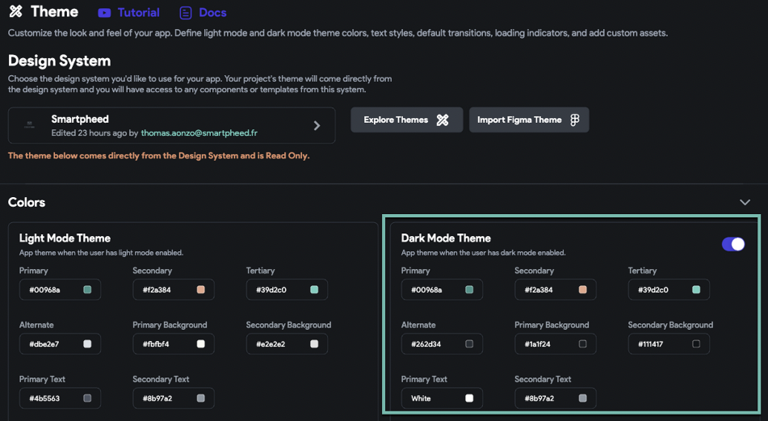
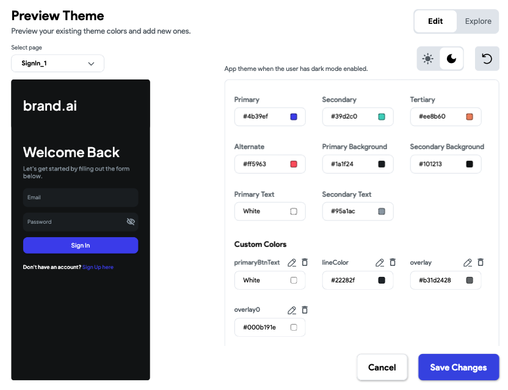

# Fix Incorrect App Colors on Real Devices

When testing an application on a physical device, users may notice that colors appear differently than expected. This issue is often related to theme settings, particularly when Dark Mode is enabled on the device or within the application.

:::info[Prerequisites]
- Ensure the app has a defined theme.
- The application must be installed on a physical device for testing.
:::

Follow these steps to verify and correct theme-related issues that affect color appearance:

1. **Verify Dark Mode in Theme Settings**  
   Navigate to **Settings → Theme** inside the FlutterFlow editor. Confirm whether the **Dark Mode** toggle is enabled.  
   

2. **Test Behavior by Disabling Dark Mode**  
   Temporarily disable Dark Mode. Download and reinstall the app on the device. If the color issue is resolved, the cause was an incomplete or misconfigured Dark Mode theme.

3. **Adjust the Theme for Dark Mode**  
   If Dark Mode is required, update the app's Dark Theme settings by selecting compatible text and background colors. This ensures proper visibility and branding across different device modes.

4. **Use the Explore Themes Preview**  
   Use the **Explore Themes** option in the Theme section to preview and test color combinations.  

   

:::tip
Dark Mode configuration is device-dependent. Always test your theme settings across both Light and Dark modes to ensure consistency.
:::

:::note
- Devices with automatic theme switching may cause inconsistencies if both Light and Dark modes are not properly configured.
- Avoid using the same color for text and background in either theme.
:::