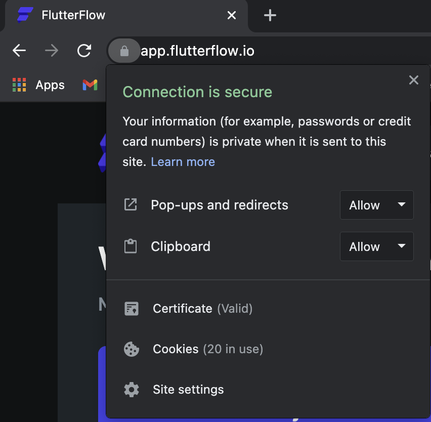

# Fix Clipboard Permissions for Copy-Pasting Widgets

If you’re unable to copy and paste widgets in FlutterFlow, the issue may be related to blocked clipboard permissions in your browser.

:::info[Prerequisites]
Ensure you’re using a supported browser like **Google Chrome** and are signed in to your FlutterFlow project.
:::

Follow the steps below to enable clipboard access in Chrome:

    1. Click the **lock icon** in the address bar next to `flutterflow.io`.
    2. In the permissions popup, locate **Clipboard**.
    3. Set clipboard access to **Allow**.
    4. Refresh the page and try copying/pasting the widget again.

    

:::tip
For other browsers such as **Firefox**, **Edge**, or **Safari**, refer to that browser’s permission settings to enable clipboard access.
:::

