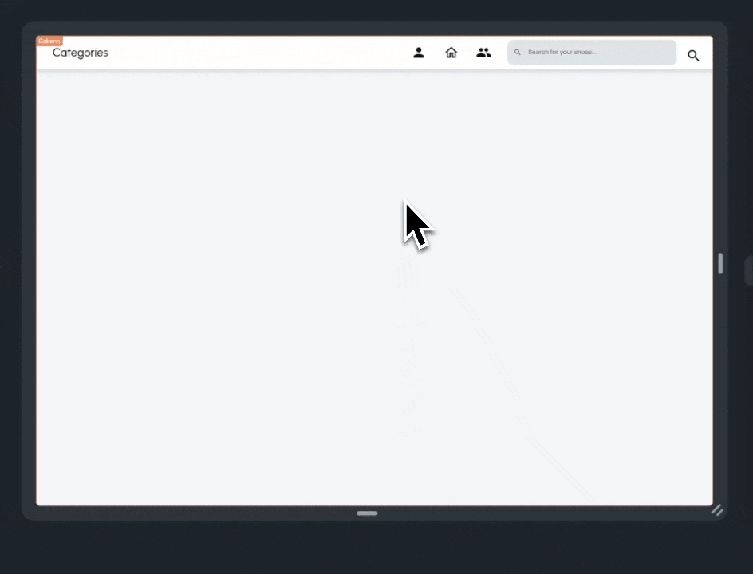
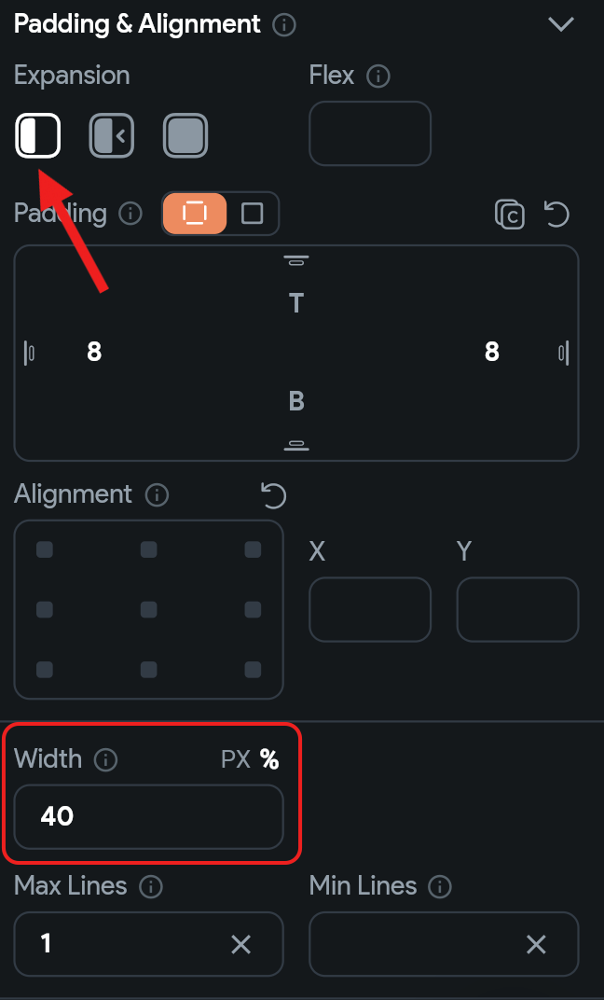
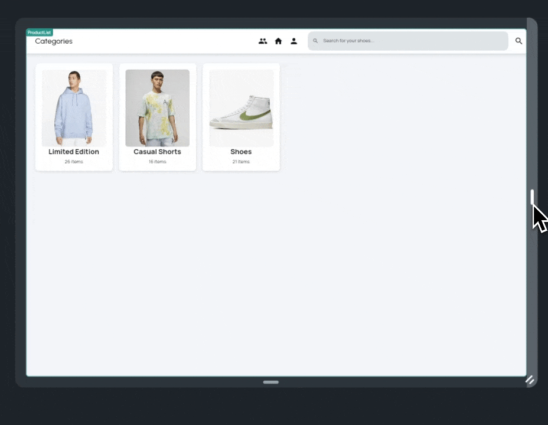
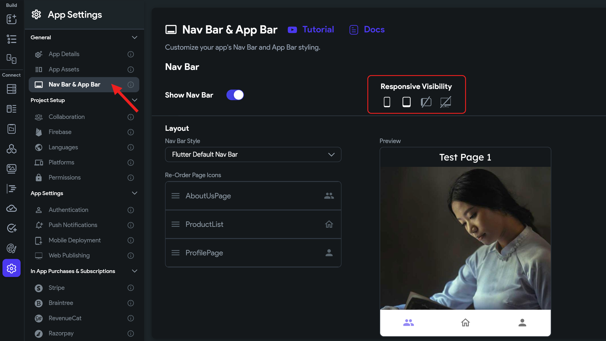
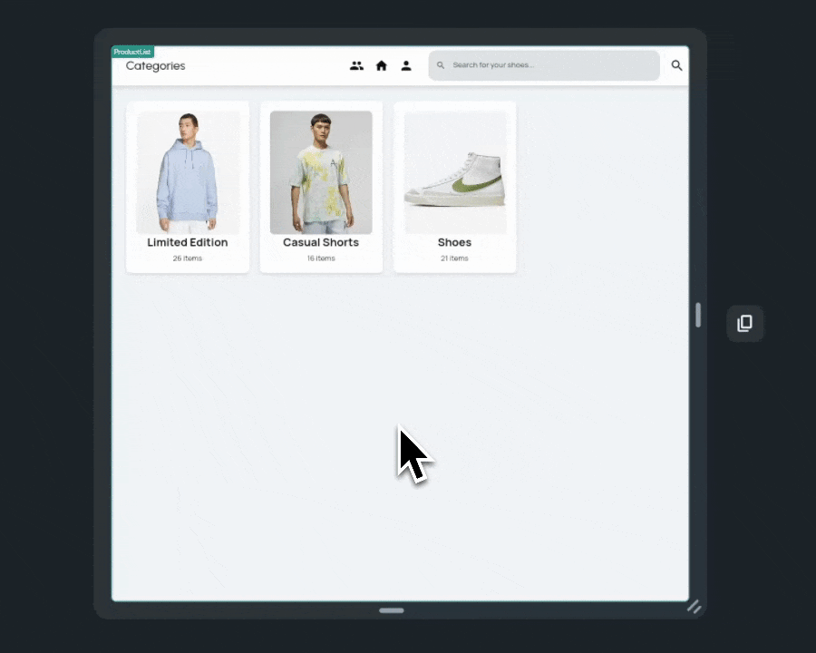

import Tabs from '@theme/Tabs';
import TabItem from '@theme/TabItem';

# Responsive Layout

FlutterFlow is great at creating applications adaptable to a wide range of screen sizes, devices, and platforms. Ensuring that our screens maintain their aesthetic appeal across all these variations is crucial. Below, we outline various methods to enhance the responsiveness of your UI screens.

**Note:** 
Please check out the examples in the order they're given, as they use the same 
example. Jumping to sections might make things confusing.


### Global Properties

Let's start by demonstrating how screen width and height values change when you switch between devices in Test Mode. 

First, create a new project. In the Home Page, under a Column parent, add two Text widgets. Label one "Screen Width" and the other "Screen Height."


Next, we'll display the changing values alongside these titles. For each Text widget, set its value to a variable. Select *Combine Text* from the options. Your first Text value should be either "Screen Width: " or "Screen Height: ".

Then, add another Text value that will show the corresponding value. This second Text value is also set from a variable. Choose 'Global Properties,' and then select either 'Screen Width' or 'Screen Height' from the list. These options hold the current screen width/height values. Repeat this process for both Text widgets.


Now, when you switch to Test Mode and try out different devices, you'll see the screen width and height values update accordingly.

<Tabs>
<TabItem value="1" label="Running app on Test Mode for desktop device sizes" default>

</TabItem>
<TabItem value="2" label="Running app on Test Mode for mobile device sizes">

</TabItem>
</Tabs>


This is to show you that these screen values are always accessible as global properties. You can use them to design your UI logic effectively.

## Expanded & Flex

Let's explore a fundamental method to make columns and rows adapt to different screen widths and heights. While designing a Row or Column, it's important to avoid assigning fixed sizes to the children, unless specifically required by the design.

Take, for instance, the navigation bar we're creating for our web version. It includes the page name, several navigation icons, and a search bar. Notice how the search bar adjusts its length based on the available width. This adaptability is achieved because the widths of the children are set relative to the available space in the horizontal section.



To design the same navbar, create the following widget hierarchy:

```
- Container (named as webHeader)
       - Row
             - Row
             - TextField (named as searchBar)
             - IconButton
```

The second Row is further broken down into the following:

```
- Row 2
    - Text (named as pageName)
    - Row 3 (named as navIcons)
        - IconButton
        - IconButton
        - IconButton
```


As you can see, the search bar currently occupies the maximum available space. However, we want both `Row 2` and the `searchBar` to share the space equally. To achieve this, simply adjust the Widget properties.

For `Row 2`, set its Expansion property to *Flexible* (the middle icon) and assign a Flex value of 1. Repeat the same steps for the `searchBar`. This change ensures they are allocated space in a 1:1 ratio, based on what's available. After this adjustment, you'll notice that the remaining space, following the placement of the *search IconButton* on the right, is evenly divided between `Row 2` and the `searchBar`.


We encourage you to test with different web dimensions and sizes to see how well this adapts.

Depending on your design needs, there are various approaches to managing space. Let's consider a different scenario: What if we want the searchBar to always occupy 40% of the screen width, with `Row 2` taking up the remaining space after placing the `searchBar` and `search IconButton`?

To do this, first set the `searchBar`'s width to 40% and its expansion to *Default* (the first icon).




Next, adjust the `Row 2` widget's Expansion setting to *Expanded* (the third icon). With these settings, you'll see that `Row 2` now occupies all the space left over after allocating 40% to the `searchBar` and placing the `search IconButton`.

Note: We've added some padding and enhanced the UI of the `searchBar` to improve its appearance.


You can also go ahead and improve the spacing between the `pageName` and `navIcons` by adjusting the MainAxisAlignment to *Space Between* (represented by the last icon).

Feel free to try this out with different screen sizes to see how it effectively adapts to the available space.

## Wrap method

Another effective method to enhance the responsiveness of a row or column containing multiple items is through the use of the Wrap widget.

Let's consider a scenario with a Row of category cards.


You might observe that when the screen size is adjusted to resemble mobile dimensions, the cards begin to get cut off at the edges.



To resolve this issue, simply replace the parent Row widget with a Wrap widget.

Make sure to set the Wrap Direction to 'Horizontal' in the Wrap properties. You'll then see that the previously overflowing cards neatly move to the next line, as illustrated in the example.


The Wrap widget efficiently manages layout for varying screen sizes by automatically adjusting its children into multiple rows or columns. It prevents overflow and ensures a clean, responsive design, especially useful for adapting content like category cards from desktop to mobile views.

## Responsive Breakpoints

Moving on to more complex layout scenarios, where the UI significantly differs between mobile and web platforms, it's important to first understand breakpoints.

**Breakpoints** in responsive design are like thresholds for different screen sizes. They act as specific points where the layout of a user interface meets a certain screen size requirement and then changes to accommodate it. When the screen size crosses one of these thresholds, the layout adjusts.

FlutterFlow has default breakpoints for different screen sizes, but you can also adjust these to better suit your app's design needs.

### Customize Responsive Breakpoints

Go to your Theme Settings > Design System and find the Breakpoints section with default values already set. You can go ahead and customize it if needed.


The following sections will also rely heavily on *Responsive Visibility,* so let's proceed.

## Visibility of Nav Bar & App Bar

In many designs, the App Bar and Nav Bar are typically included in mobile or mobile + tablet screens, and often omitted in desktop formats. FlutterFlow makes it easy to enable or disable the Nav Bar and App Bar.

Just go to App Settings, select Nav Bar & App Bar, and toggle the 'Show Nav Bar' option. Upon enabling it, you'll see additional settings. Icons for mobile, tablet, tablet (landscape), and desktop let you choose where the Nav Bar should appear.

Generally, it's advisable to enable it only for mobile, or mobile and tablet. Let's follow these steps to configure it for our app.



Now, when testing directly in our editor, observe how the navbar appears only for mobile and tablet screen sizes. This same approach can be applied to the App bar as well.



## Responsive Visibility

In our previous examples, we improved many aspects, but some responsive issues still remained. For instance, our NavBar displayed the same navigation icons on both top header and bottom navbar. Additionally, when the screen width was reduced to mimic mobile dimensions, the header elements became cramped and difficult to interact with.

To address this, we can leverage FlutterFlow's Responsive Visibility feature to implement distinct AppBar and SearchBar designs for mobile, while maintaining the current design for web.

Imagine we've created a new widget, `mobileAppBar` , and added it to our layout. This widget cleverly separates the categories header and search bar vertically and includes a back navigation button. The goal is to activate this mobile-friendly layout for mobile and tablet screens, while preserving the 'webHeader' for tablet (landscape) and desktop views.


To implement this, we can go to its widget properties and toggle the device icons as shown in the following demo.

<div style={{
    position: 'relative',
    paddingBottom: 'calc(56.67989417989418% + 41px)', // Keeps the aspect ratio and additional padding
    height: 0,
    width: '100%'}}>
    <iframe 
        src="https://www.loom.com/embed/5ef35754c19c427997eefb3182b0b28a?sid=c1ac1ef9-de7d-4517-b86f-df5f8ba5f1e6"
        title=""
        style={{
            position: 'absolute',
            top: 0,
            left: 0,
            width: '100%',
            height: '100%',
            colorScheme: 'light'
        }}
        frameborder="0"
        loading="lazy"
        webkitAllowFullScreen
        mozAllowFullScreen
        allowFullScreen
        allow="clipboard-write">
    </iframe>
</div>
<p></p>

And now you have a more responsive screen for this shopping app use case that looks good in both mobile and desktop formats.

With these adjustments, your shopping app now boasts a highly responsive screen that seamlessly adapts to both mobile and desktop formats. This ensures an optimal user experience across all devices, maintaining both functionality and aesthetic appeal.