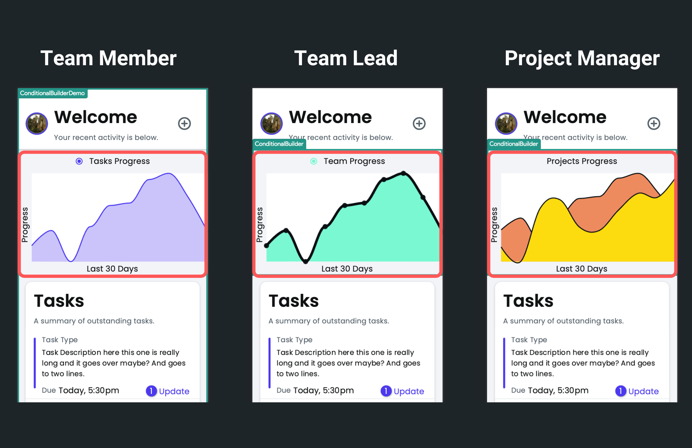

# ConditionalBuilder

The `ConditionalBuilder` widget allows you to dynamically display different widgets based on certain conditions (either [single](../../../resources/control-flow/functions/conditional-logic.md#single-condition) or [multiple](../../../resources/control-flow/functions/conditional-logic.md#multiple-conditions-andor)). Using this widget, you can define different conditions, each associated with a specific widget to be displayed when that condition is true. It's like having a switch that shows different things depending on what's happening in your app.

For example, displaying different charts based on user roles. For team members, an individual progress chart can be shown. Team leads can view the overall progress of the entire team, while project managers can see over project progress chart. Just like the below:

## Adding ConditionalBuilder widget

To add the `ConditionalBuilder` widget to your app:

1. Add the **ConditionalBuilder** widget (from the **Base Elements**) to where you want to display dynamic widgets.

2. Move to the **Properties Panel** **>** **Conditional Builder Properties,** andUnder the **First Condition**, provide the **IF** [condition](../../../resources/control-flow/functions/conditional-logic.md) by clicking on **UNSET**.
3. Now, besides the **THEN**, click **Empty**. This will automatically select the **IF** widget in the widget tree. Inside that, add a widget that you want to display if this condition is true.
4. To add one more condition-based widget, click on the "+" button, add a condition for the **ELSE IF** section, and add a widget inside the **Else If** widget in the widget tree.
5. If none of the conditions are satisfied, add a default widget to display inside the **Else** widget.
6. Use the **Show In UI Builder** option to see that particular widget in the [canvas area](../../../intro/ff-ui/canvas.md). You can see only one widget at a time.

<iframe src="https://www.loom.
com/embed/fe8edb48bdf744abab13f3ba7f925c5c?sid=85533669-195d-4f5e-aeae-029ceee40cb5" frameborder="0" allow="accelerometer; autoplay; clipboard-write; encrypted-media; gyroscope; picture-in-picture; web-share" referrerpolicy="strict-origin-when-cross-origin" allowfullscreen></iframe>

