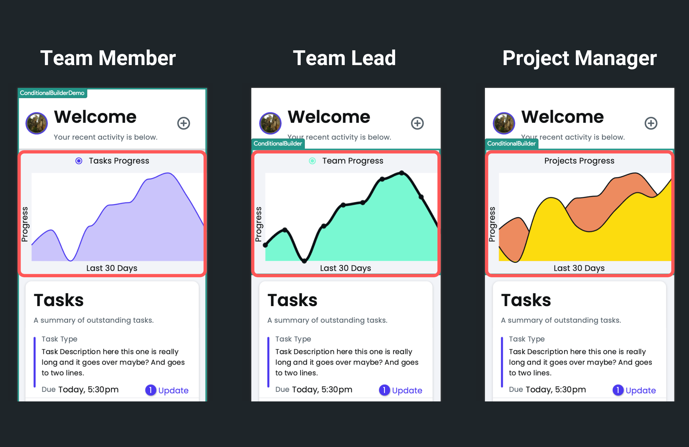

# ConditionalBuilder

The **ConditionalBuilder** displays exactly one branch from an ordered **IF / ELSE IF / ELSE** chain. At runtime, FlutterFlow evaluates conditions from top to bottom, shows the child of the first true condition, and uses **ELSE** when none match. A nullable condition is treated as false.

For example, displaying different charts based on user roles. For team members, an individual progress chart can be shown. Team leads can view the overall progress of the entire team, while project managers can see over project progress chart. Just like the below:

## Adding ConditionalBuilder widget

To add the `ConditionalBuilder` widget to your app:

1. Add a **ConditionalBuilder** where the dynamic content should appear.
2. In **Conditional Builder Properties**, set the **First Condition** by selecting **UNSET** and building a Boolean [condition](../../../resources/control-flow/functions/conditional-logic.md).
3. Next to **THEN**, select **Empty**, then add the single widget for that branch.
4. Select **+** to add an **ELSE IF** branch. Configure its condition and child. Drag the branch handle to change evaluation order.
5. Add the fallback child under **ELSE**.
6. Enable **Show in UI Builder** on one branch to preview it on the [canvas](../../../intro/ff-ui/canvas.md). This setting chooses the editor preview only; it does not change the generated runtime condition.

Every condition must be configured and every branch, including ELSE, must have a child before the project can generate successfully. Add or remove branches from **Conditional Builder Properties** rather than by dropping or deleting its structural branch nodes directly in the widget tree.

:::tip

Put the most specific or highest-priority condition first. Once a condition is true, later ELSE IF conditions are not evaluated for display.

:::

<iframe title="ConditionalBuilder interactive tutorial" src="https://www.loom.com/embed/fe8edb48bdf744abab13f3ba7f925c5c?sid=85533669-195d-4f5e-aeae-029ceee40cb5" frameborder="0" allow="accelerometer; autoplay; clipboard-write; encrypted-media; gyroscope; picture-in-picture; web-share" referrerpolicy="strict-origin-when-cross-origin" allowfullscreen></iframe>

