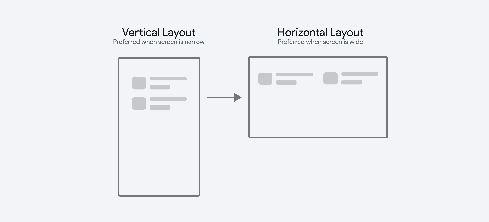

# Flex

The **Flex** widget is a multi-child layout whose axis comes from the Boolean **Is Horizontal** property. When true it uses a horizontal axis like Row; when false it uses a vertical axis like Column. Bind the property to screen width or other logic when the layout should change at runtime.

## Adding Flex Widget

To use the Flex widget, add it from the **Layout Elements** section of the **Widget Palette**, then add child widgets inside it. From the properties panel, set a condition for the **Is Horizontal** property. When this condition evaluates to `True`, the items will be laid out horizontally.

The UI builder can evaluate **Is Horizontal** directly when its condition uses global properties such as screen width or height. More complex expressions involving variables or custom functions are evaluated correctly in generated code, but the builder may use the property's saved UI Builder Value to choose which axis to preview.

Consider an ecommerce app where recent orders are displayed vertically on mobile devices and switch to a horizontal layout on larger screens to make better use of the available space.

    <iframe
        src="https://demo.arcade.software/3zWIgGDDec21fNIeCVOU?embed&show_copy_link=true" title="Flex interactive tutorial"
        style={{
            position: 'absolute',
            top: 0,
            left: 0,
            width: '100%',
            height: '100%',
            colorScheme: 'light'
        }}
        frameborder="0"
        loading="lazy"
        webkitAllowFullScreen
        mozAllowFullScreen
        allowFullScreen
        allow="clipboard-write">
    </iframe>

Here's another example of using a Flex widget on a create account page to dynamically align the signup fields based on screen size.

    <iframe
        src="https://demo.arcade.software/HPk574WhIatWbJBdlxtf?embed&show_copy_link=true" title="Flex interactive tutorial"
        style={{
            position: 'absolute',
            top: 0,
            left: 0,
            width: '100%',
            height: '100%',
            colorScheme: 'light'
        }}
        frameborder="0"
        loading="lazy"
        webkitAllowFullScreen
        mozAllowFullScreen
        allowFullScreen
        allow="clipboard-write">
    </iframe>

:::tip[Best Practices]

- If you only need a simple vertical or horizontal arrangement, consider using [**Row**](../../../resources/ui/widgets/composing-widgets/rows-column-stack.md) or [**Column**](../../../resources/ui/widgets/composing-widgets/rows-column-stack.md).
- For very large numbers of children, consider using [**ListView**](../../../resources/ui/widgets/composing-widgets/list-grid.md#listview-widget) or [**GridView**](../../../resources/ui/widgets/composing-widgets/list-grid.md#gridview-widget) instead of **Flex**, as they offer better performance for scrolling large lists of items.
- When the content exceeds the screen limit, you can enable scrolling to make the content accessible. However, if you want to avoid scrolling altogether and still fit all the content on the screen, consider using a [**Wrap**](wrap-widget.md) widget.
- Do not place Expanded or Flexible children in a scrollable Flex. The scrolling axis is unbounded, so that combination cannot be laid out.

:::

## Customization

When **Is Horizontal** is disabled, Flex lays out children vertically; when enabled, it lays them out horizontally. **Main Axis Size**, [main-axis alignment](../../../resources/ui/widgets/composing-widgets/rows-column-stack.md#main-axis), [cross-axis alignment](../../../resources/ui/widgets/composing-widgets/rows-column-stack.md#cross-axis), [scrollability](../../../resources/ui/widgets/composing-widgets/rows-column-stack.md#scrollability), scroll physics, and [spacing](../../../resources/ui/widgets/composing-widgets/rows-column-stack.md#spacing) follow the selected axis. A scrollable Flex scrolls along that main axis.
