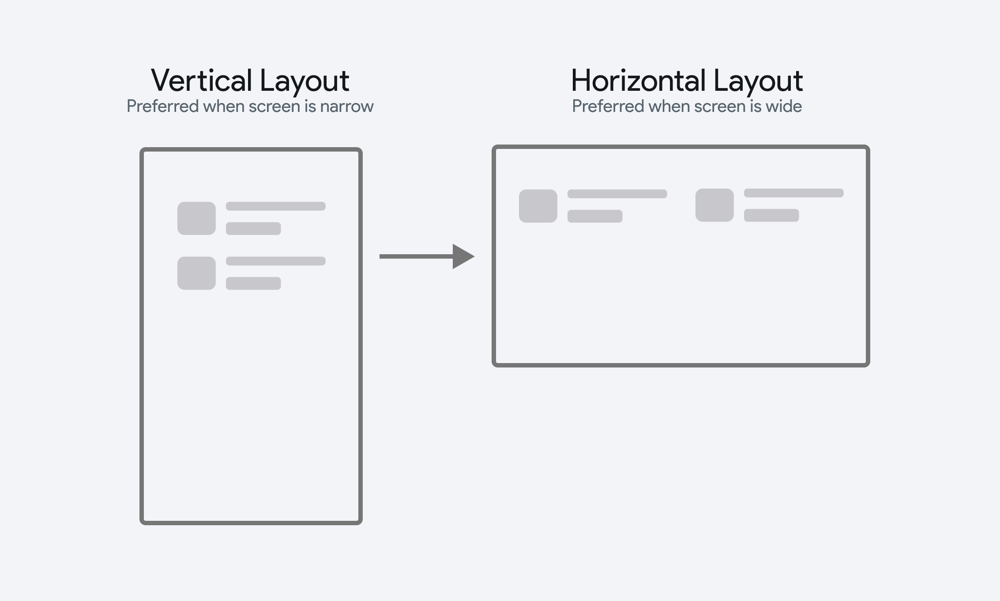

# Flex

The **Flex** widget can be used as an alternative to **Row** and **Column**.  It allows you to dynamically set the layout axis (horizontal or vertical) based on specific conditions or logic. This is especially useful for creative responsive layouts - where child elements should be horizontal when the screen is wide, and vertical when the screen is narrow. 

## Adding Flex Widget

To use the Flex widget, add it from the **Layout Elements** section of the **Widget Palette**, then add child widgets inside it. From the properties panel, set a condition for the **Is Horizontal** property. When this condition evaluates to `True`, the items will be laid out horizontally.

Consider an ecommerce app where recent orders are displayed vertically on mobile devices and switch to a horizontal layout on larger screens to make better use of the available space.

    <iframe 
        src="https://demo.arcade.software/3zWIgGDDec21fNIeCVOU?embed&show_copy_link=true"
        title=""
        style={{
            position: 'absolute',
            top: 0,
            left: 0,
            width: '100%',
            height: '100%',
            colorScheme: 'light'
        }}
        frameborder="0"
        loading="lazy"
        webkitAllowFullScreen
        mozAllowFullScreen
        allowFullScreen
        allow="clipboard-write">
    </iframe>

Here's another example of using a Flex widget on a create account page to dynamically align the signup fields based on screen size.

    <iframe 
        src="https://demo.arcade.software/HPk574WhIatWbJBdlxtf?embed&show_copy_link=true"
        title=""
        style={{
            position: 'absolute',
            top: 0,
            left: 0,
            width: '100%',
            height: '100%',
            colorScheme: 'light'
        }}
        frameborder="0"
        loading="lazy"
        webkitAllowFullScreen
        mozAllowFullScreen
        allowFullScreen
        allow="clipboard-write">
    </iframe>

:::tip[Best Practices]

- If you only need a simple vertical or horizontal arrangement, consider using [**Row**](../../../resources/ui/widgets/composing-widgets/rows-column-stack.md) or [**Column**](../../../resources/ui/widgets/composing-widgets/rows-column-stack.md).
- For very large numbers of children, consider using [**ListView**](../../../resources/ui/widgets/composing-widgets/list-grid.md#listview-widget) or [**GridView**](../../../resources/ui/widgets/composing-widgets/list-grid.md#gridview-widget) instead of **Flex**, as they offer better performance for scrolling large lists of items.
- When the content exceeds the screen limit, you can enable scrolling to make the content accessible. However, if you want to avoid scrolling altogether and still fit all the content on the screen, consider using a [**Wrap**](wrap-widget.md) widget.

:::

## Customization

When **Is Horizontal** property is disabled, the Flex widget behaves like a Column, and when enabled, it acts as a Row. Settings like [main axis alignment](../../../resources/ui/widgets/composing-widgets/rows-column-stack.md#main-axis), [cross axis alignment](../../../resources/ui/widgets/composing-widgets/rows-column-stack.md#cross-axis), [scrollability](../../../resources/ui/widgets/composing-widgets/rows-column-stack.md#scrollability), and [spacing](../../../resources/ui/widgets/composing-widgets/rows-column-stack.md#spacing) work the same way they do for the Column and Row widgets.

