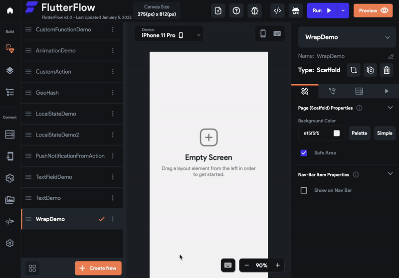
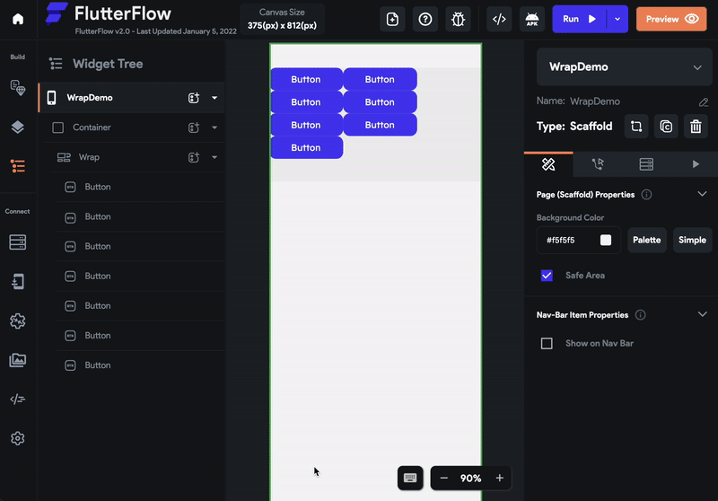
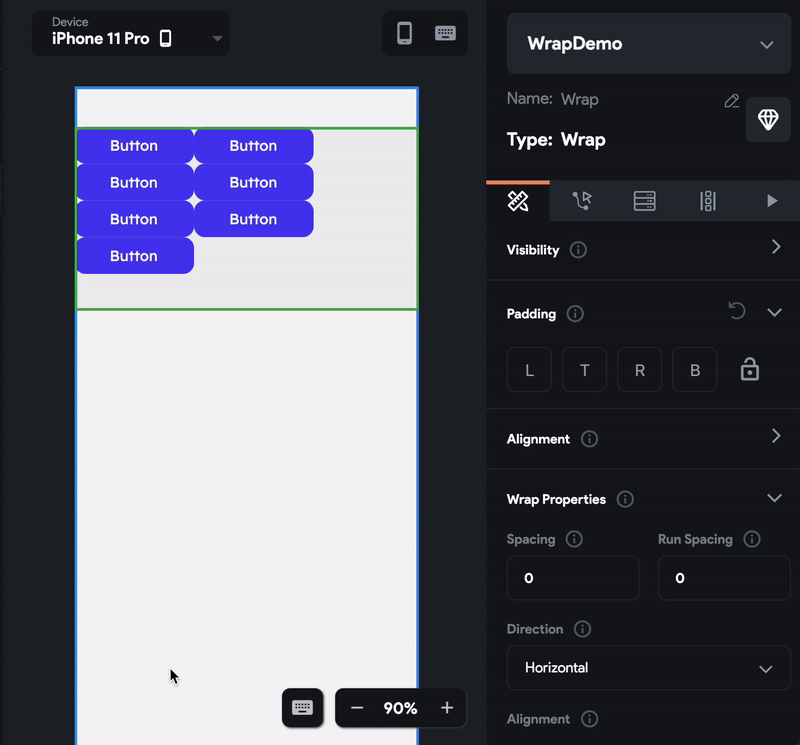
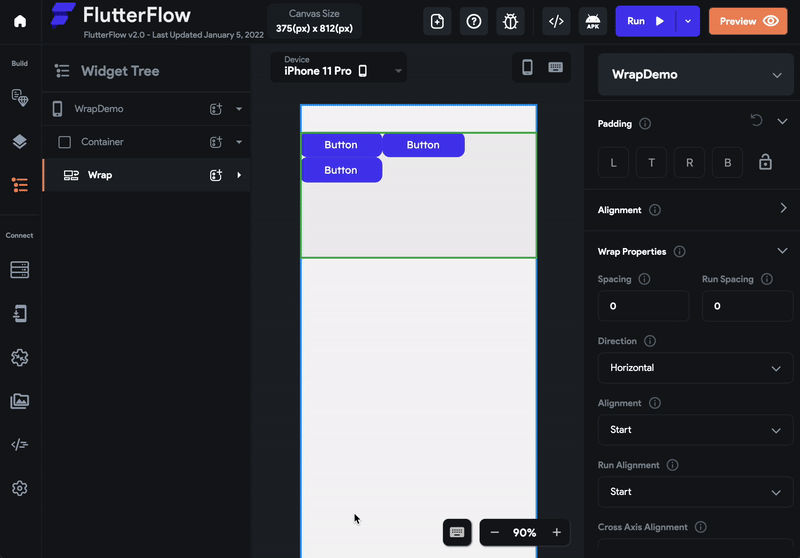
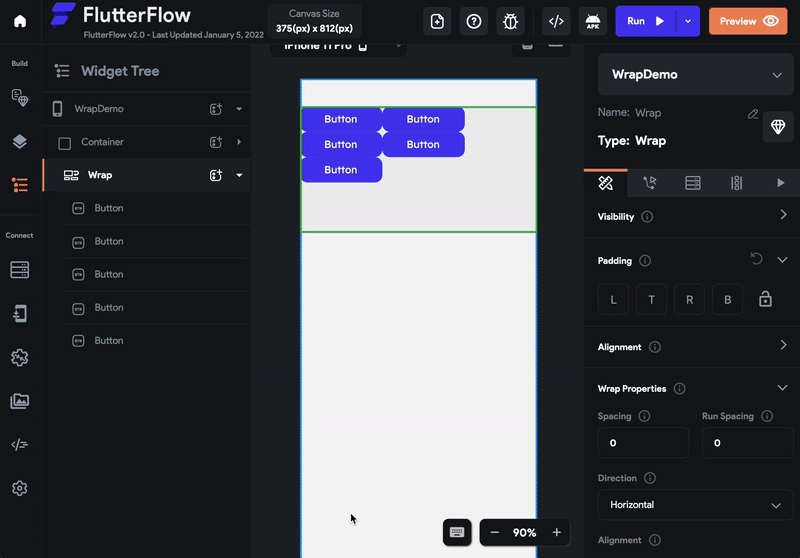

# Wrap

The Wrap widget is similar to Row and Column as it shows its children one after another. If there is not enough space to show your item, the Wrap widget will automatically place it in a new row or column.

## Adding Wrap widget

Here's an example of how you can use a Wrap widget in your project:

1. First, drag the [**Container**](../../../resources/ui/widgets/basic-widgets/container.md) widget from the **Layout Elements** tab (in the Widget Panel) or add it directly from the widget tree and set its **width** to **infinity** and **height** to **200**.

2. Add the **Wrap** widget from the **Layout Elements** tab inside the Container.
3. Add the **Button** widget inside the Wrap widget.
4. Copy-Paste and add a few more Button widgets.

See how the Button that won't fit in the remaining space is placed in the next line.

## Customizing
You can customize the appearance and behavior of this widget using the various properties available under the properties panel.

### Changing Direction

In the example above you saw that the items are added in the horizontal direction, which is a default axis for adding items.

To change the direction in which the items are added:

1. Select the **Wrap** from the widget tree or from the canvas area.
2. Move to the Property Editor and scroll down to the **Wrap Properties** section.
3. Spot the **Direction** dropdown, change it to **Vertical**.

The Horizontal Direction makes the Wrap widget work like a Row while the Vertical Direction makes the Wrap widget work like a Column.

### Adding Space Between Items

To add space between items:

1. Select the **Wrap** from the widget tree or from the canvas area.

2. Move to the Property Editor and scroll down to the **Wrap Properties** section.
3. In the **Spacing** input box, enter the value as 10. If the **Direction** is set to **Horizontal**, Wrap will insert the empty space of 10px vertically between the items. and If the **Direction** is set to **Vertical**, Wrap will insert the empty space of 10px horizontally between the items.
4. In the **Run** **Spacing** input box, enter the value as 15. If the **Direction** is set to **Horizontal**, Wrap will insert the empty space of 15px horizontally between the items. and If the **Direction** is set to **Vertical**, Wrap will insert the empty space of 15px vertically between the items.

### Adjust Alignment

The default Main Axis for a Wrap Widget is the horizontal axis, so adjusting this will change how the child widgets are horizontally distributed in the Wrap widget.

To change the Alignment:

1. Select the **Wrap** from the widget tree or from the canvas area.

2. Move to the Property Editor and scroll down to **Alignment**.
3. Select from the options displayed including **Start**, **Center**, **End**, **Space** **evenly**, **Space** **between**, and **Space** **around**.

### Adjust Run Alignment

The default Run Axis for a Wrap Widget is the vertical axis, so adjusting this will change how the child widgets are vertically distributed in the Wrap widget.

To change the Run Alignment:

1. Select the **Wrap** from the widget tree or from the canvas area.

2. Move to the Property Editor and scroll down to **Run Alignment**.
3. Select from the options displayed including **Start**, **Center**, **End**, **Space** **evenly**, **Space** **between**, and **Space** **around**.

### Adding Items From Bottom

By default, the new items are always added from top to bottom direction. In a very rare case, you may need to change this behavior.

To add items from the bottom to top:

1. Select the **Wrap** from the widget tree or from the canvas area.

2. Move to the Property Editor and scroll down to **Vertical Direction**.
3. Set the Dropdown value to **Up**.
4. Try adding items.

### Clipping The Items

If you add several items to the Wrap widget that exceed the size of the patent widget, the Wrap widget will continue to display the overflowing items. However, you can choose to hide the overflowing items using the Clip Behaviour property:

To clip the overflowing items:

1. Select the **Wrap** from the widget tree or from the canvas area.

2. Move to the Property Editor and scroll down to **Clip Behaviour**.
3. Change it to **Clip Content**.

---

## Video guide

If you prefer watching a video tutorial, here's the one for you:

    <iframe 
        src="https://www.youtube.com/embed/Ameag92MqTw"
        title=""
        style={{
            position: 'absolute',
            top: 0,
            left: 0,
            width: '100%',
            height: '100%',
            colorScheme: 'light'
        }}
        frameborder="0"
        loading="lazy"
        webkitAllowFullScreen
        mozAllowFullScreen
        allowFullScreen
        allow="clipboard-write">
    </iframe>

