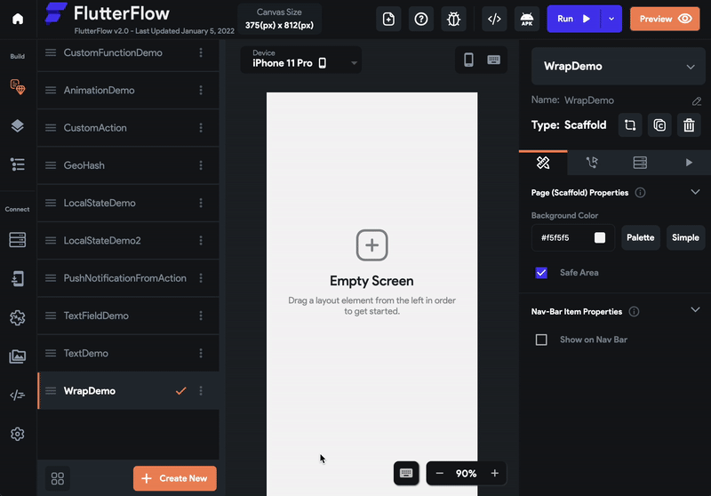
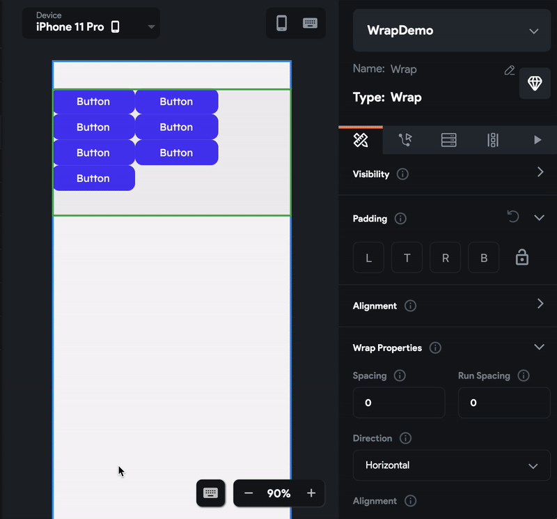
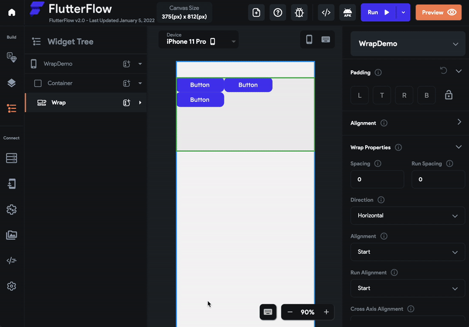
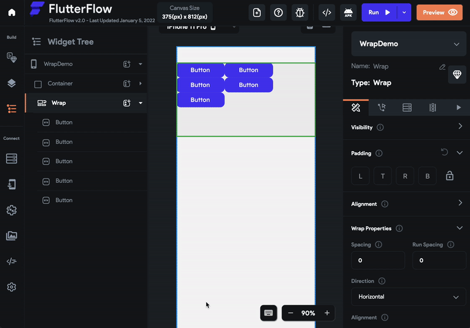

# Wrap

The **Wrap** widget lays out children in runs. When the current run has insufficient room, the next child moves to a new row for a horizontal Wrap or a new column for a vertical Wrap. Unlike a Row or Column, Wrap is designed to create additional runs rather than keep every child on one line.

## Adding Wrap widget

Here's an example of how you can use a Wrap widget in your project:

1. First, drag the [**Container**](../../../resources/ui/widgets/basic-widgets/container.md) widget from the **Layout Elements** tab (in the Widget Panel) or add it directly from the widget tree and set its **width** to **infinity** and **height** to **200**.

2. Add the **Wrap** widget from the **Layout Elements** tab inside the Container.
3. Add the **Button** widget inside the Wrap widget.
4. Copy-Paste and add a few more Button widgets.

See how the Button that won't fit in the remaining space is placed in the next line.

## Customizing
You can customize the appearance and behavior of this widget using the various properties available under the properties panel.

### Changing Direction

In the example above you saw that the items are added in the horizontal direction, which is a default axis for adding items.

To change the direction in which the items are added:

1. Select the **Wrap** from the widget tree or from the canvas area.
2. Move to the Property Editor and scroll down to the **Wrap Properties** section.
3. Spot the **Direction** dropdown, change it to **Vertical**.

**Horizontal** fills a row and then creates another row. **Vertical** fills a column and then creates another column.

<video className="docs-video" autoPlay loop muted playsInline controls aria-label={"Changing the Wrap widget direction"}><source src={require("./imgs/wrap-change-direction.mp4").default} type="video/mp4" /></video>

### Adding Space Between Items

To add space between items:

1. Select the **Wrap** from the widget tree or from the canvas area.

2. Move to the Property Editor and scroll down to the **Wrap Properties** section.
3. In **Spacing**, enter the distance between children within each run. For a horizontal Wrap this is horizontal space; for a vertical Wrap it is vertical space.
4. In **Run Spacing**, enter the distance between runs. For a horizontal Wrap this is vertical space between rows; for a vertical Wrap it is horizontal space between columns.

### Adjust Alignment

**Alignment** distributes children within each run on the main axis. That axis is horizontal when **Direction** is Horizontal and vertical when Direction is Vertical.

To change the Alignment:

1. Select the **Wrap** from the widget tree or from the canvas area.

2. Move to the Property Editor and scroll down to **Alignment**.
3. Select from the options displayed including **Start**, **Center**, **End**, **Space** **evenly**, **Space** **between**, and **Space** **around**.

<video className="docs-video" autoPlay loop muted playsInline controls aria-label={"Adjusting Wrap widget alignment"}><source src={require("./imgs/wrap-adjust-alignment.mp4").default} type="video/mp4" /></video>

### Adjust Run Alignment

**Run Alignment** distributes the runs on the cross axis. That axis is vertical when **Direction** is Horizontal and horizontal when Direction is Vertical.

To change the Run Alignment:

1. Select the **Wrap** from the widget tree or from the canvas area.

2. Move to the Property Editor and scroll down to **Run Alignment**.
3. Select from the options displayed including **Start**, **Center**, **End**, **Space** **evenly**, **Space** **between**, and **Space** **around**.

### Adjust Cross Axis Alignment

**Cross Axis Alignment** aligns children relative to one another within the same run. Choose **Start**, **Center**, or **End**. The cross axis is vertical for a horizontal Wrap and horizontal for a vertical Wrap.

### Adding Items From Bottom

**Vertical Direction** defaults to **Down**. It controls the order of layout on the vertical axis and how vertical Start and End are interpreted. Choose **Up** when the vertical order should be reversed.

To add items from the bottom to top:

1. Select the **Wrap** from the widget tree or from the canvas area.

2. Move to the Property Editor and scroll down to **Vertical Direction**.
3. Set the Dropdown value to **Up**.
4. Try adding items.

### Clipping The Items

If the Wrap exceeds the bounds of its parent, its default **No clip** behavior can paint content outside those bounds. Use **Clip Behavior** when that overflow must be hidden:

To clip the overflowing items:

1. Select the **Wrap** from the widget tree or from the canvas area.

2. Move to the Property Editor and scroll down to **Clip Behavior**.
3. Change it to **Clip content**.

---

## Video guide

If you prefer watching a video tutorial, here's the one for you:

    <iframe
        src="https://www.youtube.com/embed/Ameag92MqTw" title="Wrap interactive tutorial"
        style={{
            position: 'absolute',
            top: 0,
            left: 0,
            width: '100%',
            height: '100%',
            colorScheme: 'light'
        }}
        frameborder="0"
        loading="lazy"
        webkitAllowFullScreen
        mozAllowFullScreen
        allowFullScreen
        allow="clipboard-write">
    </iframe>

