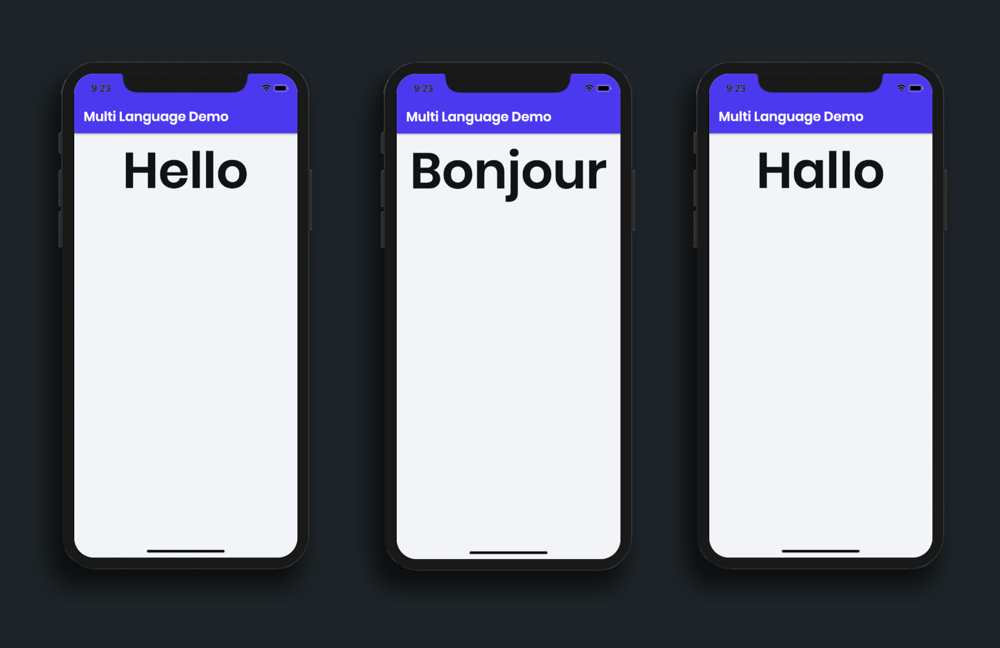
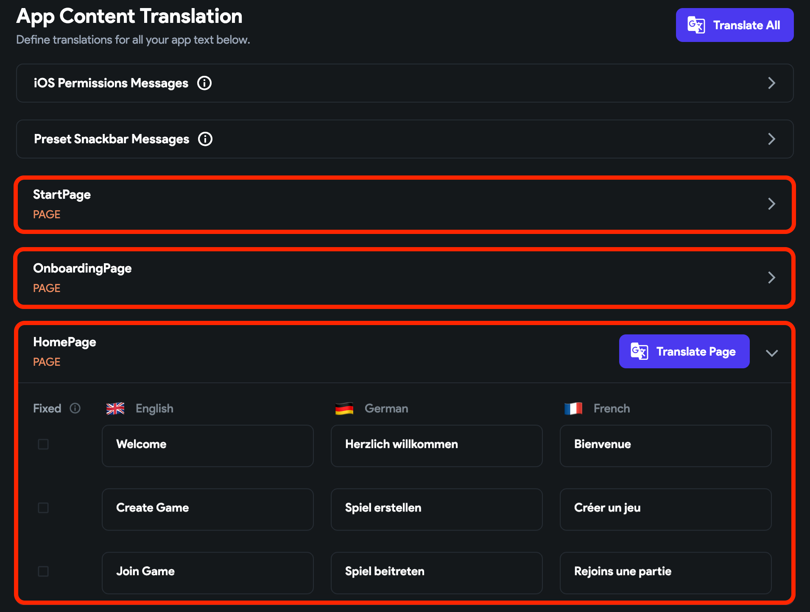
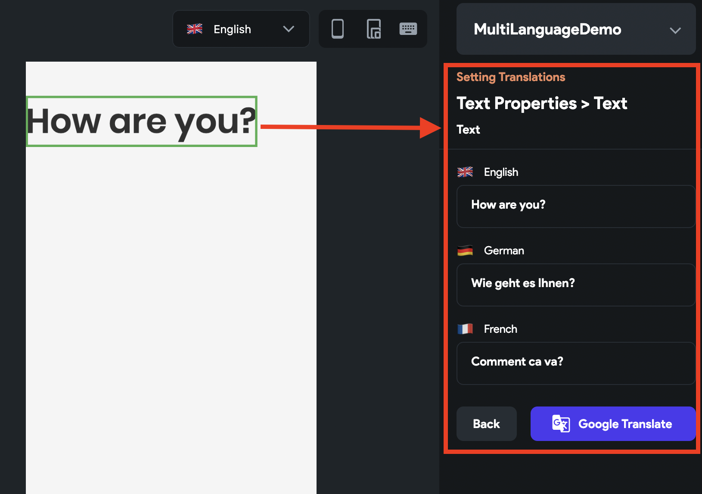

# Localizing App

A multi-language feature allows you to show all your app's text in different languages.

FlutterFlow allows you to translate all your app's text in one go using Google Translate or manually change the text if you’d prefer. You can also translate predefined messages such as permission messages, authentication snackbar messages, etc.

Adding multi-language support can be crucial to your app. For example, if you have an app that tells non-English users to perform the exercise steps in English, they won't understand and prefer to use another app (which might be mediocre but available in the user’s language). Adding a Multi-Language feature to your app helps you succeed globally.

## Add multi-language support

To add multi-language support to your project:

1. Click on the **Setting and Integrations** from the Navigation Menu (left side of your screen).
2. Under the **Project Setup** section, select **Languages**.
3. Click on the **+ Add Language** button. This will open the **Select Language** popup.
4. Search for the language that you want to support and click on it. Similarly, add other languages.
5. Now, inside the **Primary Language** dropdown, click on the **Unset**. This will open a popup, click **continue** and choose your base language. (A language that is shown when the current device language is not supported by your app.)
6. (Optional) Inside the **Display Language** dropdown, select the language that you want to display while building your app in App Builder.
7. Find the **Translation** section below and click on the **Translate All** button. This will open a new popup, click on **Translate**. This will translate all your app's text into supported languages using Google Translate.
8. Go through all of your app's text (non-translated/translated) that are grouped by page name.
9. Now, click on the **Select Page or Component** from the Navigation Menu (left side of your screen).
10. Select any page, find the language dropdown above the canvas, try changing it to other languages, and see the translated text appear on the canvas.

:::warning
Changing the primary language after translating all of your text will clear the existing translations for other languages.
:::

    <iframe 
        src="https://demo.arcade.software/1qn5CemOPB4djFDMAAPS?embed&show_copy_link=true"
        title=""
        style={{
            position: 'absolute',
            top: 0,
            left: 0,
            width: '100%',
            height: '100%',
            colorScheme: 'light'
        }}
        frameborder="0"
        loading="lazy"
        webkitAllowFullScreen
        mozAllowFullScreen
        allowFullScreen
        allow="clipboard-write">
    </iframe>

Here's how it looks when you run your app on a real device/emulator and try changing the device language:

    <iframe 
        src="https://demo.arcade.software/JG4rqqxbkRFY9oLIvnLx?embed&show_copy_link=true"
        title=""
        style={{
            position: 'absolute',
            top: 0,
            left: 0,
            width: '100%',
            height: '100%',
            colorScheme: 'light'
        }}
        frameborder="0"
        loading="lazy"
        webkitAllowFullScreen
        mozAllowFullScreen
        allowFullScreen
        allow="clipboard-write">
    </iframe>

## Changing app language manually

Instead of showing your app's text based on the user's device language, you can let users choose the language of the app.

For example, when the app starts, you may present a language selection screen or start the app with any default language, such as English and then allow users to later change the language from the settings menu.

Let's build a simple example of changing the app language on a button click which looks like the following visual:

    <iframe 
        src="https://demo.arcade.software/7BIW7wH90W8BYCjLI4c1?embed&show_copy_link=true"
        title=""
        style={{
            position: 'absolute',
            top: 0,
            left: 0,
            width: '100%',
            height: '100%',
            colorScheme: 'light'
        }}
        frameborder="0"
        loading="lazy"
        webkitAllowFullScreen
        mozAllowFullScreen
        allowFullScreen
        allow="clipboard-write">
    </iframe>

Changing the app language manually includes the following steps:

1. [Building a page](#1-building-a-page)
2. [Translating app content](#2-translating-app-content)
3. [Adding action to change the language](#3-add-set-app-language-action)

### 1. Building a page

You can skip this step if you have already built your page.

To build a page:

1. Create a page and add the Column widget.
3. Add a [**Text**](../../resources/ui/widgets/basic-widgets/text.md) Widget that shows some texts.
4. Add a [**Button**](../../resources/ui/widgets/basic-widgets/button.md) to change the language and add some padding around it.

    <iframe 
        src="https://demo.arcade.software/gT61tesLihLZMMPZ3qYa?embed&show_copy_link=true"
        title=""
        style={{
            position: 'absolute',
            top: 0,
            left: 0,
            width: '100%',
            height: '100%',
            colorScheme: 'light'
        }}
        frameborder="0"
        loading="lazy"
        webkitAllowFullScreen
        mozAllowFullScreen
        allowFullScreen
        allow="clipboard-write">
    </iframe>

### 2. Translating app content

Translate your app content as per the instructions [here](#add-multi-language-support).

### 3. Add Set App Language [Action]

Using this Action, you can change the language of your app.

:::info
- This action is only visible when you added a multi-language feature to your app.
- This action is limited to only your app and does not change your device language.
:::

Follow the steps below to define Set App Language Action to any widget.

1. Select widget from the widget tree or from the canvas area.
2. Select **Actions** from the Properties panel (the right menu)
3. Click **+ Add Action** button
4. Choose a gesture from the dropdown among ***On Tap**, **On Double Tap**, or* **On Long Press**
5. Select the **Action Type** as **Set App Language***.*
6. Set **Language Source** to **Select Language**.
7. From the **Language** dropdown, select the language that you want to set.

    <iframe 
        src="https://demo.arcade.software/oUbnfhoT1xpghONrtPiK?embed&show_copy_link=true"
        title=""
        style={{
            position: 'absolute',
            top: 0,
            left: 0,
            width: '100%',
            height: '100%',
            colorScheme: 'light'
        }}
        frameborder="0"
        loading="lazy"
        webkitAllowFullScreen
        mozAllowFullScreen
        allowFullScreen
        allow="clipboard-write">
    </iframe>

## Managing app text translation

Managing your app's text translation includes updating the translated text (produced by Google Translate) or running a Google Translate on the new or existing text (with slight modification) on a specific page.

There are two ways you can manage the app text translation:

- [Inside Language Settings](#inside-language-settings)
- [Inside App Builder](#inside-app-builder)

### Inside Language Settings

The Language Settings page lists all your app's text grouped by page name. You can use the Language Settings page when you want to manage the text in bulk.

To manage the app text translation inside the language settings page:

1. Click on the **Setting and Integrations** from the Navigation Menu (left side of your screen).
2. Under the **Project Setup** section, select **Languages**.
3. Scroll down to the **Translation** section, find and click on the **page name** that contains the text you want to manage. This will show a list of texts on a page.
4. Find your text:
    - To manually add/update translation, directly make changes inside the box under the language column and mark the text as **Fixed**.
    - To Google Translate a new or existing text (with slight modification), click on the **Translate Page** and then click **Translate**.

:::info
The Translate Page button will create a translation for all the texts on a page. If you don't want any text (with your own translation) to be overridden by Google Translate results, make sure you mark them as **Fixed**.
:::
<figure>
    
  <figcaption class="centered-caption">Manage text translation inside language settings page</figcaption>
</figure>

### Inside App Builder

While building your app, you can translate or update the translation for the individual text right inside the app builder.

To manage the app text translation inside the App Builder:

1. Click on the **Select Page or Component** from the Navigation Menu (left side of your screen).    
2. Select your **Page** and then select the widget (e.g., Text, TextField, etc.)
3. Move to Property Editor and click on the Globe icon () for the property you would like to add a translation. This will open a new panel.
    - To manually add/update translation, directly make changes inside the box under the language name.
    - To Google Translate a new or existing text (with slight modification), click on the **Google** **Translate** button and then click **Translate**.

<figure>
    
  <figcaption class="centered-caption">Manage text translation inside App Builder</figcaption>
</figure>

## Translating predefined messages

FlutterFlow allows you to manage the translation for predefined messages, such as permission messages and snackbar messages.

There are two types of messages you can translate:

- [iOS Permission Messages](#ios-permission-messages)
- [Preset Snackbar Messages](#preset-snackbar-messages)

### iOS Permission Messages

iOS permission messages are the messages that iOS users will see when prompted to grant permissions to your app (such as a camera or photo library access).

To add translations for the iOS permission messages:

1. Click on the **Setting and Integrations** from the Navigation Menu (left side of your screen).
2. Under the **Project Setup** section, select **Languages**.
3. Scroll down to the **Translation** section and click on the **iOS Permissions Messages** to open the section.
4. Inside the Permission Message section (e.g., **Camera Permission Message**, **Photo Library Permission Message**, etc.), enter your message for the base language. You can get an idea of what to write using the hint available inside the box.
5. Now, there are two ways you can add translation:
    - To Google Translate your message, click on the **Translate Message** button (top right side of the current section) and then click **Translate**.
    - To manually add translations, directly add your translated messages under the language name and mark the permission message as **Fixed**.

:::info
- The permission messages are displayed based on the feature you have added to your app. For example, the Camera and Photo Library Permission messages are shown when you have a page with a Button that has Upload Photo/Video action added to it.
- If you don't want any messages (with your own translation) to be overridden by Google Translate results, make sure you mark them as **Fixed**.
:::

    <iframe 
        src="https://demo.arcade.software/afcZVdQjsGh3BLWR4qQI?embed&show_copy_link=true"
        title=""
        style={{
            position: 'absolute',
            top: 0,
            left: 0,
            width: '100%',
            height: '100%',
            colorScheme: 'light'
        }}
        frameborder="0"
        loading="lazy"
        webkitAllowFullScreen
        mozAllowFullScreen
        allowFullScreen
        allow="clipboard-write">
    </iframe>

### Preset Snackbar Messages

Preset Snackbar Messages are ones we show for a certain action inside the Snackbar.

    <iframe 
        src="https://demo.arcade.software/92eWqXwOZJvvkuX7OuhE?embed&show_copy_link=true"
        title=""
        style={{
            position: 'absolute',
            top: 0,
            left: 0,
            width: '100%',
            height: '100%',
            colorScheme: 'light'
        }}
        frameborder="0"
        loading="lazy"
        webkitAllowFullScreen
        mozAllowFullScreen
        allowFullScreen
        allow="clipboard-write">
    </iframe>

To add translations for the preset snackbar messages:

1. Click on the **Setting and Integrations** from the Navigation Menu (left side of your screen).    
2. Under the **Project Setup** section, select **Languages**.
3. Scroll down to the **Translation** section and click on the **Preset Snackbar Messages** to open the section.
4. Inside the Message section (e.g., **Authentication Message**, **Upload Media Message**, etc.), enter your message for the base language. You can get an idea of what to write using the hint available inside the box.
5. Now, there are two ways you can add translation:
    - To Google Translate your message, click on the **Translate Message** button (top right side of the current section) and then click **Translate**.
    - To manually add translations, directly add your translated messages under the language name and mark the permission message as **Fixed**.

    <iframe 
        src="https://demo.arcade.software/s5LVDBTzN9U8rnpSu02b?embed&show_copy_link=true"
        title=""
        style={{
            position: 'absolute',
            top: 0,
            left: 0,
            width: '100%',
            height: '100%',
            colorScheme: 'light'
        }}
        frameborder="0"
        loading="lazy"
        webkitAllowFullScreen
        mozAllowFullScreen
        allowFullScreen
        allow="clipboard-write">
    </iframe>

## Retrieving language related data

While building a multi-language app, sometimes you may need language-related data such as current language code or a specific language-related text.

In FlutterFlow, you can get the following two types of language-related data:

- [Current language code](#current-language-code)
- [Language dependent text](#language-dependent-text)

### Current language code

The Current language code gives you the ISO language code for the current app language, such as *en*, *de*, *fr*, etc.

Let's build an example of showing the current language code in a Text widget.

    <iframe 
        src="https://demo.arcade.software/odSRBIQmbhwCbT0alT7Q?embed&show_copy_link=true"
        title=""
        style={{
            position: 'absolute',
            top: 0,
            left: 0,
            width: '100%',
            height: '100%',
            colorScheme: 'light'
        }}
        frameborder="0"
        loading="lazy"
        webkitAllowFullScreen
        mozAllowFullScreen
        allowFullScreen
        allow="clipboard-write">
    </iframe>

To retrieve the current language code:

1. Add the **Column > [Text](../../resources/ui/widgets/basic-widgets/text.md)** widget to your app.
2. Move to the property panel and click on the **Set from Variable** text.
3. Select **Source** as **Internationalization** and **Available Options** as the **Current Language Code**.
4. (Optional) Set the *Default Variable Value* if you wish to.
5. Click **Confirm**.
6. Add [**Button**](../../resources/ui/widgets/basic-widgets/button.md) widgets with an action to change the language. To change the language manually, find the instructions [here](#changing-app-language-manually).

    <iframe 
        src="https://demo.arcade.software/8iT8ro5lwocpMetWhzZz?embed&show_copy_link=true"
        title=""
        style={{
            position: 'absolute',
            top: 0,
            left: 0,
            width: '100%',
            height: '100%',
            colorScheme: 'light'
        }}
        frameborder="0"
        loading="lazy"
        webkitAllowFullScreen
        mozAllowFullScreen
        allowFullScreen
        allow="clipboard-write">
    </iframe>

### Language dependent text

Sometimes you might want to store/process a text that is dependent on the current app language—for example, showing/storing the nation/country flag or name based on the current app language.

Let's build an example of showing the nation/country flag in a Text widget.

    <iframe 
        src="https://demo.arcade.software/OHKmMkZgK39OB5dxYgQF?embed&show_copy_link=true"
        title=""
        style={{
            position: 'absolute',
            top: 0,
            left: 0,
            width: '100%',
            height: '100%',
            colorScheme: 'light'
        }}
        frameborder="0"
        loading="lazy"
        webkitAllowFullScreen
        mozAllowFullScreen
        allowFullScreen
        allow="clipboard-write">
    </iframe>

To show the language-dependent text:

1. Add the **Column > [Text](../../resources/ui/widgets/basic-widgets/text.md)** widget to your app.
2. Move to the property panel and click on the **Set from Variable** text.
3. Select **Source** as **Internationalization** and **Available Options** as the **Language Dependent Text**.
4. Click on the language name to open the section and enter your text inside the **Value** input box.
5. Similarly, enter a value for other languages as well.
6. (Optional) Set the default value if you wish to.
7. Click **Confirm**.
8. Add [**Button**](../../resources/ui/widgets/basic-widgets/button.md) widgets with an action to change the language. To change the language manually, find the instructions [here](#changing-app-language-manually).

    <iframe 
        src="https://demo.arcade.software/qpg5dLDnvgc90v9cz72c?embed&show_copy_link=true"
        title=""
        style={{
            position: 'absolute',
            top: 0,
            left: 0,
            width: '100%',
            height: '100%',
            colorScheme: 'light'
        }}
        frameborder="0"
        loading="lazy"
        webkitAllowFullScreen
        mozAllowFullScreen
        allowFullScreen
        allow="clipboard-write">
    </iframe>

:::tip[Language Selector Widget]
You can also use our in built component **[LanguageSelector widget](language-selector.md)** to allow the user the set the language of your app from a language dropdown.
:::
