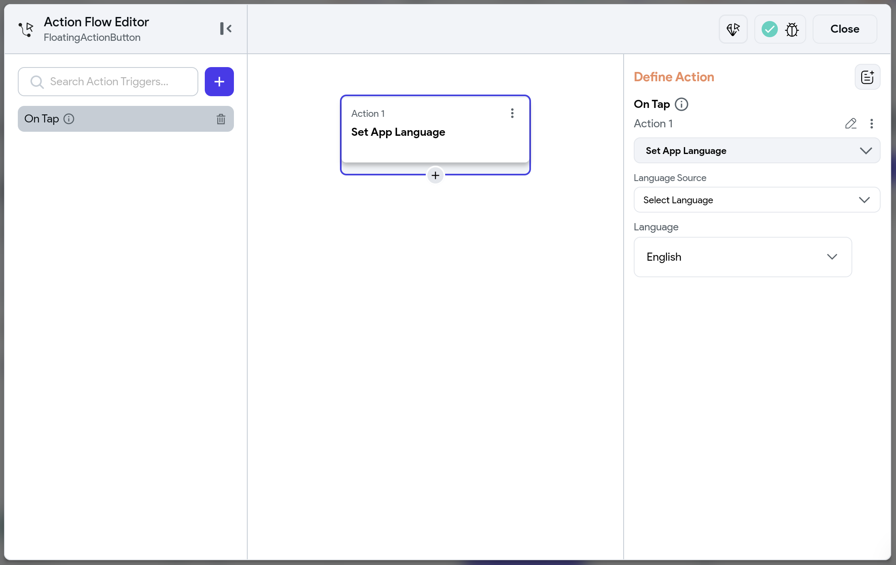
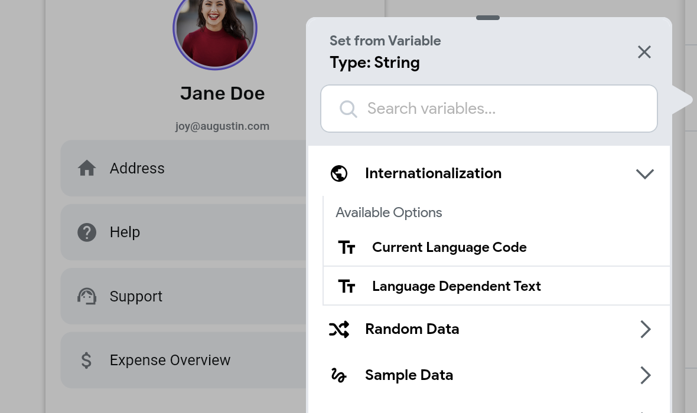

# Localization

**Localization** (often abbreviated as **l10n**) is the process of making your app work for different languages, regions, and cultures. It involves translating the app's text, adapting date and number formats, and adjusting other elements to meet the cultural expectations of a particular locale.

:::info[Difference Between Internationalization and Localization]

- [**Internationalization (i18n)**](https://docs.flutter.dev/ui/accessibility-and-internationalization/internationalization): This is the process of setting up your app in such a way that it can easily adapt to various languages and regions without requiring engineering changes. **Note that FlutterFlow handles most of the internationalization for you, so the only thing you need to take care of is localization.**
- **Localization (l10n)**: This is the process of translating the content of your app and adapting it for a specific locale or culture. It involves providing translations for user-visible strings, formatting dates, times, and numbers, and adapting content to meet cultural norms.

In a nutshell, internationalization is about making your app to support multiple languages, while localization is the actual process of translating the content and adapting it to specific locales.

:::

## Add Multi Language Support

FlutterFlow enables you to translate all text in your app at once using Google Translate or to manually adjust translations as needed. Additionally, you can localize predefined messages, such as permission prompts, authentication snackbars, and other in-app notifications.

Adding multi-language support is essential for making your app accessible to a wider audience. For instance, if your app provides exercise instructions only in English, non-English speakers may find it hard to understand and might choose a different app, even if it’s less effective, simply because it’s available in their language. Implementing a multi-language feature helps your app succeed globally by offering a user-friendly experience for diverse audiences.

To add multi-language support in FlutterFlow, navigate to **Settings and Integrations** > **Languages**, add the languages to support, set a primary language as a fallback, and optionally choose a display language. Then, use **Translate All** for automatic translations and adjust them if needed. Finally, verify translations on different pages by changing the language dropdown in the canvas.

:::warning

Changing the primary language after translating all of your text will clear the existing translations for other languages.

:::

    <iframe 
        src="https://demo.arcade.software/po8PphcS06ljCvKsTG76?embed&show_copy_link=true"
        title=""
        style={{
            position: 'absolute',
            top: 0,
            left: 0,
            width: '100%',
            height: '100%',
            colorScheme: 'light'
        }}
        frameborder="0"
        loading="lazy"
        webkitAllowFullScreen
        mozAllowFullScreen
        allowFullScreen
        allow="clipboard-write">
    </iframe>

## LanguageSelector Widget

The **LanguageSelector** widget in FlutterFlow allows users to switch to their preferred language in real-time without needing to restart the app. It displays the currently selected language and, when interacted with, presents a list of all available languages for easy selection.

It's particularly useful on onboarding screens or within settings menus to allow users to customize their language preferences.

### LanguageSelector Properties

You can customize the appearance using the various properties available under the Properties Panel.

:::tip

By default, the **LanguageSelector** widget does not persist the user's language choice across app sessions. To retain the selected language, enable the **Persist Selection** option under Language Settings.

:::

## Set App Language Manually [Action]

Sometimes, you might prefer not to use the default [LanguageSelector widget](#languageselector-widget) and instead implement a custom widget for language switching. For example, you could create a custom language selection screen that appears when the app first launches.

You can use the **Set App Language** action to let users choose their preferred language from the available options.

:::info

Note that this action affects only the app's language and does not modify the device's system language.

:::

## Managing Translation

There are two ways you can manage the app text translation:

**Inside Language Settings**

The Language Settings page lists all of your app's text, grouped by page, making it easy to manage translations in bulk.

To manually add or update a translation, make changes directly in the language column and mark the text as **Fixed**. Marking it as **Fixed** will prevent auto translate from overriding your custom translations during the bulk translation process.

To use Google Translate for new or existing text, click **Translate Page.**

**Inside Properties Panel**

You can also add or update translations for individual text directly inside the properties panel. To do so, select the widget (e.g., Text, TextField, etc.), go to the properties panel, and click on the Globe icon. This will open a new panel.

- To manually add or update a translation, make changes directly in the box under the language name.
- To auto-translate for all languages, click on **Google Translate**.

## Translating Predefined Messages

FlutterFlow allows you to manage the translation for the following types of predefined messages.

- **iOS Permission Messages**: iOS permission messages are the prompts shown to iOS users when your app requests access to device features, such as the camera or photo library.
- **Preset In-App Messages**: These are built-in messages that FlutterFlow displays for specific actions, such as authentication and file upload actions.

To add translations for predefined messages, navigate to **Settings and Integrations** > **Project Setup** > **Languages**. Scroll down to the **Translation** section and select the category containing the message you wish to translate.

Start by entering your message in the base language. Then, either use the **Translate Message** button for automatic translation or manually add your translations and mark them as **Fixed** to prevent them from being overridden by auto-translate.

:::info

Permission messages are displayed based on the features included in your app. For instance, Camera and Photo Library permission messages appear when a page contains a button with the **Upload Photo/Video action**.

:::

    <iframe 
        src="https://demo.arcade.software/tTmqFpnDLdCgVXHl9kDz?embed&show_copy_link=true"
        title=""
        style={{
            position: 'absolute',
            top: 0,
            left: 0,
            width: '100%',
            height: '100%',
            colorScheme: 'light'
        }}
        frameborder="0"
        loading="lazy"
        webkitAllowFullScreen
        mozAllowFullScreen
        allowFullScreen
        allow="clipboard-write">
    </iframe>

## Accessing Language-Specific Data

When building a multi-language app, you may need data like the current language code or language-specific text.

In FlutterFlow, you can retrieve the following types of language-related data:

- **Current Language Code**: This provides the ISO language code for the current app language (e.g., en, de, fr).
- **Language-Dependent Text**: Allows you to specify different values for each language. For instance, you might want to display a country flag or name based on the current app language.

These options are accessible through **Set from Variable > Internationalization**.

## Localizing Dates

To ensure your app displays dates in formats familiar to users from different regions, you can use the predefined **DateTime Format Options** while displaying dates.

For example, in the United States, dates follow a **month, day, year** format (e.g., 12/31/2023), whereas in India, they use a **day, month, year** format (e.g., 31/12/2023). To accommodate these regional differences, set the format option to `yMd`, a locale-aware format that automatically adjusts date representation based on the user's locale.

:::tip

Here are a few more locale-aware formatting options you can use:

- **`yMMMd`** – Formats the date with an abbreviated month and day, e.g., `Dec 31, 2023` (US) or `31 Dec 2023` (India).
- **`jm`** – Displays time with minutes, e.g., `5:30 PM` (US) or `17:30` (Europe).

For custom locale-specific date formats, you can also [**create your own patterns**](../../resources/data-representation/global-properties.md#custom-formatting).

:::

## Localizing Numbers

Different regions use different symbols for decimal and thousand separators. For example, the U.S. uses a period for decimals and a comma for thousands, while many European countries use the opposite.

To localize the numbers, set the [**Number Format Options**](../../resources/ui/widgets/basic-widgets/text.md#formatting-numbers) to **Decimal** and then set the **Decimal Type** to **Automatic**.

## Localizing Currency

Currency symbols and their placement vary by locale. For example, in the U.S., the dollar sign appears before the amount (`$1,000.00`), whereas in countries like France, the currency symbol is placed after the amount (e.g., `1 000,50 €`).

To handle this behavior, enable the **Display as Currency** option under Number Format settings and leave the **Currency Symbol** field empty to automatically adjust based on the user’s locale.

## Testing

Localization testing is crucial to ensure that all elements work properly across different languages and locales. Here are a few ways to test localization:

- **Change Device Locale**: Test your app by changing the device locale to verify translations and layout adjustments.
- **Use Emulators**: Use Android or iOS emulators to simulate different locales and ensure everything is displaying correctly.
- **Long Texts**: Verify that long translations do not overflow or cause UI issues.
- **Manual Testing**: Manually verify the accuracy of translations, date formats, number formats, etc.