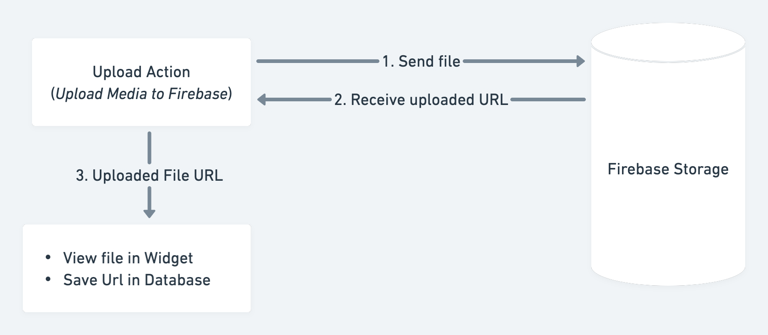
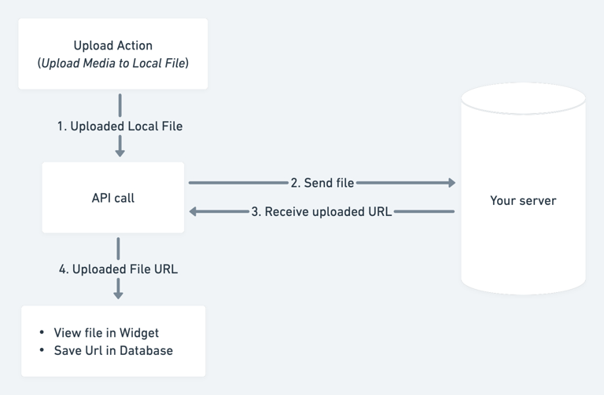
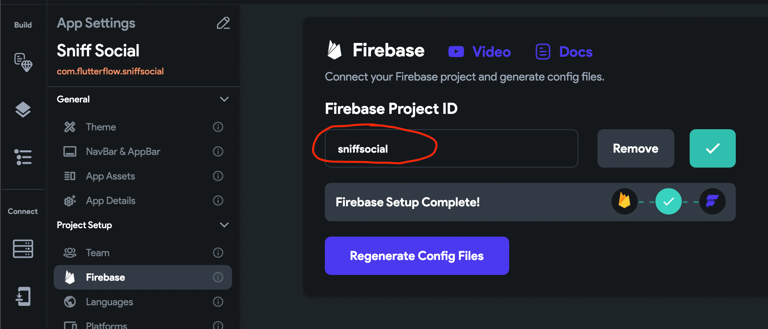

# Upload Data

This section covers actions for uploading media such as photos, videos, PDFs, and Audio files.

You can learn about adding each action by visiting the following pages.

- [Upload/Save Media](upload-save-media.md)
- [Upload/Save File](upload-save-file.md)

## Types of upload

To upload media, you have two options:

### Firebase

This will upload your media to [Firebase Storage](https://firebase.google.com/docs/storage). Once uploaded, you can directly use the ***Widget State > Uploaded File URL*** to preview media or save the URL.



### Supabase

Similar to Firebase, this will upload your media to the Supabase bucket (at a specific location that you specify). Once uploaded, you can directly use the ***Widget State > Uploaded File URL*** to preview media or save the URL.

### Local Upload (Widget State)

This will save your media to the device first. You can access it via ***Widget State > Uploaded Local File***. Then, make an API call to transfer the file to your server. **Note** that this API call must return the URL of the uploaded file, which you can later use to preview the media or store it somewhere in your database.


## Web Access for PDFs and Other Files

Some types of files require additional configuration to be accessed on the web. In particular, the PDF Viewer requires network files (such as uploaded PDFs) to allow what is called Cross-Origin Resource Sharing (CORS). Without diving too deep into that, the important part is that if you want users to be able to upload and view PDFs using Firebase Storage, follow the instructions below:

**Put On Your Developer Hat**

You'll need to run a few commands to get started. Don't worry though! No programming experience is required for this part, but you'll get to see how it's done 🙂

:::note
If you *do* have programming experience, you may find it easier to follow this guide instead: https://firebase.google.com/docs/storage/web/download-files#cors_configuration
:::

Start by finding the Project ID of your Firebase project. You can find that in the Firebase settings tab as seen below.



Once you have that, follow these steps. Anywhere you see `*FIREBASE_PROJECT_ID*` , replace it with the project ID you found above:

**Step 1**

Go to the following link (remember to use your project ID): `https://console.cloud.google.com/home/dashboard?cloudshell=true&project=FIREBASE_PROJECT_ID`

You'll see a view at the bottom that looks like this (you may have to hit "Continue"):


Your Project ID should appear in yellow. If not, or if a different project is selected, you may have to tap on the down arrow (circled in red above) and select your project.

**Step 2**

Tap on the terminal (black screen), paste in the following command (again, replacing it with your Project ID ****in the last line), and hit *Enter* (or *Return*)**:**


```
touch cors.json && \
echo [{\"origin\": [\"*\"], \"method\": [\"GET\"], \"maxAgeSeconds\": 3600}] > cors.json && \
gsutil cors set cors.json gs://FIREBASE_PROJECT_ID.appspot.com
```

If you get a message to "Authorize Cloud Shell" make sure to hit "Authorize". Once the command runs it should give you an output similar to below. If so, it worked!


And with that you are done! PDFs and other uploaded files will now load in the web with no issues!