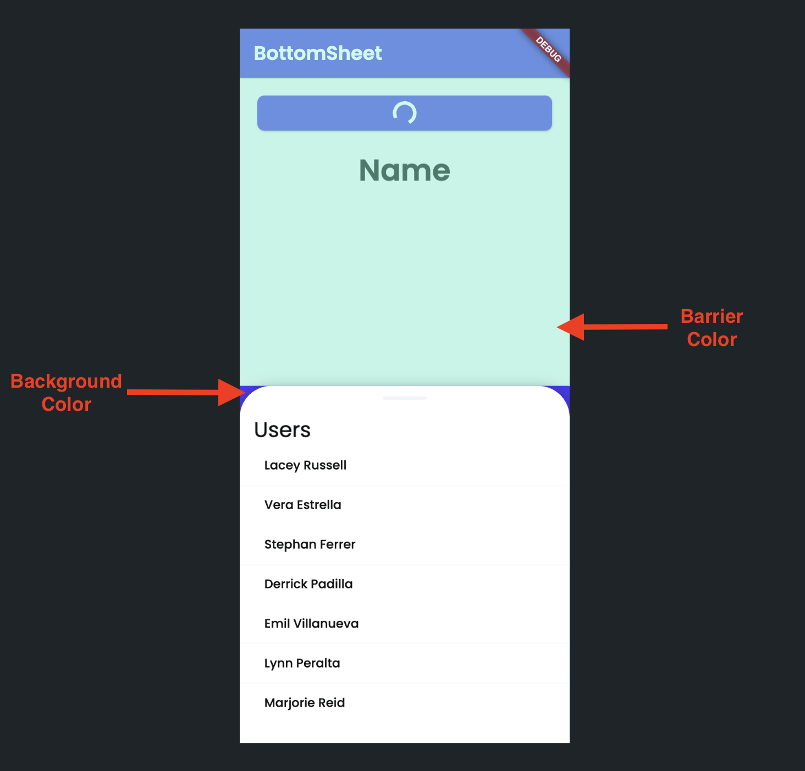

# Bottom Sheet
A Bottom Sheet is a modal surface that presents a component from the bottom of the screen. By default, its barrier prevents interaction with the page behind it, a barrier tap dismisses it, and the user can drag it downward to close it. The **Non Dismissible** and **Enable Drag** settings control those two dismissal paths separately.

You can use the bottom sheet when you want to perform a small action without creating a separate screen.

    <iframe
        src="https://demo.arcade.software/4GbJ3ujPrnvX6MwYiGdY?embed&show_copy_link=true" title="Bottom Sheet interactive tutorial"
        style={{
            position: 'absolute',
            top: 0,
            left: 0,
            width: '100%',
            height: '100%',
            colorScheme: 'light'
        }}
        frameborder="0"
        loading="lazy"
        webkitAllowFullScreen
        mozAllowFullScreen
        allowFullScreen
        allow="clipboard-write">
    </iframe>

## Types of Bottom Sheet action

Below are the types of Bottom Sheet actions:

1. **Show:** Opens a selected component as a modal bottom sheet.
2. **Dismiss:** Closes the active bottom sheet and can optionally return a typed value.

## Opening Bottom Sheet

Follow the steps below to add an action that opens the bottom sheet:

1. First, create a bottom sheet [component](../../resources/ui/components/intro-components.md).
:::tip
You can also create one from the 'BottomSheet' [**templates**](../../resources/ui/components/creating-components.md#creating-component-from-template).
:::

    <iframe
        src="https://demo.arcade.software/OfBRZFRhgkbMjHmXfEyo?embed&show_copy_link=true" title="Bottom Sheet interactive tutorial"
        style={{
            position: 'absolute',
            top: 0,
            left: 0,
            width: '100%',
            height: '100%',
            colorScheme: 'light'
        }}
        frameborder="0"
        loading="lazy"
        webkitAllowFullScreen
        mozAllowFullScreen
        allowFullScreen
        allow="clipboard-write">
    </iframe>

2. Select the **Widget** (e.g., Button) from where you want to open the bottom sheet.
3. Select **Actions** from the Properties panel (the right menu), and click **+ Add Action**.
4. Search for **Bottom Sheet** under *Widget/UI Interactions*, then select **Show**.
5. Choose the component under **Display Component** and supply any required component parameters.
6. Optionally set **Height (Optional)** to override the component's inherent height. A bottom sheet cannot be taller than the presenting page.
7. Use **Background Color (Optional)** for the sheet surface and **Barrier Color (Optional)** for the overlay over the page behind it.

    

8. Leave **Non-Blocking** off when later actions must wait for the sheet to close or use its result. Enable **Non-Blocking** only when the flow should continue immediately after opening the sheet.
9. Enable **Non Dismissible** to prevent a tap on the barrier (scrim) from closing the sheet.
10. **Enable Drag** allows the user to drag the sheet and dismiss it by swiping downward. Turn it off as well as enabling **Non Dismissible** if the sheet must close only through an explicit action inside the component.
11. Enable **Use Safe Area** when the sheet's content should avoid operating-system intrusions at the top, left, and right edges.
12. If the component has a **Dismiss Bottom Sheet** action with **Has Value** enabled, set **Action Output Variable Name** on this opening action. Later actions can read the result under **Action Outputs**.

    <iframe
        src="https://www.loom.com/embed/def8de637f1a43f1bd5f443d59ba5c29?sid=ab58e43b-e6d0-49e9-a536-e349885b6e63" title="Bottom Sheet interactive tutorial"
        style={{
            position: 'absolute',
            top: 0,
            left: 0,
            width: '100%',
            height: '100%',
            colorScheme: 'light'
        }}
        frameborder="0"
        loading="lazy"
        webkitAllowFullScreen
        mozAllowFullScreen
        allowFullScreen
        allow="clipboard-write">
    </iframe>

## Closing Bottom Sheet

Follow the steps below to add an action that closes the bottom sheet:

1. Select the **Widget** (e.g., Button, ListTile, Container) on which you want to add the action.
2. Select **Actions** from the Properties panel (the right menu), and click **+ Add Action**.
3. Search for **Bottom Sheet** under *Widget/UI Interactions*, then select **Dismiss**.
4. To return data, enable **Has Value**, select its data type, and set the value. This value is passed to the action that opened the sheet.
5. Return to the **Show Bottom Sheet** action, set **Action Output Variable Name**, and use that variable from **Action Outputs** in a later action.

All value-returning **Dismiss Bottom Sheet** actions in the same component must use the same data type. A barrier tap or drag dismissal does not execute one of those configured dismiss actions, so do not assume those paths return the same value. Keep **Non-Blocking** off if the next action needs the result.

:::note
Dismiss actions are not supported inside action blocks. Place **Dismiss Bottom Sheet** on a widget action within the displayed component.
:::

Here is an example of returning the selected user name back to the page.

    <iframe
        src="https://demo.arcade.software/KDaNgnasSA3pZ9fxjBF5?embed&show_copy_link=true" title="Bottom Sheet interactive tutorial"
        style={{
            position: 'absolute',
            top: 0,
            left: 0,
            width: '100%',
            height: '100%',
            colorScheme: 'light'
        }}
        frameborder="0"
        loading="lazy"
        webkitAllowFullScreen
        mozAllowFullScreen
        allowFullScreen
        allow="clipboard-write">
    </iframe>

